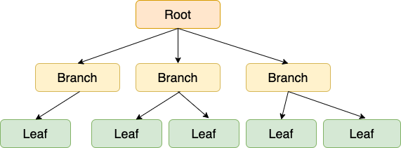
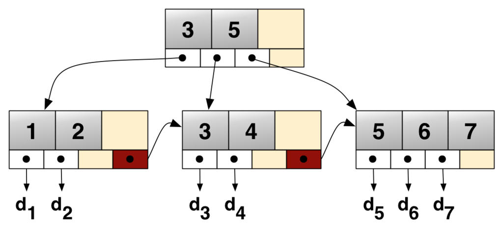
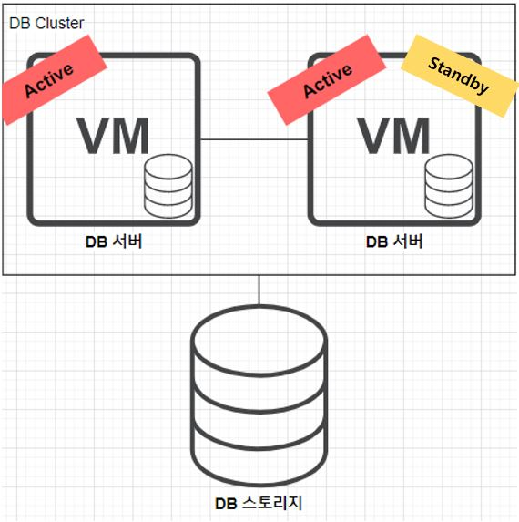
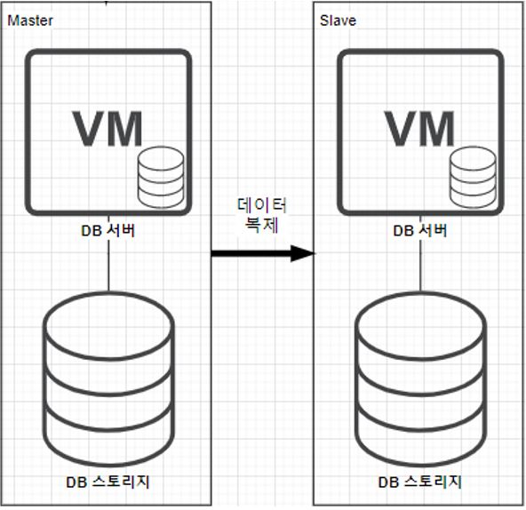

# Database
<br>

-----------------------


### 트랜잭션

<details>
   <summary> 예비 답안 보기 (👈 Click)</summary>
<br />

-----------------------

+ __데이터베이스의 상태를 변화시키는 하나의 논리적인 작업 단위__
+ 논리적인 작업의 쿼리 캐수와 관계 없이 논리적인 작업 셋 자체가 100% 적용되거나 아무것도 적용되지 않아야 함을 보장

</details>

-----------------------

<br>

### 트랜잭션 특징 ACID

<details>
   <summary> 예비 답안 보기 (👈 Click)</summary>
<br />

-----------------------

+ Atomicity(원자성)
    - 트랜잭션을 구성하는 연산 전체가 모두 정상적으로 실행되거나 모두 취소되어야 한다.
+ Consistency(일관성)
    - 트랜잭션이 실행을 성공적으로 완료하면 언제나 일관성 있는 데이터베이스 상태로 유지한다.
+ Isolation(고립성)
    - 두 개 이상의 트랜잭션이 동시에 발생할 때, 서로의 연산에 영향을 주면 안된다.
+ Durability(영구성)
    - 커밋된 트랜잭션의 내용은 영구히 반영된다.

</details>

-----------------------

<br>


### 트랜잭션 격리수준

<details>
   <summary> 예비 답안 보기 (👈 Click)</summary>
<br />

-----------------------

+ __Read Uncommitted__
    - 다른 트랜잭션에서 커밋되지 않은 내용에 접근 가능 __(Dirty Read)__
+ __Read Committed__
    - 커밋된 내용만 접근 가능
    - 한 트랜잭션 내에서 검색 결과가 비일관적인 현상 발생 __(Nonrepeatable read)__
+ __Repeatable Read__
    - 커밋이 완료된 데이터만 읽을 수 있으며, 트랜잭션 범위 내에서 조회한 내용이 항상 동일함을 보장
    - __일정범위의 레코드를 두번 이상 읽을 때, 첫 번재 쿼리에서 없던 유령 레코드가 두번째 쿼리에서 나타나는 현상을 Phantom read__
+ __Serializable__
    - 한 트랜잭션에서 사용하는 데이터는 다른 트랜잭션이 접근 불가능


MySQL은 MVCC 기능을 통해 트랜잭션이 시작되면 시작 시점에 데이터의 스냅샷을 만들어 일관된 데이터를 읽을 수 있도록 한다.  
MySQL의 default 값은 Repeatable Read이며, MVCC 기능 덕분에 phantom read 현상이 일반적으로는 발생하지 않는다. 하지만 select for update, select for share 같이 락을 사용하는 쿼리는 언두 로그가 아닌 실제 테이블 데이터를 읽어오므로 phantom read 현상이 발생할 수 있다.


> 자세한 내용은 [망나니 개발자](https://mangkyu.tistory.com/299)님 블로그를 참고

</details>

-----------------------

<br>


### Commit

<details>
   <summary> 예비 답안 보기 (👈 Click)</summary>
<br />

-----------------------

+ 트랜잭션이 성공하여 트랜잭션 결과를 영구적으로 반영하는 연산

</details>

-----------------------

<br>

### Rollback

<details>
   <summary> 예비 답안 보기 (👈 Click)</summary>
<br />

-----------------------

+ 트랜잭션의 실행을 취소하였음을 알리는 연산
+ 트랜잭션이 수행한 결과를 원래의 상태로 원상 복귀시키는 연산

</details>

-----------------------

<br>


### 갱신 분실 문제

<details>
   <summary> 예비 답안 보기 (👈 Click)</summary>
<br />

-----------------------


A와 B가 동시에 제목이 같은 공지사항을 동시에 수정한다고 했을 때 A가 먼저 수정을 완료하고 B가 이후에 완료버튼을 눌렀다면 B의 수정사항만 남게되는데 이것을 갱신 분실 문제라고 한다.  
갱신 분실 문제는 데이터베이스 트랜잭션의 범위를 넘어서는 문제로 트랜잭션으로만 해결할 수는 없고 3가지 선택 방법이 있다.
+ 마지막 커밋만 인정하기
  - 위에서는 B의 커밋만 인정한다.
  - 기본값
+ 최초 커밋만 인정하기
  - 위에서는 A의 수정을 인정하고 B의 수정이 완료될 때 오류가 발생한다.
+ 충돌하는 갱신 내용 병합하기
  - 사용자 A와 사용자 B의 수정사항을 병합한다.

쉽게 정리하면, 동시에 수정했을때, 마지막 수정사항으로 덮어씌워지는 것을 갱신 분실 문제라고 한다.

갱실 분실 문제를 해결하기 위해서는 보통 락을 사용한다.

</details>

-----------------------

<br>


### Locking

<details>
   <summary> 예비 답안 보기 (👈 Click)</summary>
<br />

-----------------------

동시에 여러개의 트랜잭션이 수행될 때, 트랜잭션들이 DB의 일관성을 파괴하지 않도록 트랜잭션 간의 상호작용을 제어하는 것을 동시성 제어라고 하며 이를 위한 해결책 중 하나가 잠금이다.


+ 트랜잭션이 데이터에 접근하기 전에 Lock을 요청해서 Lock이 허락되면 해당 데이터에 접근할 수 있도록 하는 기법
+ 종류
    - 비관적 락(Pessimistic lock)
        - 공유락(Shared Lock) : 사용중인 데이터를 다른 트랜잭션이 읽기 허용, 쓰기 비허용
        - 베타락(Exclusive Lock) : 사용중인 데이터를 다른 트랜잭션이 읽기, 쓰기 비허용
        - __데이터 수정 즉시 트랜잭션 충돌을 감지할 수 있다.__
        - 롤백을 개발자가 일일이 하는 것이 힘든 경우, 충돌이 일어났을 때 롤백 비용이 많이 드는 경우, 주문 시에 쿠폰 사용, 알림 제공, 주문서 작성 등의 여러 기능이 한 트랜잭션에 묶여 있는 경우에 적합하다.
    - 낙관적 락(Optimistic lock)
        - 데이터 갱신 시 충돌이 발생하지 않을 것으로 가정하여 락을 걸지 않는 방식 -> __락이 아닌 버전 관리 기능을 통해서 트랜잭션 격리성 관리__
        - Version 컬럼을 별도로 추가해서 충돌 방지 -> Version 정보를 사용하면 최초 커밋만 인정된다.
            - 벌크 연산은 버전을 무시하기 때문에 벌크 연산에서는 버전을 증가시키려면 버전 필드를 강제로 증가시켜야 한다.
        - DB 가 제공하는 락 기능을 사용하지 않고 __JPA 가 제공하는 버전 관리 기능을 사용__ -> 애플리케이션에서 제공하는 락
        - __커밋 전까지는 충돌을 알 수 없다.__
        - __충돌이 나면 롤백 처리는 개발자의 몫이다.__
    - 둘의 사용을 판단하는 기준을 읽기와 수정 비율이 어디에 가까운지 보고 판단해야 한다. 수정의 비율이 높다면 Pessimistic을 사용하고 읽기의 비중이 높다면 Optimistic을 사용한다.


</details>

-----------------------

<br>


### 스토리지 엔진 락

<details>
   <summary> 예비 답안 보기 (👈 Click)</summary>
<br />

-----------------------

#### 레코드 락
일반적으로 레코드 락은 테이블 레코드 자체를 잠그는 락을 의미한다. 하지만 MySQL에서의 레코드 락은 테이블의 레코드가 아닌 인덱스의 레코드를 잠근다는 점에서 중요한 차이가 있다.
 

```sql
# member 테이블에서 last_name이'C'로 시작하는 구성원은 300명이다.
SELECT COUNT(*) FROM member WHERE last_name LIKE 'C%';

# 그 중에서 first_name이 backtony인 사원은 1명만 있다.
SELECT COUNT(*) FROM member WHERE last_name LIKE 'C%' AND first_name = 'backtony';
```
그리고 이때 성(last_name)에만 인덱스가 걸려있는 경우에, 성이 C로 시작하며 이름이 backtony인 구성원의 등록일을 변경하는 UPDATE 쿼리를 실행한다고 하자.

```sql
# member 테이블에는 last_name 컬럼만으로 구성된 인덱스 KEY idx_last_name(last_name)가 존재한다.
# 해당 구성원의 등록일을 오늘로 변경하는 쿼리를 실행해보자.
UPDATE member SET register_date = NOW() WHERE last_name LIKE 'C%' AND first_name = 'backtony';
```
UPDATE 문에 의해 영향받는 레코드는 1건이다. 하지만 1건을 업데이트 하기 위해 300건의 인덱스 레코드에 잠금이 걸린다. 왜냐하면 MySQL은 테이블 레코드가 아닌 인덱스에 잠금을 걸기 때문이다. 인덱스는 성(last_name)으로만 구성되어 있기 때문에, 해당 레코드를 갱신하기 위해서는 인덱스를 통해 검색되는 모든 레코드에 잠금을 걸게 된다.


레코드 락은 트랜잭션이 DML 구문을 실행할 때 자동으로 거는 락이며, 레코드 락 덕분에 여러 트랜잭션이 동시에 서로 다른 레코드에 접근할 수 있는 것이다.


#### 갭 락

갭 락(Gap Lock)은 레코드가 아닌 레코드와 레코드 사이의 간격을 잠금으로써 레코드의 생성, 수정 및 삭제를 제어한다.

예를 들어 현재 성이 J로 시작하는 레코드가 Jo, Joe 2개가 있다고 하자. 그리고 언제든지 다른 데이터들 ex) Jang, Jeong, Jung 이 추가될 수 있다. 따라서 현재 트랜잭션에서 조회를 할 때, 다른 트랜잭션에서 임의의 데이터가 추가되지 않도록 잠그려면 아래와 같은 쿼리를 실행해야 한다. 

```sql
SELECT * FROM member WHERE last_name LIKE "J%" FOR UPDATE;         // 쓰기 잠금(베타락)
SELECT * FROM member WHERE last_name LIKE "J%" LOCK IN SHARE MODE; // 읽기 잠금(공유락)
```

갭 락은 인덱스 범위 조건 중에서 실제 레코드를 제외하고, 데이터가 추가될 수 있는 범위에 걸리게 된다.


#### 넥스트 키 락
넥스트 키 락(Next Key Lock)이란 레코드 락과 갭 락을 합친 잠금으로, 앞서 살펴본 갭 락은 단독으로 사용되기 보다는 넥스트 키 락의 일부로 함께 사용된다.

갭 락이나 넥스트 키 락은 바이너리 로그에 기록되는 쿼리가 리플리카 서버에서 실행될 때 소스 서버에서 만들어낸 결과와 동일한 결과를 만들어내도록 보장해주는 것이 주목적이라고 한다. 그런데 의외로 넥스트 키 락과 갭 락으로 인해 데드락이 발생하거나 다른 트랜잭션이 기다리는 일이 자주 발생하므로, 바이너리 로그 포맷을 ROW 형태로 바꿔서 넥스트 키 락이나 갭 락을 줄이는 것이 좋다고 한다.

</details>

-----------------------

<br>


### MVCC(다중 버전 동시성 제어)과 락


<details>
   <summary> 예비 답안 보기 (👈 Click)</summary>
<br />

-----------------------

MVCC는 다른 트랜잭션이 수정하는 것 자체는 막지 못하고, 트랜잭션 격리 레벨에 따라 __일관된 읽기__ 를 제공한다.   
반면에 __낙관적 락이나 비관적 락은 다른 트랜잭션이 같은 데이터를 수정하는 것을 막는다.__

__갱신 분실 문제__ 를 예방하기 위해서는 락을 사용해야 한다.

</details>

-----------------------

<br>

### 무결성 제약조건

<details>
   <summary> 예비 답안 보기 (👈 Click)</summary>
<br />

-----------------------

+ 데이터베이스의 정확성, 일관성을 보장하기 위해 저장, 삭제, 수정 등을 제약하기 위한 조건
+ 개체 무결성 : 기본 키는 null, 중복값 불가능
+ 참조 무결성 : 외래 키는 null이거나 참조 테이블의 기본 키 값과 동일해야 함


</details>

-----------------------

<br>


### 조인

<details>
   <summary> 예비 답안 보기 (👈 Click)</summary>
<br />

-----------------------

+ __두 개 이상의 테이블이나 데이터베이스를 연결하여 데이터를 검색하는 방법__
+ 적어도 하나의 컬럼을 서로 공유하고 있어야 한다.

### 종류
+ INNER JOIN
    - 기준 테이블과 join한 테이블의 __중복된 값__ 을 보여준다.
    - __교집합__ 과 같아고 보면 된다.
+ LEFT OUTER JOIN
    - 기준 테이블의 값 + join 테이블과 기준테이블의 중복된 값
    - 기준 테이블은 다 보여주고, join 테이블은 기준 테이블과 중복되는 값만 붙여준다고 생각하면 된다.
    - 기준 테이블과 중복되는 값이 없다면 join 테이블의 내용은 NULL로 표기된다.
+ RIGHT OUTER JOIN
    - LEFT OUTER JOIN의 반대이다.
+ FULL OUTER JOIN
    - 기준, Join 테이블의 합집합
    - 전부 다 보여주고 빈값들은 NULL로 채워진다.
+ CROSS JOIN
    - 크로스 곱이라고도 하는데 모든 경우의 수를 전부 표현해주는 방식이다.
    - 각 테이블의 데이터 개수가 N,M 이라면 결과는 N*M의 데이터 개수가 나온다.    
+ SELF JOIN
    - CROSS JOIN의 대상이 자기 자신인 것

</details>

-----------------------

<br>


### DML, DDL, DCL

<details>
   <summary> 예비 답안 보기 (👈 Click)</summary>
<br />

-----------------------


+ DML(Data Manipulation Language) : 데이터 조작
    - Select, Insert, Update, Delete
+ DDL(Data Definition Language) : 데이터(구조, 객체) 정의
    - Create, Drop(테이블 삭제), Truncate(테이블 데이터 삭제, 테이블 초기화), Alter
+ DCL(Data Control Language) : 권한 제어
    - Grant, Revoke


</details>

-----------------------

<br>

### 힌트

<details>
   <summary> 예비 답안 보기 (👈 Click)</summary>
<br />

-----------------------

+ __옵티마이저가 항상 최적의 실행 경로 실행을 보장하지 않기 때문에 직접 최적의 실행 경로를 작성해주는 것__

</details>

-----------------------

<br>


### 인덱스

<details>
   <summary> 예비 답안 보기 (👈 Click)</summary>
<br />

-----------------------

+ 추가적인 쓰기와 저장 공간사용을 통해 __데이터베이스의 검색 속도 향상시키기 위한 방법__
+ 칼럼의 값(key)와 해당 레코드가 저장된 주소를 키와 값의 쌍으로 인덱스 정의
+ 일반적으로 B+ 트리 자료구조를 사용
+ 장단점
    - 검색 속도 향상
    - 데이터의 추가, 삭제, 수정의 경우 인덱스도 변경하고 정렬해야 하므로 성능 저하
    - 추가적인 저장 공간 필요


</details>

-----------------------

<br>


### Cluster 인덱스

<details>
   <summary> 예비 답안 보기 (👈 Click)</summary>
<br />

-----------------------

+ 인덱스로 지정한 컬럼을 기준으로 물리적으로 정렬하는 인덱스
+ 한 테이블당 1개 (Primary Key)
+ 위에서 언급한 일반적인 인덱스로 검색속도는 빠르지만, 입력,수정,삭제는 느림

</details>

-----------------------

<br>


### Non-Cluster 인덱스


<details>
   <summary> 예비 답안 보기 (👈 Click)</summary>
<br />

-----------------------

+ 데이터 자체는 정렬되지 않고, 인덱스값을 기준으로 정렬하여 새로 인덱스 페이지를 만드는 인덱스
+ 새로 인덱스 페이지를 만들고 리프 페이지에 실제 데이터가 위치한 주소를 가리킴
+ 한 테이블 당 여러 개 가능
+ 검색 속도는 Cluster에 비해 느리지만, 입력,수정,삭제가 빠름

</details>

-----------------------

<br>


### 멀티 인덱스

<details>
   <summary> 예비 답안 보기 (👈 Click)</summary>
<br />

-----------------------

+ __두개 이상의 필드를 조합하여 생성한 인덱스__
+ 그냥 두개 인덱스로 조회하면 되지 않을까?
    - mysql은 단일 쿼리를 실행할 때 __하나의 테이블 당 하나의 인덱스만 사용__ 할 수 있다. 
    - 둘중 인덱싱데이터 내 행이 적은 것을 먼저 참조하게 된다.

</details>

-----------------------

<br>

### 커버링 인덱스

<details>
   <summary> 예비 답안 보기 (👈 Click)</summary>
<br />

-----------------------

커버링 인덱스는 실제로 인덱스를 생성하는게 아니라 쿼리를 작성할 때, 성능을 최적화 하는 방식으로 쿼리의 모든 항목이 인덱스 컬럼으로 이루어진 상태를 의미한다. (인덱스 탐색 후 실제 pk로 데이터 접근을 하지 않고 바로 결과값 리턴) 

</details>

-----------------------

<br>


### scan

<details>
   <summary> 예비 답안 보기 (👈 Click)</summary>
<br />

-----------------------

+ Table Full Scan
    - 테이블에 속한 블록 전체를 읽어서 사용자가 원하는 데이터를 찾는다.
+ Index Range Scan
    - 인덱스 컬럼이 가공되지 않은 상태로 조건절에 있을 때 수행된다.
    - 인덱스에서 일정량을 스캔하면서 얻은 ROWID를 사용해 테이블 레코드를 찾는다.
+ Index Full Scan
    - 인덱스 컬럼이 조건에 없으면 Index Range Scan이 불가능하므로, 옵티마이저는 Table Full Scan을 고려한다.
    - 그런데 대용량 테이블이라 Table Full Scan에 대한 부담이 너무 크면 Index를 활용해야할 필요가 있다.
    - 인덱스의 전체 크기는 테이블의 전체 크기보다 훨씬 적으므로, Index Range Scan을 할 수 없을 때, Table Full Scan보다는 Index Full Scan을 고려한다.


</details>

-----------------------

<br>


### B 트리

<details>
   <summary> 예비 답안 보기 (👈 Click)</summary>
<br />

-----------------------

  
+ 이진 트리를 확장해서 많은 자식을 갖을 수 있는 __균형 트리__
+ key들이 항상 오름차순으로 정렬되어 구성
+ Branch와 Leaf 노드가 key와 data를 저장

</details>

-----------------------

<br>


### B+ 트리

<details>
   <summary> 예비 답안 보기 (👈 Click)</summary>
<br />

-----------------------

  
+ B트리를 확장해서 데이터의 빠른 접근을 위한 인덱스 역할만 하는 비단말 노드를 추가한 트리(리프들이 연결되어 있음)
+ __Branch 노드는 key만 저장__
+ key들이 항상 오름차순으로 정렬되어 구성
    - 하나의 노드에 더 많은 key를 담을 수 있게 되므로 트리의 높이가 B 트리에 비해 더 낮아진다.(cache hit를 높임)
+ Leaf 노드는 Key와 Data를 저장하고 Linked List로 연결되어 있음(검색에 유용)
    - 풀 스캔 시 B트리는 모든 노드를 확인해야하지만, B+ 트리의 경우 리프노드에 연결된 연결리스트로 선형 탐색이 가능하다.

</details>

-----------------------

<br>


### 정규화

<details>
   <summary> 예비 답안 보기 (👈 Click)</summary>
<br />

-----------------------

이상현상이 존재하는 테이블(릴레이션)을 분해하여 여러 개의 테이블(릴레이션)으로 생성하는 과정  
__이상현상을 제거하기 위해 테이블을 분리하는 작업__
+ 이상현상
    - 삽입 이상 : 불필요한 데이터를 추가해야만 삽입이 가능한 상황
    - 갱신 이상 : 전체의 데이터 중 일부만 변경하여 데이터가 불일치하는 상황
    - 삭제 이상 : 삭제로 인해 꼭 필요한 데이터까지 삭제되는 상황
+ 1 정규화 : 테이블의 컬럼이 하나의 값을 갖도록 테이블을 분해하는 것(도메인이 __원자값만__ 포함)
+ 2 정규화 : 기본키의 부분집합이 결정자가 안되도록 분리(완전 함수적 종속)
+ 3 정규화 : 이행종속 제거 (a -> b, b -> c 일때, a->c 가 성립되는 것을 분리, 즉, a-> b랑 b->c 테이블로 분리)
+ BCNF : __값을 정하는 결정자가 후보키가 되도록 테이블 분해(모든 결정키가 후보키)__

</details>

-----------------------

<br>


### 반정규화

<details>
   <summary> 예비 답안 보기 (👈 Click)</summary>
<br />

-----------------------

__반정규화는 성능 향상을 위해 중복, 통합하는 기법으로 조인으로 인한 성능 저하가 예상되는 경우 반정규화를 사용한다.__

</details>

-----------------------

<br>


### 커넥션 풀

<details>
   <summary> 예비 답안 보기 (👈 Click)</summary>
<br />

-----------------------

클라이언트 요청에 따라 각 애플리케이션의 스레드에서 데이터베이스에 접근하기 위해서는 커넥션이 필요하다.  
커넥션 풀이란 __미리 일정 수의 Connection을 만들어 풀에 보관해 두는 것__ 을 의미한다.  
+ 사용자의 요청에 따라 Connection을 생성하다 보면 많은 수의 연결이 발생했을 때 서버에 과부하가 걸리게 되므로 방지하기 위함
+ 커넥션 풀을 사용하면 생성, 소멸에 시간 소요가 없어지기 때문에 효율적
+ 한번에 사용할 수 있는 커넥션 수가 제어되어 애플리케이션이 쉽게 죽지 않음


</details>

-----------------------

<br>

### 관계형 DB, NoSQL

<details>
   <summary> 예비 답안 보기 (👈 Click)</summary>
<br />

-----------------------


+ 관계형 DB
    - __정해진 스키마에 따라 데이터를 테이블에 저장하는 데이터베이스__
    - __데이터 구조를 보장하고 중복을 피할 수 있다.__
    - 데이터는 관계를 통해 여러 테이블에 분산된다.
    - 수직적 확장이 가능하다(서버의 성능 향상)
    - 사용처
        - __데이터 구조가 명확하고 일관성이 중요한 경우__
        - 데이터 간의 관계가 복잡하고 자주 변경되는 경우
+ NoSQL
    - __스키마가 없거나 느슨한 스키마로 데이터 간의 관계없이 자유로운 형태로 데이터를 저장하는 데이터베이스__
    - 유연하기 때문에 언제든지 데이터를 조정하고 새로운 필드를 추가할 수 있다.
    - 일부 데이터를 중복으로 다루기 때문에 업데이트 시 추가적인 관리가 필요할 수 있다.
    - __수평적 확장(여러 서버에 데이터 분산)__ 으로 __트래픽 분산 및 대용량 처리__ 가 가능하다.
    - Eventual Consistency
        - Consistency를 보장해주지 못하기 때문에 나온 개념으로, Consistency를 완전히 보장하지는 않지만, 결과적으로 언젠가는 Conssistency가 보장됨을 의미
    - 사용처
        - __읽기를 자주 하지만 데이터 변경은 드문 경우__
        - 정확한 데이터 구조를 알 수 없거나, 변경/확장될 수 있는 경우
        - 데이터베이스를 수평적으로 확장해야하는 경우(막대한 양의 데이터를 다루는 경우)

</details>

-----------------------

<br>


### Redis, Memcached

<details>
   <summary> 예비 답안 보기 (👈 Click)</summary>
<br />

-----------------------

+ redis
    - __싱글 스레드 인메모리 DB로 다양한 데이터 구조를 지원__ 하며 주로 캐시에 사용
    - __스냅샷, AOF를 통해 백업 가능__
        - 스냅샷 기능을 통해 디스크에 백업하거나, AOF를 통해 명령 쿼리를 저장해두고 서버가 셧다운되면 재실행 방식으로 휘발을 막음
        - AOF :모든 작업을 log 파일에 기록해두고 서버가 재실행되면 순차적으로 연산을 수행하면서 데이터를 복구하는 방식
    - 자료구조 지원
+ Memcached
  - __멀티스레드__ 를 지원하는 고성능 분산 메모리 캐싱 시스템
  - 단순 Key Value 형태로 지원
  - 데이터 복제를 지원하지 않는다.

둘다 캐시에 사용되며 redis가 복제와 다양한 자료 구조를 지원하기 때문에 다양한 시나리오에 더 적합하다.


#### redis 자료구조
* string : key-value 형태
* List : 링크드 리스트 자료구조
* set : 중복을 허용하지 않는 자료구조
* sorted set(ZSet) : set 자료구조에 score을 주고 이를 기준으로 순서 유지
* hash : key 내부에 key value 형태의 Map 구조
* Bit arrays, HyperLogLogs, Streams..


#### redis 구성 방식
* replication 아키텍처
  * master-slave 구조로 장애시 수동 복구
* sentinel 아키텍처
  * sentinel, master, slave 구조로 sentinel이 master를 모니터링하고 문제 발생시 자동으로 failover
* cluster 아키텍처
  * 클러스터에 포함된 노드들이 서로 통신하면서 HA를 유지하며 샤딩을 기본으로 사용 
  * 3.0버전부터 지원

</details>

-----------------------

<br>


### Elastic search

<details>
   <summary> 예비 답안 보기 (👈 Click)</summary>
<br />

-----------------------

+ 자바 기반의 오픈소스 검색 엔진
+ ELK 스택으로 lastic search, Logstach, kibana 로 묶어서 사용함
+ 역색인(inverted index)로 데이터를 저장해서 전문(Full-text)검색 시에 RDBMS보다 성능이 뛰어남
    - 역색인이란 책 뒤에 보면 단어별로 위치가 어딘지 명시해놓은 방식
    - RDBMS는 인덱스가 B+ tree 방식으로 구현되어 있음

</details>

-----------------------

<br>

### Elastic search 키워드 검색 vs RDBMS %like%

<details>
   <summary> 예비 답안 보기 (👈 Click)</summary>
<br />

-----------------------

+ RDBMS
    - __LIKE의 경우 와일드카드로 시작하는 경우, 인덱스를 사용하지 않기 때문에 전체 검색이 진행되어 느리다.__
    - LIKE의 경우 고정된 문자로 시작되는 경우, 인덱스가 동작한다.
+ Elastic search 
    - 전체 검색이 아니라 역색인을 기반으로 검색하기 때문에 빠르다.

</details>

-----------------------

<br>

### 클러스터링

<details>
   <summary> 예비 답안 보기 (👈 Click)</summary>
<br />

-----------------------

  

DB 클러스터링은 __DB스토리지는 공유하고 동일한 DB 서버를 다중화(여러 대)하는 방식__ 이다.  
동기 방식으로 동기화한다.  
+ Active-Active 방식
    - 여러 대의 DB서버가 트래픽을 분산해서 받는다.
    - 여러 대의 서버가 DB 스토리지를 공유하기 때문에 병목이 생길 수 있다.
+ Active-Standby 방식
    - 한쪽은 Standby 상태로 두어 Active 상태의 서버가 죽으면 FailOver되어 전환하는 방식
    - FailOver이 이루어지는 동안 손실이 존재한다.

</details>

-----------------------

<br>

### 레플리케이션

<details>
   <summary> 예비 답안 보기 (👈 Click)</summary>
<br />

-----------------------

  

DB 레플리케이션은 __DB 서버와 DB 스토리지를 다중화하는 방식__ 이다.  
+ 조회작업은 Slave에서 INSERT, DELETE, UPDATE 작업은 Master에서 수행하면서 트래픽 분산
+ Slave로 데이터를 옮길 때 비동기 방식으로 동작하기 때문에 일관성 있는 데이터를 얻지 못할 수 도 있다.
+ Master 노드가 다운되면 복구 및 대처가 까다롭다.

</details>

-----------------------

<br>


### 수직 파티셔닝

<details>
   <summary> 예비 답안 보기 (👈 Click)</summary>
<br />

-----------------------

+ __큰 Table이나 인덱스를 관리하기 쉬운 단위로 분리하는 방식__
+ 예를 들어, 사람이라는 테이블이 너무 커지게 되면서 사람을 북유럽인, 아시아인, 서유럽인 이렇게 테이블로 분리하는 것이라고 볼 수 있다.
+ 장점
    - Insert 시 분리된 파티션으로 분산시켜 경합을 줄임
    - 읽기/쓰기 향상
    - 파티션 별로 백업 및 복구 가능
    - 데이터 전체 검색 시 필요한 부분만 탐색해서 성능 증가
+ 단점
    - 인덱스와 테이블을 별도로 파티셔닝 할 수 없다. 즉, 테이블과 인덱스를 같이 파티셔닝 해야한다.
    - 테이블 간 조인 비용 증가

</details>

-----------------------

<br>

### 샤딩(수평 파티셔닝)

<details>
   <summary> 예비 답안 보기 (👈 Click)</summary>
<br />

-----------------------

보통 수직 파티셔닝보다 샤딩을 많이 사용한다. 수직 파티셔닝이 가능했다면 처음 설계 단계에서 확장성 있는 설계를 못했을 가능성이 있고, 분리하면 오히려 조인 등의 성능 저하가 발생할 수 있다.


+ __같은 테이블 스키마를 가진 데이터를 다수의 데이터베이스에 분산하여 저장하는 방식__
+ 데이터를 잘 분산시키기 위해 고려해야할 것이 Shard Key이고 이를 정하는 방식으로 Hash Sharding, Dynamic Sharding, Entity Group 방식이 있다.
+ 샤딩은 복잡도가 매우 높아지므로 다른 방식을 우선적으로 고려해야 한다.

<br>

#### 샤딩 종류
* Modular Sharding : 샤드키를 모듈러 연산한 결과로 DB를 선택하는 방식
  * 장점: Range 샤딩에 비해 데이터가 균일하게 분산된다.
  * 단점: DB를 추가 증설하게 된다면 이미 적재된 데이터들의 재정렬이 필요하다.
    * (DB는 2개, 상품번호가 0~10까지 있을 경우) 상품번호 % 2 모듈러 연산 시 DB1에는 0,2,4,6,8,10 상품, DB2에는 1,3,5,7,9 상품이 들어가게 된다.
    * 확장 시에 배수로 확장을 고려해볼 수 있다.
  * 해시 샤딩은 key를 해시한 다음 모듈러 샤딩 방식과 동일하다.
* Range Sharding : 샤드키의 범위를 기준으로 DB를 선택하는 방식
  * 장점 : Modular 샤딩에 비해 증설에 재정렬 비용이 들지 않는다.
  * 단점: 일부 DB에 데이터가 몰릴 수 있다. => 기껏 분산처리를 했는데 활성 유저가 특정 DB에 몰리면 다시 추가적인 관리가 필요하다.

균등 분포가 중요한 사용자 기반 시스템 같은 경우 Modular Sharding이 적합하다. 만약 일관된 개수로 쌓인다면 특정 기간 조회가 발생하는 로그 데이터의 경우 레인지 샤딩이 적합하다.

</details>

-----------------------

<br>


### SQL Injection

<details>
   <summary> 예비 답안 보기 (👈 Click)</summary>
<br />

-----------------------

__해커에 의해 조작된 SQL쿼리문이 데이터베이스에 그대로 전달되어 비정상적 명령을 실행시키는 공격 기법__ 을 말한다.  

다음과 같은 방법들로 대응할 수 있다.
* 입력값에 대한 특수문자 검증
* ORM 사용 시 쿼리를 직접 작성할 일이 줄어들기 때문에 예방 가능
* prepareStatement 사용 시 특수문자가 escape 된다.

</details>

-----------------------

<br>


### 대용량 테이블 고려 사항

<details>
   <summary> 예비 답안 보기 (👈 Click)</summary>
<br />

-----------------------

+ 인덱스 점검 : 중복도가 낮은 것(카디널리티가 높은 것)을 기준으로 인덱스 생성 
  - 인덱스도 공간을 차지하기 때문에 테이블당 최대 4개가 적당하다.
  - 조건절로 열을 같이 자주 사용하는 것이 있다면 멀티 인덱스를 고려한다.
+ 조회 쿼리로 커버링 인덱스를 활용할 수 있을지 고려
+ write DB(mysql)와 read DB(mongo, es) 분리를 고려하여 read와 write 트래픽 분산
+ write DB에 부하가 심하다면 샤딩을 고려(샤딩키는 유일하도록 선정)
  + 샤딩은 고려해야할 포인트가 많으므로 가장 마지막에 고려 


</details>

-----------------------

<br>


### Statement, PreparedStatement

<details>
   <summary> 예비 답안 보기 (👈 Click)</summary>
<br />

-----------------------

Statment는 __SQL문을 실행할 수 있는 객체__ 를 의미하고 둘다 첫 실행 시에 아래와 같은 과정을 거쳐 DB에 쿼리가 실행된다.
1. Parsing(구문 분석)
2. Compile
3. Execute

Statement는 매번 쿼리를 수행할 때마다 3단계를 거치게 되지만, PreparedStatement는 처음 한 번만 3단계를 거치고 이후에는 캐시에 담아서 재사용한다.  
간략하게 설명하면, statement는 매번 컴파일을 해야하지만, PreparedStatement는 캐싱해서 재사용하기 때문에 PreparedStatement가 성능이 더 좋다.  
PreparedStatement를 사용할 경우 바인딩에서 문자열을 이어서 사용하게 되면 SQL Injection 공격에 취약하므로 ?를 사용해서 바인딩해야 한다.  

</details>

-----------------------

<br>


