# Java
<br>

-----------------------


### Java의 장단점

<details>
   <summary> 예비 답안 보기 (👈 Click)</summary>
<br />

-----------------------
+ 장점
    + 운영체제에 독립적
        - JVM에서 동작하기 때문에 플랫폼에 종속적이지 않다.
    + 객체지향 언어
        - 캡슐화, 상속, 추상화, 다형성 등을 지원하여 객체 지향 프로그래밍이 가능
    + 동적 로딩을 지원
        - 애플리케이션이 실행될 때 모든 객체가 생성되지 않고, 각 객체가 필요한 시점에 클래스를 동적 로딩해서 생성된다. 또한 유지보수 시 해당 클래스만 수정하면 되기 때문에 전체 애플리케이션을 다시 컴파일할 필요가 없다. 따라서 유지보수가 쉽고 빠르다.
+ 단점
    + 비교적 느림
        - 한번의 컴파일링으로 실행 가능한 기계어가 만들어지지 않고 JVM에 의해 기계어로 번역되고 실행되는 과정을 거치기 때문에 조금 느리다.

</details>

-----------------------

<br>

### Kotlin의 장단점

<details>
   <summary> 예비 답안 보기 (👈 Click)</summary>
<br />

-----------------------

+ 장점
    - 위 Java의 장점 동일 + 데이터 타입 명시 없이 val, var로 타입 추론 & 불변, 가변 지정
    - 가독성 : 자바에 비해 간결한 코드, 다양한 kotlinDsl(특히 collection)
    - NPE 안전 기능 내장 : 컴파일 타임에 null값에 대한 잘못된 접근을 감지
    - data class를 통해 Java에서 사용하는 보일러플레이트 코드 제거(Java는 17부터 Record 타입 등장)
    - 코루틴 지원
+ 단점
  - 컴파일 속도가 느리다. (컴파일 시 자바로 변환 후 바이트 코드로 변환하기 때문)
  - 자바에 비해 비교적 적은 생태계
  - 숨은 비용?(알고 써야한다.)
    - Int = int, Int? = Integer 으로 박싱 언박싱
    - 확장함수는 Java의 static function

> __코루틴은 경량 쓰레드__ <br>
> 쓰레드는 같은 프로세스에 소속되어 있기 때문에 heap 영역은 공유하지만 스레드마다 고유한 stack 영역을 가지고 있기 때문에 컨텍스트 스위칭 시에는 비용이 발생한다. 코루틴은 Heap 영역에 할당되어 특정 쓰레드에 종속되지 않는다. 따라서 하나의 스레드가 다수의 코루틴을 수행할 수 있고 컨텍스트 스위칭이 필요 없기 때문에 경량 쓰레드라고 부른다. 
> 실제로 스레드는 기본적으로 1MB의 자체 스택을 갖는 반면 간단한 코루틴은 힙 메모리에서 몇십바이트만 차지한다.

* [Why kotlin coroutines are considered light weight?](https://stackoverflow.com/questions/63719766/why-kotlin-coroutines-are-considered-light-weight)
* [코틀린 코루틴](https://blog.naver.com/joymrk/222268630742)


</details>

-----------------------

<br>

### 코루틴 CPS 패턴이란?

<details>
   <summary> 예비 답안 보기 (👈 Click)</summary>
<br />

-----------------------

Kotlin 은 비동기 프로그래밍을 지원을 위해 CSP(Communicating Sequential Process) 기법을 사용합니다. Suspend 함수는 Suspension point(중단점)을 제공하여 함수가 중단될 수 있도록 하며, 이를 통하여 blocking 로직으로부터 벗어나서 비동기로 동작할 수 있도록 합니다. Kotlin 은 이 중단점을 제공하기 위해 Suspend 함수를 컴파일 할 때, 함수 마지막 인자로 Continuation 이라는 객체를 추가합니다.

```kotlin
// Kotlin 
suspend fun makeHelloWorld(): String

// 위 Kotlin 코드를 아래와 같은 Java 코드로 변환 

// Java/JVM 
fun makeHelloWorld(@NotNull `$completion`: Continuation?): Any? 
```

continuation은 다음과 같은 구조를 가지고 있습니다.

```kotlin
interface Continuation<in T> {
	val context: CoroutineContext
	fun resumeWith(result: Result<T>)
}
```
continuation은 resumeWith 호출로 결과값을 전달해 원래 함수를 재개시키는 기능을 제공합니다. 함수를 일시중지 시키고 재개하려면 어디까지 진행했고 어디서부터 다시 재개해야 하는지 알고 있어야 합니다. 이는 코틀린 컴파일러가 코드를 변환할 때 label을 두어 표시합니다.

```kotlin
suspend fun makeHelloWorld(): String {
    val msg = "hello world"
    delay(1000)
    return msg
}
```
위 코드는 디컴파일해보면 다음과 같습니다.

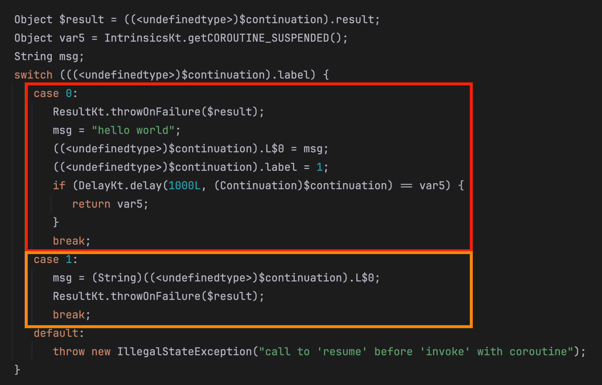

위 그림을 보면 중단되는 포인트(suspension point)마다 label을 통해 case로 나누고 해당 케이스마다 결과값들을 continuation에 저장하여 상태관리하는 것을 확인할 수 있습니다.

그렇다면 이렇게 만들어진 함수는 continuation에서 어떻게 호출되는지를 Continuation 의 구현체인 BaseContinuationImpl의 resumeWith로 살펴보겠습니다.


invokeSuspend 함수 호출부가 바로 앞서 만들었던 makeHelloWorld 함수를 호출하는 부분입니다. 해당 함수의 리턴 값이 COROUTINE_SUSPENDED라면 해당 함수를 return해버립니다. 즉, 중단지점이 없는 경우라면 while문의 반복으로 앞선 switch case문들이 계속 돌아가면서 타겟함수의 수행이 완료되는 것이고, 중단지점이 존재한다면 COROUTINE_SUSPENDED를 리턴 받으면서  특정 switch문까지만 진행되고 일시중지되었다가 해당 작업이 완료되면 코루틴 프레임워크에 의해 자동으로 resumeWith가 호출되면서 다시 작업이 이어지는 것입니다.


</details>

-----------------------


<Br>

### OOP(객체 지향 프로그래밍) 특징

<details>
   <summary> 예비 답안 보기 (👈 Click)</summary>
<br />

-----------------------

객체 지향 프로그래밍이란 __프로그램 구현에 필요한 객체를 파악하고 객체들 간의 상호작용을 통해 프로그램을 만드는 것__ 을 말한다.

+ 캡슐화
    - 정보 은닉 : 필요 없는 정보는 외부에서 접근하지 못하도록 제한
    - 높은 응집도, 낮은 결합도로 유연함과 유지보수성 증가
+ 추상화
    - 사물들의 공통적인 특징을 파악해서 하나의 개념(집합)으로 다루는 것    
    - 목적과 관련이 없는 부분을 제거하여 필요한 부분만을 표현하기 위한 개념
+ 상속
    - 기존 상위클래스에 근거하여 새롭게 클래스와 행위를 정의할 수 있게 도와주는 개념
+ 다형성
    - __형태가 같은데 다른 기능을 하는 것을 의미__
    - 오버라이딩, 오버로딩

</details>

-----------------------

<br>

### OOP(객체 지향 프로그래밍) SOLID 원칙

<details>
   <summary> 예비 답안 보기 (👈 Click)</summary>
<br />

-----------------------

+ S : 단일 책임 원칙(Single Responsible Principle)
    - 객체는 단 하나의 책임만을 가져야한다.
    - 어떤 변화에 의해 클래스를 변경해야 하는 이유는 오직 하나뿐이어야 한다.
+ O : 개방 폐쇄 원칙(Open Closed Principle)
    - 기존 코드를 변경하지 않으면서 기능을 추가할 수 있도록 설계되어야 한다.
+ L : 리스코프 치환 원칙
    - 자식 클래스는 최소한 자신의 부모 클래스에서 가능한 행위는 수행할 수 있어야한다.
+ I : 인터페이스 분리 원칙
    - 특정 클라이언트를 위한 인터페이스 여러 개가 범용 인터페이스 하나보다 낫다.
    - 인터페이스가 명확해지고, 대체 가능성이 높아진다.
+ D : 의존관계 역전 원칙 (Dependency Inversion Principle)
    - 의존 관계를 맺을 때 변화하기 쉬운 것 또는 자주 변화하는 것보다는 변화하기 어려운 것, 거의 변화가 없는 것에 의존하라는 것이다.
    - 쉽게 이야기하면, 구현 클래스에 의존하지 말고, 인터페이스에 의존하라는 뜻

</details>

-----------------------


<br>

### JVM 실행과정

<details>
   <summary> 예비 답안 보기 (👈 Click)</summary>
<br />

-----------------------

1. JVM은 OS로부터 메모리(Runtime Data Area)를 할당 받음
2. 컴파일러(javac)가 소스코드(.java)를 읽어 바이트 코드(.class)로 변환
3. Class Loader를 통해 Class파일을 JVM내 Runtime Data Area로 로딩
4. 로딩된 Class 파일을 Execution Engine을 통해 해석 및 실행


</details>

-----------------------

<br>

### JVM 메모리(Runtime Data Area) 구조

<details>
   <summary> 예비 답안 보기 (👈 Click)</summary>
<br />

-----------------------

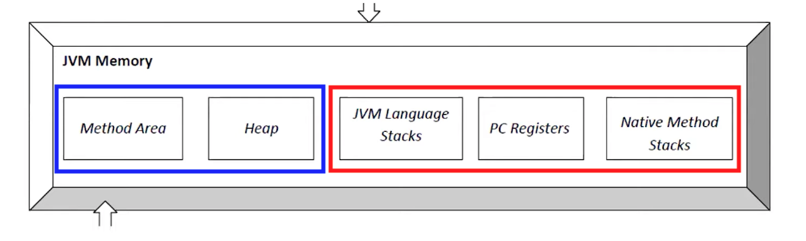  
+ 메서드(static) 영역
    - 클래스가 사용되면 해당 클래스의 파일(.class)을 읽어들여, 클래스에 대한 정보(바이트 코드)를 메서드 영역에 저장
    - 클래스와 인터페이스, 메서드, 필드, static 변수, final 변수 등이 저장되는 영역입니다.
+ JVM 힙 영역
    - 런타임 시 동적으로 할당하여 사용하는 영역
    - new 연산자로 생성된 객체와 배열 저장
    - 참조가 없는 객체는 GC(가비지 컬렉터)의 대상
+ JVM 스택 영역
    - 스레드마다 존재하여 스레드가 시작할 때마다 할당
    - 지역변수, 매개변수, 연산 중 발생하는 임시 데이터 저장
    - 메서드 호출 시마다 개별적 스택 생성

+ pc register
    - 쓰레드가 현재 실행할 스택 프레임의 주소를 저장
+ Native Method Stack
    - C/C++ 등의 Low level 코드를 실행하는 스택

</details>

-----------------------

<br>


### 가비지 컬렉터

<details>
   <summary> 예비 답안 보기 (👈 Click)</summary>
<br />

-----------------------

### 요약

+ 가비지 컬렉터는 동적으로 할당한 메로리 영역 중 사용하지 않는 영역을 탐지하여 해제하는 역할
+ 자바 가비지 컬렉터는 Mark And Sweep 알고리즘을 사용
    - Java8 : Parallel GC 사용
    - Java9 이상 : G1 GC 사용

__동작 과정__
1. 새로운 객체 생성은 Heap의 Eden 영역에 저장
2. Eden 영역이 꽉차면 Minor GC가 수행되고, Reachable 객체는 Survival 0 영역으로 이동과 동시에 age-bit 1 상승
3. 2번 과정이 반복되면서 Survival 1 -> 0 -> 1 이동이 반복
4. age-bit가 일정 값 이상이 되면 해당 객체에 대해 promotion 과정이 진행되어 Old Generation 영역으로 이동
5. Old Generation 영역이 꽉차면 Major GC가 발생


<br>

### 자세한 설명
가비지 컬렉터는 __동적으로 할당한 메로리 영역 중 사용하지 않는 영역을 탐지하여 해제하는 역할__ 을 합니다.  
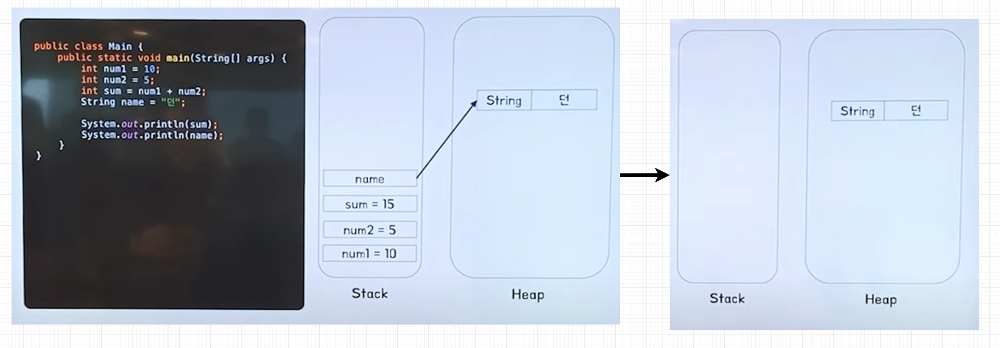  
메인 메서드가 실행되면 스택에 num1, num2, sum 값이 쌓이게 되고, name은 Heap 영역에 쌓이고 스택에서는 이를 참조합니다.  
메인 메서드가 끝나게 되면 스택이 전부 pop되고 Heap 영역에 객체 타입의 데이터만 남게 됩니다.  
이런 객체를 __Unreachable Object__ 라고 표현하고 __가비지 컬렉터의 대상__ 이 됩니다.
이런 자원을 해제하여 메모리의 누수를 방지합니다.

#### 언제 수행되는가?
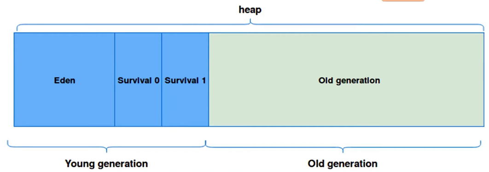
위 그림은 JVM의 Heap 영역 구성입니다.  
JVM의 Heap 영역은 크게 __Young Generation과 Old Generation__ 으로 나뉩니다.  
Young Generation에서 발생하는 GC는 __Minor GC__ , Old Generation에서 발생하는 GC는 __Major GC__ 라고 부릅니다. young과 old가 모두 꽉차면 Full GC(minor GC + Major GC)가 발생합니다.  
Young Generation은 __Eden, Survival 0, Survival 1__ 영역으로 나뉩니다.
+ Eden
    - 새롭게 생성된 객체들이 할당되는 영역
+ Servival 0, 1
    - Minor GC로부터 살아남은 객체들이 존재하는 영역
    - 0 또는 1 둘중 하나는 반드시 비어있어햐 합니다.
    - 둘로 나눠져 있는 이유는 __메모리의 단편화__ 를 막기 위해서 입니다.


구성을 살펴보았으니 이제 어떻게 언제 수행되고 어떻게 동작하는지 순서대로 보겠습니다.  
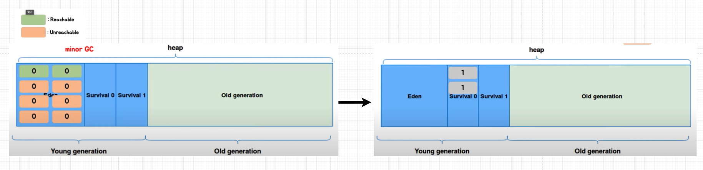
새로운 객체가 계속 생성되다가 Eden 영역이 꽉차는 순간 Minor GC가 발생합니다.  
mark and sweep이 진행되고 Unreachable은 해제되고 Reachable이라고 판단되는 객체들은 Survival 0 역역으로 옮겨지면서 age-bit가 0에서 1로 증가합니다. age-bit는 Minor GC에서 살아남을 때마다 1씩 증가합니다.

<br><Br>

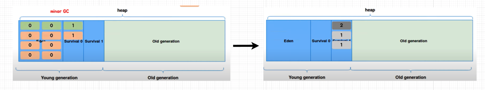  
시간이 지나 Eden 영역이 꽉차게 되면 다시 Minor GC가 발생합니다.  
이번에는 Reachable이라고 판단된 객체들이 Survival 1 영역으로 이동합니다.
<br><br>

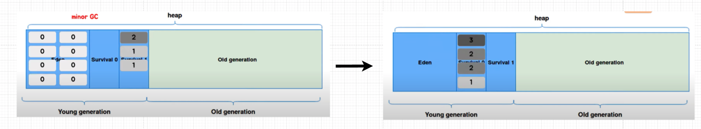
시간이 지나 Eden 영역이 꽉차게 되면 다시 Minor GC가 발생합니다.  
이번에는 Reachable이라고 판단된 객체들이 Survival 0 영역으로 이동합니다.  
<br><Br>

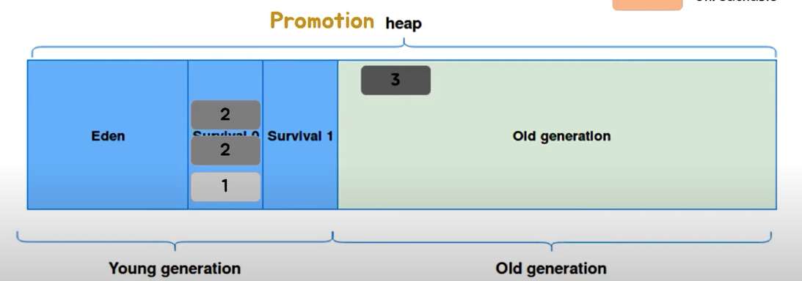  
JVM GC에서는 일정 수준의 age-bit를 넘어가면 오래도록 참조될 객체라고 판단하여 해당 객체를 Old Generation으로 넘겨주는데 이 과정을 __Promotion__ 이라고 합니다.  
java8 Parallel GC 사용 기준 age-bit가 15가 되면 promotion이 진행됩니다.  
<br><Br>

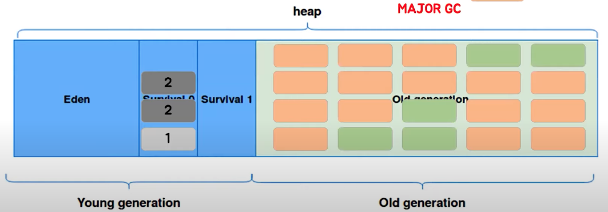
언젠가 Old Generation 영역이 꽉차게되면 이때는 __Major GC__ 가 발생합니다.  
Mark And Sweep 방식을 통해 필요없는 메모리를 비워줍니다.  
Major GC는 Minor GC보다 더 오래 걸립니다.


### Young Generation과 Old Generation
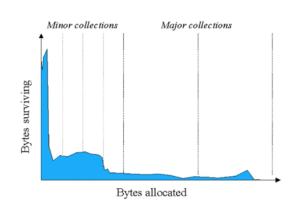
heap 영역을 두 영역으로 나눈데는 이유가 있습니다.  
GC 개발자들이 애플리케이션을 분석해보니 대부분의 객체들의 수명이 짧다는 것을 확인했습니다.  
GC도 결국 비용이므로 메모리의 특정 부분만을 탐색하여 해제하면 효율적이기 때문에 Young Generation에서 최대한 처리하도록 나눴다고 합니다.

#### 어떻게 애플리케이션과 병행되는가?
---
+ Stop The World
    - GC를 실행하기 위해 JVM이 애플리케이션 실행을 멈추는 것을 의미합니다.
    - 모든 GC는 STW를 발생시키는데 Minor GC는 객체의 수명이 짧고 많은 객체를 검사하지 않기 때문에 매우 빨라 애플리케이션에 거의 영향을 주지 않습니다. __반면에 Major GC의 경우 살아있는 모든 객체를 검사해야 하기 때문에 오랜 시간이 걸립니다.__

### Parallel GC
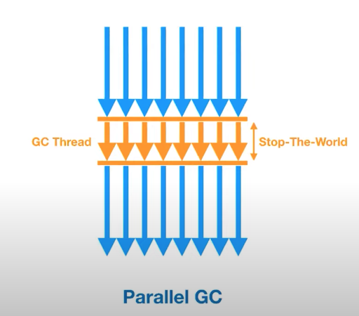  
__Parallel GC는 여러 개의 쓰레드로 GC를 실행하는 방식입니다.__  
여러 개의 쓰레드를 사용하므로 Stop The World 시간이 짧아지고, 멀티 코어 환경에서 애플리케이션 처리 속도를 향상시키기 위해 사용됩니다.  
Java 8에서 기본으로 사용되는 방식입니다.

### G1 GC
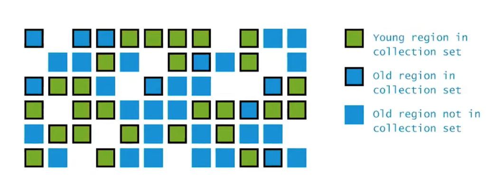
G1는 Garbage First의 줄임말으로 Heap을 일정 크기의 Region으로 나눠서 어떤 영역은 Young Generation, 어떤 영역은 Old Generation으로 활용합니다.  
런타임에 G1 GC가 필요에 따라 영역별 Region 개수를 튜닝합니다.  
이에 따라 Stop The World를 최소화 할수 있게 되어 __Java9 이상부터는 G1 GC를 기본 GC를 기본 실행방식__ 으로 사용합니다.


</details>

-----------------------

<br>


### 접근 제한자

<details>
   <summary> 예비 답안 보기 (👈 Click)</summary>
<br />

-----------------------

+ public : 접근에 제한이 없음
+ private : 자기 자신 클래스 내에서만 접근 가능
+ default : 동일한 패키지 내에서만 접근 가능
+ protected : 동일한 패키지 내에서만 접근 가능 + 상속을 이용한 접근 가능

</details>

-----------------------

<br>

### String vs Char

<details>
   <summary> 예비 답안 보기 (👈 Click)</summary>
<br />

-----------------------

Char은 내용물이 1개인 문자로 제한되는 반면에 String은 문자열을 담을 수 있다.  
Char의 경우 변수 안에 직접적으로 문자를 가지고 있지만 String은 reference 타입으로 실질적인 문자열이 아니라 주소값을 가지고 있다.  
이 때문에 비교 방식에 차이가 있다.  
Char의 경우 값이 같다면 ==(동일성) 비교를 사용할 수 있지만, String의 경우 내용이 같더라도 생성되는 주소가 다르기 때문에 == 비교를 사용하면 다른 결과가 나오게 되고 equals를 사용해야 한다.

</details>

-----------------------

<br>

### ==과 equals

<details>
   <summary> 예비 답안 보기 (👈 Click)</summary>
<br />

-----------------------


+ == (kotlin에서 ===)
    - 참조 비교로 두 객체가 같은 메모리 공간을 가리키는지 확인
+ equals (kotlin에서 ==)
    - 기본적으로 object에 정의된 equals는 == 와 동일하게 참조값을 비교한다. 하지만 대부분 재정의하여 객체의 내부 값(상태)를 비교하는 용도로 사용된다.
    - 두 객체의 내부 값이 같은지 내용을 비교한다.
    - 기본 타입(Primitive Type)에 대해서는 적용할 수 없다.
    - 객체 비교시 override해서 원하는 방식으로 수정할 수 있다.


</details>

-----------------------

<br>


### 데이터 타입

<details>
   <summary> 예비 답안 보기 (👈 Click)</summary>
<br />

-----------------------

+ Value Type
    - __기본 Primitive 타입으로 int, char 등이 있다.__
    - 기본 타입의 크기가 작고 고정적이기 때문에 __메모리 Stack 영역__ 에 저장된다.
    - 정수형 : byte, short, int, long
    - 실수형 : float, double
    - 논리형 : boolean
    - 문자형 : char
+ 참조 타입(Reference Type)
    - __기본형을 제외하고는 모두 참조형이다.__
    - String과 박싱 타입인 Integer 등이 있다.
    - 참조 타입은 데이터의 크기가 가변적이고, 동적이므로 __Heap 영역__ 에서 관리된다.
    - __데이터는 Heap 영역에서 관리되지만 메모리의 주소값은 Stack 영역에 담긴다.__
    - new 키워드를 이용해 객체를 생성하여 데이터가 생성된 __주소를 참조하는 타입__     
    - String과 배열은 일반적인 참조 타입과 달리 new 없이 생성 가능하지만 참조타입이다.
    - 더이상 참조하는 변수가 없을 때 GC에 의해 삭제된다.


</details>

-----------------------

<br>


### Call By Value와 Call By Reference

<details>
   <summary> 예비 답안 보기 (👈 Click)</summary>
<br />

-----------------------
+ Call By Value(값에 의한 호출)
    - 함수 호출 시 인자로 전달되는 __변수의 값을 복사하여 함수의 인자로 전달__ 한다.
    - 따라서, __함수 안에서 인자의 값이 변경되어도, 외부의 변수의 값은 변경되지 않는다.__
+ Call by Reference(참조에 의한 호출)
    - __함수 호출 시 인자로 전달되는 변수의 레퍼런스를 전달한다.__
    - 따라서 __함수 안에서 인자의 값이 변경되면, 인자로 전달된 변수의 값도 함께 변경된다.__

자바는 새롭게 지역 변수(다른 주소)를 만들어서 값만 복사하고 할당한다. 따라서 자바는 Call By Value에 해당한다.  

</details>

-----------------------

<br>


### hashcode

<details>
   <summary> 예비 답안 보기 (👈 Click)</summary>
<br />

-----------------------


__객체를 식별하는 정수값을 의미한다.(고유하지 않다.)__  
해시 기반 컬렉션(HashMap, HashSet)에서 빠르게 찾기 위해 사용되며 다음과 같이 동작한다.  

1. hashCode를 통해 비교한다. 다르면 서로 다른 객체다. 
2. hashCode가 같다면 equals로 
3. 두 객체가 동일하지 않다면 반드시 다른 hashCode값을 가질 필요는 없지만 가능한 다른 값을 가지는 것이 좋다.


> 현대 시대에서 대부분 사용하는 64비트 컴퓨터에서 돌아가는 JVM(가상머신)은 기본적으로 8바이트(64bit) 주소체계를 기본으로 하는데, 만일 8바이트의 주소값을 hashCode를 이용해 반환하면 메서드의 타입에 따라 4바이트(32bit)로 강제 캐스팅(long → int)이 되기 때문에 값이 겹칠수도 있다는 케이스가 존재하게 된다. (이를 Hash Collisions 해시충돌이라 일컫는다) 그렇다면 hashCode 메서드의 반환 타입을 long 타입으로 반환되게 메소드를 업그레이드 하지 않은 이유는, 기존에 int 타입형 메서드로서 여러 프로젝트에서 사용되고 있기 때문에 어쩔수 없이 호환성을 위해서 놔둔것으로 보면 된다.

</details>

-----------------------

<br>

### Wrapper class

<details>
   <summary> 예비 답안 보기 (👈 Click)</summary>
<br />

-----------------------

프로그램에 따라 기본 타입의 데이터를 객체로 취급해야하는 경우가 있다.  
예를 들어, 메서드의 인수로 객체 타입만이 요구된다면, 기본 타입의 데이터를 그대로 사용할 수는 없다.  
이때 기본 타입의 데이터를 먼저 객체로 변환 후 작업을 수행해야 한다.  
__래퍼 클래스(Wrapper class)는 산술 연산을 위해 정의된 클래스가 아니므로, 인스턴스에 저장된 값을 변경할 수 없다.__  

기본 타입|래퍼 클래스
---|---
byte|Byte
short|Short
int|Integer
long|Long
float|Float
double|Double
char|Character
boolean|Boolean

래퍼 클래스는 각각 타입에 해당하는 데이터를 인수로 전달받아, 해당 값을 가지는 객체로 만들어준다.
**primitive와 래퍼 타입의 가장 큰 차이점은 래퍼 타입은 null을 허용한다는 것과 비교시에 equals를 사용해야된다는 점이다.**


wrapper 클래스의 경우 박싱과 언방싱 과정에서의 성능을 최적화하고 메모리 사용을 줄이기 위해 특정 값들을 미리 캐싱한다. 대표적으로 Integer의 경우 -128에서 127 사이의 값들을 캐싱하여 재사용한다.
```java
public class IntegerCachingExample {
    public static void main(String[] args) {
        Integer a = 100;
        Integer b = 100;
        Integer c = 200;
        Integer d = 200;

        System.out.println(a == b); // 출력: true (캐싱된 객체를 재사용)
        System.out.println(c == d); // 출력: false (새로운 객체를 생성)
    }
}
```

</details>

-----------------------

<br>


### 박싱, 언방식

<details>
   <summary> 예비 답안 보기 (👈 Click)</summary>
<br />

-----------------------


래퍼 클래스는 산술 연산을 위해 정의된 클래스가 아니므로, __인스턴스에 저장된 값을 변경할 수 없다.__  
단지, 값을 참조하기 위해 새로운 인스턴스를 생성하고, 생성된 인스턴스의 값만을 참조할 수 있다.  
기본 타입을 래퍼클래스의 인스턴스로 변환하는 과정을 __박싱__, 래퍼클래스의 인스턴스에 저장된 값을 다시 기본 타입으로 꺼내는 과정은 __언방식__ 이라고 한다.
```java
Integer num = new Integer(17); // 박싱
int n = num.intValue();        // 언박싱
System.out.println(n); // 출력 값: 17


Character ch = 'X'; // Character ch = new Character('X'); : 오토박싱
char c = ch;        // char c = ch.charValue();           : 오토언박싱
System.out.println(c); // 출력 값: X
```
JDK1.5 부터는 위와 같이 자바 컴파일러가 알아서 언방식, 박싱 작업을 해준다.  

<br>

```java
public class Wrapper03 {
    public static void main(String[] args) {
      Integer num1 = new Integer(10);
      Integer num2 = new Integer(20);
      Integer num3 = new Integer(10);

      System.out.println(num1 < num2);       // true
      System.out.println(num1 == num3);      // false
      System.out.println(num1.equals(num3)); // true
    }
}
```
래퍼 클래스를 비교할 때는 ==를 사용하면 안되고, __equals 메서드를 사용해야 한다.__  
래퍼 클래스는 객체 이므로 주소값 비교가 아니라 내부 값을 비교하는 equals를 써야한다.  


</details>

-----------------------

<br>


### non-static vs static

<details>
   <summary> 예비 답안 보기 (👈 Click)</summary>
<br />

-----------------------


+ non-static
    - 공간적 특성
        - 객체마다 별도고 존재하고 인스턴스 변수라고 부른다.
    - 시간적 특성
        - 객체와 생명주기가 동일하다.
+ static
    - 공간적 특성
        - __클래스당 하나만 생성된다.__
        - __동일한 클래스의 모든 객체들에 의해 공유된다.__
    - 시간적 특성
        - 객체가 생기기 전에 이미 생성되어 객체를 생성하지 않아도 사용 가능하다.
        - 객체가 사라져도 사라지지 않는다.
        - 프로그램 종료시에 사라진다.

</details>

-----------------------

<br>


### main이 static인 이유

<details>
   <summary> 예비 답안 보기 (👈 Click)</summary>
<br />

-----------------------

__static 멤버는 프로그램 시작 시(클래스 로딩) 메모리에 로드되어 인스턴스를 생성하지 않아도 호출이 가능하기 때문이다.__  
+ 실행 과정
    - 코드를 실행하면 컴파일러가 .java를 .class 바이트 코드로 변환
    - 클래스 로더가 .class 파일을 메모리 영역에 로드
    - Runetime Data Area 중 Method Area(=Class area, Static area)라고 불리는 영역에 Class Variable이 저장되는데, static 변수도 여기에 포함
    - JVM은 Method Area에 로드된 main()을 싱행

</details>

-----------------------

<br>


### final vs finally vs finalize

<details>
   <summary> 예비 답안 보기 (👈 Click)</summary>
<br />

-----------------------

+ final 키워드
    - 변수, 메서드 클래스가 __변경 불가능__ 하도록 만든다.
    - 기본 타입 변수에 적용 시
        - 해당 변수의 값 변경 불가능하다.
    - 참조 변수에 적용 시
        - 참조 변수가 힙 내의 다른 객체를 가리키도록 변경할 수 없다.
    - 메서드에 적용 시
        - 해당 메서드를 오버라이드할 수 없다.(오버로딩은 가능)
    - 클래스에 적용 시        
        - 해당 클래스를 상속 받아서 사용할 수 없다.
+ finally 키워드
    - try catch 블록 뒤에서 항상 실행될 코드 블록을 정의하기 위해 사용한다.
+ finalize 메서드
    - 가비지 컬렉터가 더 이상의 참조가 존재하지 않는 객체를 메모리에서 삭제하겠다고 결정하는 순간 호출된다.

</details>

-----------------------

<br>

### try with resources 

<details>
   <summary> 예비 답안 보기 (👈 Click)</summary>
<br />

-----------------------

자바 7 이전에는 try-catch-finally에서는 리로스의 생성을 try 구문에서 리소스의 반납은 finally 구문에서 하다보니 실수의 발생 여지가 있었다.  
자바 7 이후에는 try with resources 구문이 나오게 됬는데 try 옆 괄호 안에서 리소스를 생성해주면 따로 반납하지 않아도 리로스를 자동으로 반납해주게 된다.  
아래와 같이 작성한 것이 try with resources 구문이고, 만약 try-catch-finally를 사용했다면 finally 구문에서 scanner을 close하는 내용이 있어야 한다.
```java
public class ResourceClose {
    public static void main(String[] args) {
        try (Scanner scanner = new Scanner(new File("input.txt"))) {
            System.out.println(scanner.nextLine());
        } catch (FileNotFoundException e) {
            e.printStackTrace();
        }
    }
}
```


</details>

-----------------------

<br>


### 제네릭(kotlin)

<details>
   <summary> 예비 답안 보기 (👈 Click)</summary>
<br />

-----------------------

+ 클래스나 메서드에서 사용할 내부 데이터 타입을 외부에서 지정하는 기법
+ 잘못된 타입이 들어올 수 있는 것을 컴파일 단계에서 방지할 수 있다.
+ 불필요한 타입 변환을 제거할 수 있다.

```kotlin
interface Hello<T> {
  fun hello(): T
}

class Processor<T> {
  fun process(value: T) {}
}

class Box<T> where T : Fruit, T: Red

// 타입 파라미터의 상한 타입(upper bound)를 Animal으로 정하였다.
fun <T: Animal> bark(animal: T) {}
```
마지막 함수처럼 제네릭에 `T: Animal`을 명시한다면 T 타입은 Animal 타입이거나 그 하위 타입만을 허용한다. 만약 제네릭 T에 여러가지 상한을 주고 싶다면 `where`로 명시할 수 있다.

<br>


#### 공변성, 반공변성, 무공변성
* 공변성(out) : 기본적인 객체 타입은 상하관계(공변성)을 가지고 있다. 반공변성(in)은 상하관계의 역방향을 의미한다.
  * 공변성은 다음과 같은 일반적인 관계가 성립함을 의미한다. 
    * `Object > Number > Integer`
    * `Collection<Integer> > List<Integer> > ArrayList<Integer>`
* 무변성 : 제네릭은 상하관계가 성립하지 않는다.
  * 제네릭의 경우에는 컬렉션의 타입값만 때놓고 봤을때 상하관계(공변성)을 가지고 있다고 하더라도 다음과 같은 관계는 성립되지 않는다. 
    * `List<Object> > List<Number> > List<Integer>`

제네릭의 경우 무공변성이므로 공변성, 반공변성을 주기 위해 한정자를 사용한다. 

```kotlin
class Box<out T>(val value: T)

fun main() {
    val stringBox: Box<String> = Box("Hello")
    val anyBox: Box<Any> = stringBox // 공변성: Box<String>은 Box<Any>의 서브타입
  println(anyBox.value)  // Hello
}
```
제네릭은 무공변성이므로 위 코드에서 out을 제거하면 anyBox 부분에서 컴파일 에러가 발생한다. Box<String> 타입은 Box<Any>의 하위 타입이 아니기 때문이다. 하지만 out 키워드를 사용하므로서 공변성이 생기게 된다.

```kotlin
class Consumer<in T> {
  fun consume(item: T) {
    println(item)
  }
}

fun main() {
  val anyConsumer: Consumer<Any> = Consumer<Any>()
  val stringConsumer: Consumer<String> = anyConsumer // 반공변성: Consumer<Any>는 Consumer<String>의 서브타입
  stringConsumer.consume("Hello")  // Hello
}
```
이것도 마찬가지로 in이 없었다면 stringConsumer 라인에서 컴파일 에러가 발생한다. 하지만 in 키워드를 사용하므로서 반공변성이 생긴다.

참고로 out, in 한정자는 기본적으로 함수의 제네릭에는 사용할 수 없고 클래스나 인터페이스의 제네릭에 사용할 수 있다. 하지만 함수의 파라미터로 제네릭 타입을 받는 타입이 온다면 이에 대해서는 한정자를 허용한다.
```kotlin
// 불가능
fun <in T> addItem(item: T) {}

// 가능
fun <T> addItem(list: MutableList<in T>) {
  list.add(item)
}
```

<br>

그렇다면 in과 out은 어떨때 사용할까?

컬렉션의 제네릭이 out E 인경우, 해당 컬렉션은 읽기만(꺼낼수만) 가능하다.컬렉션의 값을 읽을때는 이미 E타입인 것을 추론 가능하지만, 해당 컬렉션에 값을 넣을때는 이미 컬렉션에 어떤 타입이 들어가있는지 알 수 없기 때문에 값을 넣을 수 없다. 그래서 주로 읽기 전용 컬렉션이나 생산자(producer)에서 사용되고 해당 타입은 리턴 타입으로 사용된다.

```kotlin
public interface List<out E> : Collection<E> {}
```


반면에 in은 해당 타입 파라미터가 입력 타입으로(쓰기 전용) 사용될 수 있음을 의미합니다.
```kotlin
class Consumer<in T> {
    fun consume(item: T) {
        println("Consumed: $item")
    }
}
```

#### star projection 
제네릭 타입 파라미터를 알 수 없거나 특정하지 않을 때 제네릭 타입을 다루는 방법으로 *를 사용한다.(java에서는 ?)

```kotlin
// 타입이 영원히 결정되지 못하므로 error
val arrayList = arrayListOf<*>()

// 어떤 타입으로 초기화될지 알 수 없으므로 error
fun acceptStarList(list: ArrayList<*>) {
  list.add("문자열") // error!
  list.add(1)      // error!
}

// 어떤 타입이든 받아서 메서드안에서는 꺼내서 사용할 수 있지만 
// 해당 리스트의 인자가 어떤 타입인지 알 수가 없기 때문에 인자를 추가할 수는 없다. 
// 오로지 null만 삽입 가능 => <*>와 <Any> 는 다른것
fun acceptStarList(list: List<*>) {
  if (list.isNotEmpty()) {
    val item = list.get(0) // IDE가 item을 Any? 타입으로 추정
  }
}
```


#### type erase & reified
제네릭은 컴파일 후 런타임에는 삭제 되기때문에 제네릭 타입에 접근 할수 없다. 함수 내에서 해당 제네릭 타입을 사용하기 위해서는 함수의 매개변수로 제네릭 타입을 전달해야만 사용할 수 있다. 하지만 코틀린에서는 reified로 타입 매개변수 T를 지정하면 런타임에서도 접근 할 수 있다. reifeid 자료형은 인라인 함수에서만 사용할수 있습니다.

```kotlin
inline fun <reified T> fuc() {
    print(T::class)
}
```

</details>

-----------------------

<br>

    
    
### 직렬화와 역직렬화

<details>
   <summary> 예비 답안 보기 (👈 Click)</summary>
<br />

-----------------------

+ 직렬화
    - __자바 시스템 내부에서 사용되는 객체 또는 데이터를 외부의 자바 시스템에서도 사용할 수 있도록 바이트 형태로 데이터를 변환하는 기술__
    - 조건
        - 자바 기본 타입
        - Serializable 인터페이스 상속받은 객체
    - ObjectOutputStream 객체를 이용
+ 역직렬화
    - 바이트로 변환된 데이터를 다시 객체로 변환하는 기술
    - ObjectInputStream 객체를 이용

</details>

-----------------------

<br>


### 오버로딩, 오버라이딩

<details>
   <summary> 예비 답안 보기 (👈 Click)</summary>
<br />

-----------------------

+ 오버로딩
    - 두 메서드가 같은 이름을 갖고 있으나 인자의 수나 자료형이 다른 경우
+ 오버라이딩
    - 하위 클래스에서 상위 클래스의 메서드와 일치하는 함수를 재정의하는 것

</details>

-----------------------

<br>


### 추상 클래스와 인터페이스 차이

<details>
   <summary> 예비 답안 보기 (👈 Click)</summary>
<br />

-----------------------

실질 코드 관점에서 본다면 추상 클래스와 인터페이스 모두 구현을 강제하지만 추상 클래스의 추상 메서드는 default를 제공할 수 없고 인터페이스는 default를 제공할 수 있다.
논리적인 관점으로 본다면 추상 클래스와 인터페이스 모두 다형성을 구현하기 위한 방법 중 하나이며, 추상 클래스는 상속을 통해 구현하기 때문에 더 엄격한 계층구조를 나타내기 위해서 사용한다.(상속은 한개만 가능)
반면에 인터페이스의 경우, 여러 개를 구현할 수 있기 때문에 조금 더 유연하게 다형성을 구현하는 방법이다.

</details>

-----------------------

<br>

### Error, Exception


<details>
   <summary> 예비 답안 보기 (👈 Click)</summary>
<br />

-----------------------

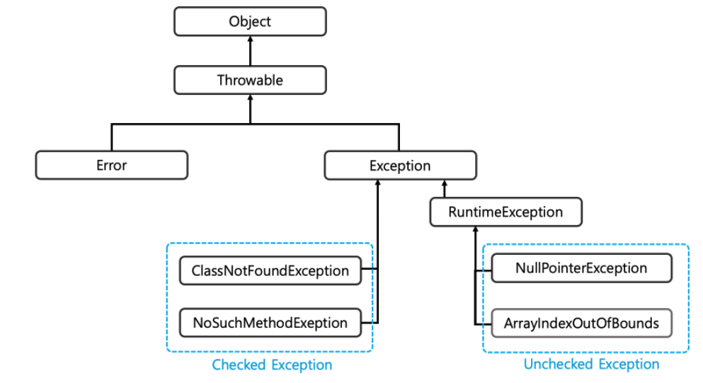  

목록|Error|Exception
---|---|---
패키지|java.lang.error|java.lang.exception
발생 시점|런타임에서 발생, 컴파일 시점에서 알 수 없다.|Checked Exception은 컴파일 시점에, Unchcked Exception은 런티림 시점에 알 수 있다.
복구|에러는 복구 불가능|try catch 블락을 이용하여 복구 가능
타입|모든 Error는 Unchecked Type|checked Type, Unchecked Type으로 분류
예시|OutOfMemory, StackOverFlow|아래서 설명


</details>

-----------------------

<br>


### Checked Exception, Unchecked Exception


<details>
   <summary> 예비 답안 보기 (👈 Click)</summary>
<br />

-----------------------


구분|Checked Exception|Unchecked Exception
---|---|---
상속|RuntimeException 상속 X| RuntimeException 상속
확인 시점|컴파일 시점|런타임 시점
처리 여부|반드시 예외처리|명시적으로 하지 않아도 됨
트랜잭션 처리|예외 발생시 롤백 X|예외 발생시 롤백 해야함
종류|IOException,SQLException..|NullPointException,ArrayIndexOutOfBounds...

대부분 Checked Exception보다는 Unchecked Exception 사용을 권장한다.  
Checked Exception의 경우 사용하는 모든 곳에 throws를 남겨야하는데 이 문제는 의존성 문제를 야기한다.  
예를 들어 가장 하위에서 SQLException(Checked Exception)를 던진다고 해보자.  
그럼 상위 서비스, 컨트롤러도 SQLException을 처리하기 위해서 throws SQLException을 붙이게 된다.  
SQLException은 JDBC 기술이므로 service, controller는 JDBC에 의존하게 된다.  
결국 JDBC 기술을 다른 기술로 교체하게 되면 연결된 모든 것들을 전부 교체해야하는 문제가 생긴다.  

</details>

-----------------------

<br>

### Java Collections

<details>
   <summary> 예비 답안 보기 (👈 Click)</summary>
<br />

-----------------------

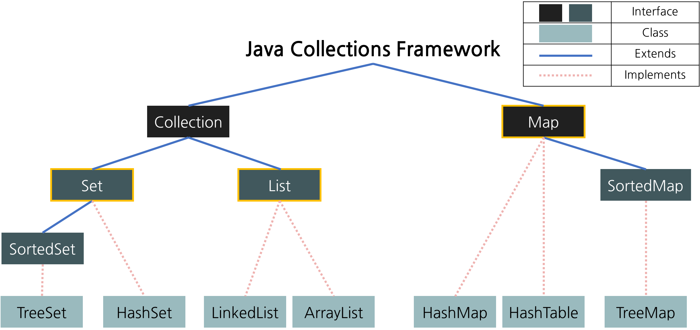


__Set과 List는 Collection 인터페이스를 구현하고 있고 Map은 인터페이스를 구현하고 있지 않다.__
+ Map   
    - Key와 Value의 형태로 이루어진 데이터 집합
    - 순서를 보장하지 않는다.
    - Key는 중복이 허용되지 않고, Value는 중복을 허용한다.
+ Collection을 상속한 것들
    - List
        - 순서가 있는 데이터 집합
        - 데이터를 중복해서 포함시킬 수 있다.
    - Set
        - 데이터의 중복을 허용하지 않는 데이터 집합
        - 순서를 보장하지 않는다.
        - Value의 중복을 허용하지 않는다.


<br>

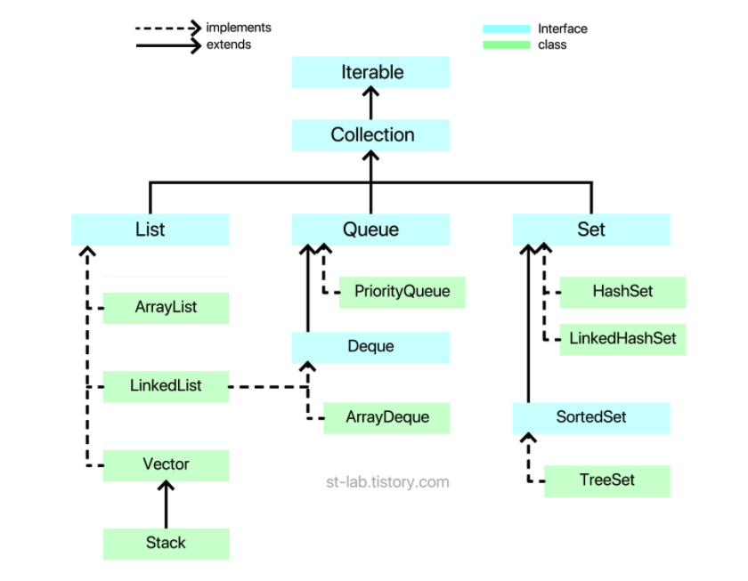
Collection 인터페이스 위에는 Iterable이라는 인터페이스가 있고 이 인터페이스는 iterator 라는 추상 메서드를 갖고 있다. 


</details>

-----------------------

<br>


#### Map

<details>
   <summary> 예비 답안 보기 (👈 Click)</summary>
<br />

-----------------------


+ HashMap    
    - 내부 hash값에 따라 키순서가 정해지므로 특정 규칙없이 출력된다.
    - key와 value에 __null값을 허용__ 한다.
    - 비동기 처리
+ LinkedHashMap    
    - 입력 순서대로 출력된다.
    - 비동기 처리
+ TreeMap
    - 내부적으로 __레드-블랙 트리(균형 이진 탐색 트리)__ 로 저장된다.
    - __Null값 비허용__
    - 키값이 기본적으로 __오름차순 정렬__ 되어 출력된다.
    - Compartor 구현으로 정렬 방법을 지정할 수 있다.
+ ConCurrentHashMap
    - key,value에 null값 비허용
    - __쓰기작업에서만 동기 처리__
+ HashTable
    - key,value에 null값 비허용
    - __모든 작업에 동기 처리__

</details>

-----------------------

<br>


#### Set

<details>
   <summary> 예비 답안 보기 (👈 Click)</summary>
<br />

-----------------------

+ HashSet
    - 저장 순서를 유지하지 않는 데이터의 집합
    - Null 저장 가능
    - 해시 알고리즘을 사용하여 검색속도가 매우 빠르다.
    - 내부적으로 HashMap 인스턴스를 이용하여 요소를 저장한다.
+ LinkedHashSet
    - 저장 순서를 유지하는 HashSet
+ TreeSet
    - 데이터가 정렬된 상태로 저장되는 이진 탐색 트리의 형태로 요소를 저장한다.
    - __Null 저장 불가능__
    - __레드 블랙 트리(균형 이진 탐색 트리)__ 로 구현되어 있다.
    - Compartor 구현으로 정렬 방법을 지정할 수 있다.

</details>

-----------------------

<br>


#### List


<details>
   <summary> 예비 답안 보기 (👈 Click)</summary>
<br />

-----------------------

+ ArrayList
    - 내부적으로 배열을 사용하는 자료구조로 메모리가 연속적으로 배치된다.
    - 배열과 달리 메모리 할당이 동적이다.
    - 데이터 삽입, 삭제 시 해당 데이터 이후 모든 데이터가 복사되므로 빈번한 삭제, 삽입이 일어나는 경우에는 부적합하다.
    - 검색의 경우는 인덱스의 데이터를 가져오면 되므로 빠르다.
    - __재할당 시 크기의 절반씩 증가한다.__
+ LinkedList
    - 양방향 포인터 구조로 각 노드가 데이터와 포인터를 가지고 한 줄로 연결되어 있는 방식으로 데이터를 저장하는 자료 구조
    - 데이터의 삽입, 삭제 시 해당 노드의 주소지만 바꾸면 되므로 삽입, 삭제가 빈번한 데이터에 적합하다.
    - 메모리가 불연속적이다.
    - 데이터 검색 시 처음부터 순회하므로 검색에는 부적합하다.
    - 스택, 큐, 양방향 큐를 만들기 위한 용도로 사용한다.
    - 양옆의 정보만을 갖고 있기 때문에 순차적으로 검색을 진행하여 검색 속도가 느리다.
+ Vector
    - 내부에서 자동으로 동기처리가 일어난다.
    - 성능이 좋지 않아 잘 사용하지 않는다.
    - __재할당 시 크기의 두 배로 증가한다.__
+ Stack
    - new 키워드로 직접 사용 가능
    - Vector를 상속받아 동기 처리


#### cf) 배열과 리스트는 다른 것
보통 둘의 차이를 비교할때는 배열과 링크드 리스트를 비교한다.

* 배열
  * 연속적인 메모리 공간에 할당되므로 인덱스를 통한 빠른 접근, 삽입과 삭제에서는 요소를 미는 등의 작업 때문에 삽입 삭제에는 느림
  * 크기가 고정
* 링크드 리스트
  * 비연속적인 메모리 공간에 할당되므로 비교적 느린 접근, 삽입과 삭제에서는 노드한 마나 추가해서 연결해주면 되기 때문에 비교적 빠름.
  * 크기가 가변


</details>

-----------------------

<br>


### String, StringBuilder, StringBuffer


<details>
   <summary> 예비 답안 보기 (👈 Click)</summary>
<br />

-----------------------

+ String
    - __새로운 값을 할당할 때마다 새로운 클래스에 대한 객체가 생성__
    - String에 저장되는 문자열은 private final char[] 형태이므로 변경할 수 없다.
    - String + String + String..
        - 가비지 컬렉터가 호출되기 전까지 생성된 String 객체들은 Heap에 머물기 때문에 메모리 관리에서 치명적이다.
+ StringBuilder
    - 메모리에 append하는 방식으로 클래스에 대한 객체를 생성하지 않는다.
    - 비동기 처리
+ StringBuffer
    - 메모리에 append하는 방식으로 클래스에 대한 객체를 생성하지 않는다.
    - 동기 처리

</details>

-----------------------

<br>


### String new와 ""의 차이

<details>
   <summary> 예비 답안 보기 (👈 Click)</summary>
<br />

-----------------------

new 는 계속 새로운 객체를 생성해내는 반면에 ""의 경우는 이미 존재하는 String 값이라면 같은 래퍼런스를 참조한다.  

</details>

-----------------------


<br>

### Sync(동기) vs Async(비동기)

<details>
   <summary> 예비 답안 보기 (👈 Click)</summary>
<br />

-----------------------


두 가지의 차이점은 __호출하는 함수가 호출되는 함수의 작업 완료 여부를 신경쓰는지 여부__ 에 차이가 있다.

* 동기 : 요청한 작업에 대해 완료 여부를 따져 순차적으로 처리한다.
* 비동기 : 요청한 작업에 대해 완료 여부를 따지지 않고 자기 작업을 그대로 처리한다.


</details>

-----------------------

<br>


### Blocking vs Non-Blocking

<details>
   <summary> 예비 답안 보기 (👈 Click)</summary>
<br />

-----------------------

두 가지의 차이점은 __작업의 차단 유무(제어권 유무)로 구분__ 할 수 있다.  

### Blocking
  


Blocking 자신의 작업을 진행하다가 다른 주체의 작업이 시작되면 __제어권을 다른 주체로 넘긴다.__  
따라서 자신은 제어권이 없기 때문에 실행할 수 없고, 다른 주체가 실행을 완료하고 제어권을 돌려줄 때까지 아무 작업도 할 수 없다.  

### Non-Blocking


Non-Blocking은 다른 주체의 작업에 __관련없이 자신이 제어권을 갖고 있다.__  
따라서, 자신은 계속 작업을 수행할 수 있다.  

</details>

-----------------------

<br>


### 리플렉션


<details>
   <summary> 예비 답안 보기 (👈 Click)</summary>
<br />

-----------------------


+ __런타임 상황에서 메모리에 올라간 클래스나 메서드등의 정의를 동적으로 찾아서 조작할 수 있는 기술__
+ 컴파일 시간이 아닐 실행 시간에 동적으로 특정 클래스의 정보를 객체화를 통해 분석 및 추출해낼 수 있는 프로그래밍 기법이다.
+ 자바에서 이미 로딩이 완료된 클래스에서 또 다른 클래스를 동적으로 로딩하여 생성자, 필드, 메서드 등을 사용할 수 있는 방식이다.  
+ 장점
    - 런타임 시점에 사용할 instance를 선택하고 동작시킬 수 있는 유연한 기능을 제공한다.
+ 단점
    - __컴파일 시점이 아니라 런타임 시점에서 오류를 잡기 때문에 컴파일 시점에 확인할 수 없다.__
    - 접근 제어자로 캡슐화된 필드, 메서드에 접근 가능해지므로 기존 동작을 무시하고 깨뜨리는 행위가 가능해진다.    
    - 위와 같은 단점 때문에 피할 수 있다면 사용을 자제하는 것이 좋다.
+ 사용처
    + 런타임 시점에 다른 클래스를 동적으로 로딩하여 접근할 때 사용
    + 클래스와 멤버 필드, 메서드 등에 관한 정보를 얻어야 할 때 사용

</details>

-----------------------

<br>


### Stream


<details>
   <summary> 예비 답안 보기 (👈 Click)</summary>
<br />

-----------------------

+ java 8 에서 추가된 API
+ 컬렉션 타입의 데이터를 Stream 메서드로 내부 반복을 통해 정렬, 필터링 등이 가능
+ 특징
    - parallel 메서드 제공을 통해 __병렬처리__ 가 가능
        - 각 스레드가 개별 큐를 가지고 있으며, 놀고 있는 스레드가 있으면 일하는 스레드의 작업을 가져와 수행
    - __데이터를 변경하지 않는다(Immutable)__
        - 원본데이터로부터 데이터를 읽기만 할 뿐, 원본데이터 자체를 변경하지 않는다.
    - 작업을 내부 반복으로 처리하므로 불필요한 코딩을 줄일 수 있다.
    - 최종 연산 후 stream이 닫히므로 __일회용__ 이다.
+ 구조
    - Stream 생성
    - 중간 연산
        - __데이터를 가공하는 과정에 해당한다.__
        - 필터링 : filter, distinct
        - 변환 : map, flatMap
        - 제한 : limit, skip
        - 정렬 : sorted
        - 연산결과확인 : peek
    - 최종 연산
        - __Stream 안의 데이터를 모아 반환하는 역할을 한다.__
        - 출력 : foreach
        - 소모 : reduce
        - 검색 : findFirst, findAny
        - 검사 : anyMatch, allMatch, noneMatch
        - 통계 : count, min, max
        - 연산 : sum, savage
        - 수집 : collect
+ __중간 연산 작업은 바로 실행되는 것이 아니라 종결 처리의 실행이 필요할 때서야 비로소 중간 처리가 실행된다.(Lazy Evalutation)__
+ ParallelStream
    - 개발자가 직접 스레드 혹은 스레드 풀을 생성하거나 관리할 필요 없이 parallelStream, parallel()만 사용하면 알아서 내부적으로 common __ForkJoinPool__ 을 사용하여 작접들을 분할하고 병렬적으로 처리한다.
        - __forkJoinPool은 ExecutorService의 구현체로 각 스레드별 개별 큐를 가지고 스레드에 아무런 task가 없으면 다른 스레드의 task를 가져와 처리하여 최적화 성능을 낼 수 있다는 특징이 있다.__
    - __내부적으로 스레드 풀을 만들어서 작업을 병렬화시킨다.__
    - __중요한 점은 parallelStream 각각 스레드 풀을 만드는게 아니라 별도의 설정이 없다면 하나의 스레드 풀을 모든 parallelStream이 공유한다.__
    - ParallelStream은 중간 연산에서 순서가 보장되지 않기 때문에 중간 연산에서 순서에 관계없는 연산의 경우에만 사용한다.
    - Parallel Stream은 작업을 분할하기 위해 Spliterator의 trySplit()을 사용하게 되는데, 이 분할되는 작업의 단위가 균등하게 나누어져야 하며, 나누어지는 작업에 대한 비용이 높지 않아야 순차적 방식보다 효율적으로 이뤄질 수 있다. array, arrayList와 같이 정확한 전체 사이즈를 알 수 있는 경우에는 분할 처리가 빠르고 비용이 적게 들지만, LinkedList의 경우라면 별다른 효과를 찾기 어렵다.


</details>

-----------------------

<br>


### Fork Join Pool

<details>
   <summary> 예비 답안 보기 (👈 Click)</summary>
<br />

-----------------------

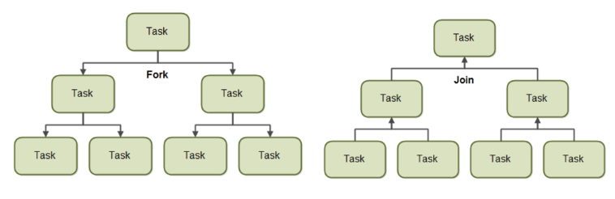  
Java7에서 새로 지원하는 fork-join 풀을 기본적으로 큰 업무를 작은 업무로 나눠 배분하여, 일을 한 후에 일을 취합하는 형태이다.  
분할 정복 알고리즘과 비슷하다고 보면 된다.  
자바에서 풀을 관리하는 ThreadPoolExecutor와 마찬가지로 ForJoinPool도 내부에 inbound queue 라는 편지함이 하나 있다.  
그걸 두고 싸우느라 시간을 낭비하는 것을 방지하기 위해 ForkJoinPool은 스레드 개별 큐를 만들었다.  
<br>


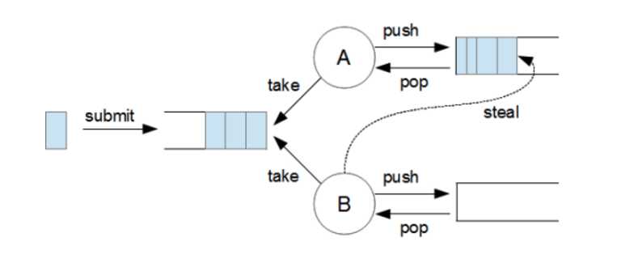
왼쪽에서 업무를 submit하면 하나의 inbound queue에 누적되고 그걸 A와 B 스레드가 가져다가 일을 처리한다.  
A와 B는 각자 큐가 있으며, 자신의 큐에 업무가 없으면 상대방의 큐에서 업무를 가져와서 처리한다.  
최대한 노는 스레드가 없게 하기 위한 알고리즘이다.  

</details>

-----------------------

<br>

### 람다식

<details>
   <summary> 예비 답안 보기 (👈 Click)</summary>
<br />

-----------------------

+ 자바 8에서 등장
+ __메서드를 하나의 식으로 표현하는 익명 함수__
+ 인터페이스 내에 한 개의 추상 메서드만 정의되어있는 함수형(Function) 인터페이스에 사용 가능
+ 장점
    - 기존에 익명함수로 작성하던 코드를 줄일 수 있음
    - 가독성 증가
    - 병렬 프로그래밍이 용이하다.

</details>

-----------------------

<br>


### Optional

<details>
   <summary> 예비 답안 보기 (👈 Click)</summary>
<br />

-----------------------

+ T orElse(T other)
    - 반환할 값을 그대로 받는다.
    - __무조건 인스턴스화 된다.__
+ T orElseGet(Supplier<? extends T> other)
    - Supplier로 랩핑된 값을 인자로 받는다.
    - 함수를 전달받아 바로 값을 가져오지 않고 필요할 때(Lazy) 값을 가져온다.
    - __Optional 안의 값이 null일 경우에만 함수가 실행되면서 인스턴스화 된다.__

</details>

-----------------------

<br>


### 자바8 추가된 내용

<details>
   <summary> 예비 답안 보기 (👈 Click)</summary>
<br />

-----------------------

+ optional
+ stream
+ lambda
+ localDateTime
+ default 메서드
    - 인터페이스는 메서드 정의만 가능하고 구현은 불가능했는데 default 메서드 개념이 생기면서 인터페이스에 구현된 메서드도 추가가 가능해졌다.

__cf) 기존 date의 문제점__  
+ 불변 객체가 아님
+ 헷갈리는 월 지정(1월을 0으로 표현)
+ 일관성 없는 요일 상수 (어디서는 일요일이 0 어디서는 1)
+ Date와 Calendar 객체의 역할 분담(Date만으로 부족해서 왔다갔다 해야함)
+ 상수 필드 남용

</details>

-----------------------

<br>


### 함수형 프로그래밍

<details>
   <summary> 예비 답안 보기 (👈 Click)</summary>
<br />

-----------------------

함수형 프로그래밍은 거의 모든 것을 순수 함수로 나누어 문제를 해결하는 기법으로, 작은 문제를 해결하기 위한 함수를 작성하여 가독성을 높이고 유지보수를 용이하게 해준다.  
Robert C.Martin은 __함수형 프로그래밍을 대입문이 없는 프로그래밍__ 이라고 정의하였다.  
명령형 프로그래밍에서는 메소드를 호출하면 상황에 따라 내부의 값이 바뀔 수 있다. 즉, 우리가 개발한 함수 내에서 선언된 변수의 메모리에 할당된 값이 바뀌는 등의 변화가 발생할 수 있다.  
하지만 함수형 프로그래밍에서는 대입문이 없기 때문에 메모리에 한 번 할당된 값은 새로운 값으로 변할 수 없다.  

+ 순수함수 : 같은 인자에 대해서 항상 같은 값을 반환하고 외부의 어떤 상태도 바꾸지 않는 함수
+ 일급객체 : 함수의 인자로 전달할 수 있고, 함수의 반환값으로 사용할 수 있고, 변수에 담을 수 있는 객체
+ 일급함수 : 함수가 일급객체면 일급함수라고 하고 일급함수에 이름이 없다면 람다식이라고 한다.

### 특징
부수 효과가 없는 순수 함수를 __1급 객체__ 로 간주하여 파라미터로 넘기거나 반환값으로 사용할 수 있으며, 참조 투명성을 지킬 수 있다.  

+ 사이드 이팩트가 없다.
    - 함수형 프로그래밍은 함수들의 조합으로 만들어지며, 각 함수들은 인자를 받고 그에 따른 결과를 내놓을 뿐 함수 내부적으로 어떠한 상태도 가지지 않는다. 따라서 함수 내부에서 벌어지는 일에 대해서는 전혀 신경쓸 필요가 없다. 단지, 함수 호출 시 입력하는 값과 그에 대한 결과 값만이 중요할 뿐이다.
+ 동시성 프로그래밍
    - 명령형 프로그래밍에서 교착상태가 발생하는 주된 원인은 스레드 간에 공유되는 데이터나 상태 값이 변경 가능(mutable)하기 때문이다. 하지만 함수형 프로그래밍은 모든 데이터가 변경 불가능하고 함수는 부수 효과를 가지고 있지 않기 때문에 여러 스레드가 동시에 공유 데이터에 접근하더라도 해당 데이터가 변경될 수 없기 때문에 동시성 관련된 문제를 원천적으로 봉쇄한다.
+ 함수를 값처럼 쓸 수 있기 때문에 익명함수처럼 간결한 코드를 구성할 수 있다.

### 단점
+ 순수함수를 구현하기 위해서 코드의 가독성이 좋지 않을 수 있다.
+ 순수함수를 사용하는 것은 쉬울지라도 조합하는 것은 쉽지 않다.


</details>

-----------------------

<br>


### 멀티스레드 프로그래밍

<details>
   <summary> 예비 답안 보기 (👈 Click)</summary>
<br />

-----------------------

+ 스레드 생성 방법
    - 방법 1: Thread 클래스를 상속받아서 run을 오버라이드해서 정의한다.
    - 방법 2: Runnable 인터페이스를 구현하여 Thread 생성자에 인자로 넘긴다.
    - 방법 3: Callable 인터페이스를 구현하여 FutureTask에 한번 감싸서 Thread의 인자로 넘긴다.
    - __Runnable은 Exception이 없고 리턴값도 없으나 Callable은 리턴값이 있고 Exception을 발생시킬 수 있다.__    
+ 스레드 실행 방법
    - 보통 start() 메서드를 사용해서 호출하는데 start 한다고 해서 바로 실행되는 것은 아니고 실행 대기열에 저장된 후 차례가 오면 실행된다.
    - 정확하게 말하자면, start는 새로운 스레드가 작업을 실행하는데 필요한 새로운 호출 스택을 생성해서 그곳에 run 메서드를 올려둔다. 이후 그곳에서 run 메서드를 호출하고 스레드가 별개의 작업을 수행하게 된다.

__보통 위와 같이 인터페이스를 구현해서 Thread의 인자로 넘기거나, 상속으로 구현하는 방식은 운영환경에서 프로그램 성능에 영향을 미치기 때문에 사용하지 않는다.__  
운영 시에는 __ExecutorService와 Executors를 이용해 스레드풀을 생성__ 하여 병렬처리한다.  
앞선 방식은 각기 다른 Thread를 생성해서 작업 처리하고 처리가 완료되면 Thread를 제거하는 작업을 손수 진행해야 하지만 ExecutorService 클래스를 사용하면 손쉽게 처리할 수 있다.  
ExecutorService에 Task만 지정해주면 알아서 ThreadPool을 이용해 Task를 실행하고 관리한다.  
Executors는 ExecutorService 객체를 생성하며 다음과 같은 메서드를 제공하여 스레드 풀의 개수 및 종류를 정할 수 있다.
```java
// 인자 개수만큼 고정된 스레드를 생성하는 스레드 풀
ExecutorService executor = Executors.newFixedThreadPool(int n);

// 필요할 때 필요한 만큼 스레드를 무한정 생성하고 60초간 작업이 없다면 pool에서 제거하는 스레드풀
ExecutorService executor = Executors.newCachedThreadPool();

// 스레드 1개인 ExecutorService 리턴
ExecutorService executor = Executors.newSingleThreadExecutor();

// 일정 시간 뒤에 실행되는 작업이나, 주기적으로 수행되는 작업이 있다면 사용하는 것
ExecutorService executor = Executors.newScheduledThreadPool(int n);
```
</details>

-----------------------

<br>

### Java 동기화

<details>
   <summary> 예비 답안 보기 (👈 Click)</summary>
<br />

-----------------------

자바에서 동시성 문제를 해결하는데 3가지 방법이 있습니다.  
+ synchronized : 안전하게 동시성을 보장할 수 있습니다. 하지만 비용이 가장 큽니다.
+ volatile : 키워드가 붙은 자원은 하나의 thread만이 write하고 나머지는 스레드는 read만 한다는 전제하에만 동시성을 보장합니다.
    - __volatile 키워드를 붙인 자원은 read, write 작업이 CPU Cache Memory가 아닌 Main Memory에서 이뤄집니다.__
    - 즉, 자원을 저장하는 메모리는 하나가 되기 때문에 같은 공유자원에 대해 각각 메모리별로 다른 값을 가지는 경우가 없습니다. 
    - 하지만 여러 스레드에서 Main Memory에 있는 공유자원에 동시에 접근할 수 있으므로 여러 스레드에서 수정하게 되면, 계산값이 덮어씌워지게 되므로 동시 접근 문제를 해결할 수 없습니다.
    - __정리하면, 가시성 문제는 해결할 수 있지만, 동시 접근 문제는 해결할 수 없습니다.__
+ Atomic 클래스는 CAS(compare-and-swap)를 이용하여 동시성을 하므로 여러 쓰레드에서 데이터를 write해도 문제가 없습니다. synchronized 보다 적은 비용으로 동시성을 보장할 수 있습니다.
    - __CAS 알고리즘이란 현재 스레드가 존재하는 CPU의 CacheMemory와 MainMemory에 저장된 값을 비교하여, 일치하는 경우 새로운 값으로 교체하고, 일치하지 않을 경우 기존 교체가 실패되고, 이에 대해 계속 재시도하는 방식입니다.__
    - __CPU가 MainMemory의 자원을 CPU Cache Memory로 가져와 연산을 수행하는 동안 다른 스레드에서 연산이 수행되어 MainMemory의 자원 값이 바뀌었을 경우 기존 연산을 실패처리하고, 새로 바뀐 MainMemory 값으로 재수행하는 방식입니다.__


</details>

-----------------------


