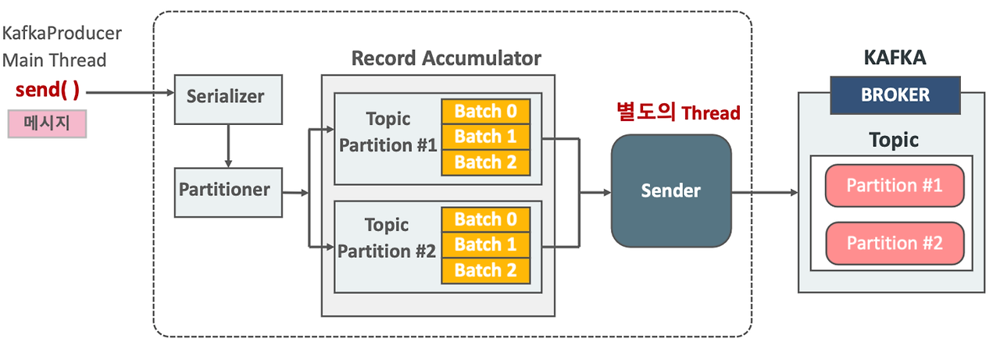

# Kafka
 

-----------------------

### RabbitMQ와 Kafka

   
 예비 답안 보기 (👈 Click)

 

-----------------------

서비스가 점점 발전하고 규모가 커지게 되면서 서로 통신하고 데이터를 교환하는 방법이 필요해졌다. 따라서 필요한 데이터를 담은 "메시지"라는 것을 한쪽에서 생성(produce)하면 다른 쪽에서 소비(consume)하는 구조를 사용하게 되었다. 이 역할을 하는 것이 RabbitMQ와 Kafka이다. 둘 다 한 곳에서 메시지를 넣어주면 필요한 곳에서 메시지를 꺼내 소비하는 방식으로 되어있지만 차이가 있다.

+ RabbitMQ
    - 전통적인 메시지 브로커
    - 생산자와 소비자간의 보장되는 메시지 전달에 초점을 맞춰 브로커 중심적인 특징
    - 컨슈머가 메시지를 가져가면 큐에는 더 이상 남지 않고 사라진다. 따라서 소비자와 메시지 브로커의 결합력이 높아지게 되어 트래픽이 증가하면 수평적으로 확장하는데 어렵다.
    - 이벤트 메시지가 성공적으로 전달되었다고 판단될 경우 이 메시지가 큐에서 삭제되어버리기 때문에 후에 다시 이벤트를 재생하기가 어렵다.
+ Kafka
    - 최신 기술인 이벤트 스트리밍 플랫폼
    - 토픽을 컨슈머가 가져간 후에도 이벤트 스트림에서 계속 토픽을 유지하기 때문에 오류 수정이 필요하거나 앱을 리빌드 하는 등의 상황에서 이벤트를 다시 재생시킬 수 있다.
    - 레코드들을 consume 해도 레코들이 삭제되지 않기 때문에 RabbitMQ에 비해 유연하고 느슨한 결합을 가져가게 되고 유연한 확장이 가능해진다.

-----------------------

 

### 카프카 브로커

   
 예비 답안 보기 (👈 Click)

 

-----------------------

> 카프카 프로듀서에서 데이터 발송 -> 카프카 브로커에 저장 -> 카프카 컨슈머가 브로커로부터 데이터를 받아서 처리

* 카프카 브로커는 카프카 클라이언트와 데이터를 주고받기 위해 사용하는 주체이자, 데이터를 분산 저장하여 장애가 발생하더라도 안전하게 사용할 수 있도록 도와주는 애플리케이션
* 보통 3대 이상의 브로커 서버를 1개의 클러스터로 묶어서 운영
* 프로듀서로부터 전달받은 데이터는 **파일 시스템에 저장**
  * 페이지 캐시(OS에서 파일 입출력의 성능 향상을 위해 만들어 놓은 메모리 영역)를 사용하여 디스크 입출력 속도를 높여 속도 이슈를 해결 => 힙 메모리 사이즈를 크게 조절할 필요가 없음.

#### 브로커 종류
* 컨트롤러 : 주로 클러스터 정상 동작을 보장
  * 파티션 리더 선출 : Kafka에서는 각 파티션에 대해 여러 개의 복제본(replica)이 존재하며, 그중 하나가 리더로 선출됩니다. 컨트롤러는 파티션의 리더를 관리하며, 리더가 다운되었을 때 새로운 리더를 선출하는 역할을 수행합니다.
  * 브로커 장애 처리 : 클러스터 내에서 브로커가 실패하거나 다시 복구되는 경우, 컨트롤러는 그에 따라 파티션 리더와 복제본을 재조정합니다.
* 코디네이터 : 주로 컨슈무 그룹 관련 작업
  * 오프셋 관리 : 컨슈머가 특정 파티션에서 메시지를 읽고 난 후, 어디까지 읽었는지(오프셋)를 기록하고 관리합니다. 이는 각 컨슈머가 자신의 오프셋을 지속적으로 업데이트하여, 재시작 시 이전에 읽었던 메시지부터 다시 처리할 수 있도록 합니다.
  * 파티션 할당: 컨슈머 그룹 내에서 각 컨슈머에게 파티션을 할당하는 작업을 수행합니다. 이 작업을 통해 여러 컨슈머가 같은 파티션을 동시에 처리하지 않도록 조정합니다.
* 주키퍼(deprecated)
  * 4.0버전 이전에는 토픽, 파티션 위치 정보 등을 주키퍼를 통해 관리했으나 4.0버전부터는 카프카 내부적으로 관리

-----------------------

 

### 토픽과 파티션

   
 예비 답안 보기 (👈 Click)

 

-----------------------

  

* 레코드 : 카프카 데이터 단위
* 토픽 : 레코드를 카테고리별로 구분하는 논리적 단위
* 파티션 : 토픽 내에서 데이터를 물리적으로 분할하는 단위

카프카에서의 데이터는 레코드라는 단위로 표현한다.  

하나의 토픽은 여러 개의 파티션으로 구성되어있고 레코드는 파티션들에 분산되어 저장된다.   

-----------------------

 

### 파티션과 컨슈머 관계

   
 예비 답안 보기 (👈 Click)

 

-----------------------

  

여러 개의 컨슈머는 동일한 컨슈머 그룹 Id로 컨슈머 그룹으로 묶을 수 있다.  
파티션과 컨슈머 그룹 내의 컨슈머는 N:1 관계로 파티션은 컨슈머 그룹 내에서 단 하나의 컨슈머에만 매핑될 수 있지만, 컨슈머는 다양한 파티션을 매핑할 수 있다.  

따라서 최대한 성능을 뽑아내려면 토픽의 파티션 개수와 컨슈머의 개수를 일치시키면 된다.

#### 파티션 개수
최초 토픽 생성 시, 파티션 개수를 지정할 수 있다. 파티션 개수는 늘릴 수는 있지만 줄일 수는 없으므로 다음을 고려해야 한다.
* 프로듀서와 컨슈머 데이터 처리량
  * 프로듀서 전송량 < 컨슈머 데이터 처리량 * 파티션 개수
  * ex) 프로듀서가 초당 1000개의 레코드를 보고, 컨슈머가 초당 100개의 레코드를 처리할 수 있다면 해당 토픽의 파티션은 최소 10개 이상이어야 한다.
* 메시지 키 사용 여부(데이터 처리 순서)
  * 메시지 키를 사용하면 메시지 키 해싱값으로 파티션을 결정하므로 메시지 키가 같다면 해당 레코드는 항상 같은 파티션으로 전송된다.
  * 처리 순서가 보장되어야 한다면 최대한 파티션 변화가 발생하지 않는 방식으로 운영해야 하고 파티션 개수가 변해야만 한다면 커스텀 파티셔너를 개발해야 한다. 따라서 애초부터 파티션 개수를 넉넉하게 잡는 것이 권장된다.
* 브로커 영향도
  * 파티션이 늘어나는 만큼 브로커에서 접근하는 파일 개수가 많아진다. 데이터 양이 많아져서 파티션 개수를 늘려야하는 상황이라면 브로커 당 파티션 개수를 확인하고 파티션 개수가 너무 많다면 카프카 브로커 개수를 늘려야한다.

-----------------------

 

### 데이터 복제

   
 예비 답안 보기 (👈 Click)

 

-----------------------

카프카는 데이터 복제를 통해 클러스터로 묶인 브로커 중 일부에 장애가 발생하더라도 데이터를 유실하지 않고 안전하게 동작하기 위해 파티션 단위로 복제된다. 토픽을 생성할 때 파티션의 복제 개수도 같이 설정하는데 직접 옵션을 선택하지 않으면 브로커에 설정된 옵션 값을 따라간다. 복제 개수의 최솟값은 1(복제없음)이고 최댓값은 브로커 개수만큼 사용할 수 있다. 

예를 들어 복제 개수가 3(자신+복제2개)으로 총 3개의 파티션이 구성된다면 리더 파티션과 팔로워 파티션으로 구성된다. 프로듀서 또는 컨슈머와 직접 통신하는 파티션을 리더 파티션, 복제 데이터를 갖는 나머지 파티션을 팔로워 파티션이라고 한다. 팔로워 파티션들은 리더 파티션의 오프셋을 확인하여 현재 자신이 가지고 있는 오프셋과 차이가 나는 경우 리더 파티션으로부터 데이터를 가져와서 자신의 파티션에 복제한다. 만약 리더 파티션을 갖고 있는 브로커에 장애가 발생해 다운되면 팔로워 파티션 중 하나가 리더 파티션 지위를 넘겨받는다. 이를 통해 데이터가 유실되지 않고 컨슈머, 프로듀서가 데이터를 주고받도록 동작할 수 있게 된다.

-----------------------

 

### 오프셋

   
 예비 답안 보기 (👈 Click)

 

-----------------------

  

레코드는 저장될 때 오프셋 값이 부여된다. 오프셋은 컨슈머 그룹이 데이터를 어디까지 읽어갔는지 확인하는 용도로 사용된다. 컨슈머 그룹은 토픽의 특정 파티션으로부터 데이터를 가져가서 처리하고 파티션의 어느 레코드까지 읽었는지 알리기 위해 데이터를 처리한 뒤 오프셋을 커밋한다.

> cf) 레코드가 브로커에 저장되면 적재된 레코드는 수정할 수 없고 로그 리텐션 기간 또는 용량 정책에 의해서만 삭제가 가능하다. 로그 세그먼트 파일은 기본적으로 1GB의 크기를 채우면 닫히고 retention 옵션에 의해 삭제된다.  

-----------------------

 

### 프로듀서 데이터 전송 구조

   
 예비 답안 보기 (👈 Click)

 

-----------------------

  

> ProducerRecord -> send 호출 -> Partitioner -> Accumulator 내부에 토픽별로 배치를 만들어 저장 -> sender -> 카프카 클러스터

프로듀서는 데이터를 전송할 때, 파티셔너에 의해 전송되는 파티션을 정한다. 파티셔너에 의해 구분된 레코드는 전송되기 전에 Accumulator에 의해 데이터가 버퍼로 쌓이고 버퍼로 쌓인 데이터는 배치라는 묶음으로 한번에 전송된다. 

-----------------------

 

### ISR(In-Sync-Replicas)

   
 예비 답안 보기 (👈 Click)

 

-----------------------

ISR은 리더 파티션과 팔로워 파티션이 모두 싱크된 상태를 의미한다.

팔로워 파티션은 리더 파티션의 데이터를 복제하는데 시간이 걸리기 때문에 싱크가 안된 시점이 존재한다. 따라서 일정 주기로 복제되었는지를 확인하고 복제되지 않는다면 해당 팔로워 파티션은 ISR 그룹에서 제외된다.

ISR 그룹에 묶인 파티션은 모두 동일한 데이터가 존재함을 보장하기 때문에 리더 파티션 선출 자격을 갖는다.

-----------------------

 

### acks

   
 예비 답안 보기 (👈 Click)

 

-----------------------

acks 옵션은 프로듀서가 전송한 데이터가 카프카 클러스터에 얼마나 신뢰성 높게 저장할지 지정할 수 있다.

* acks=0 : 데이터를 전송하기만 하고 적재되었는지 신경쓰지 않음
* acks=1 : 리더 파티션에 정상적으로 적재되었는지 확인
* acks=all 또는 acks=-1 : ISR 그룹에 포함된 모든 파티션에 적재되었는지 확인

all 옵션을 사용할 경우, min.insync.replicas 옵션(최소 ISR 그룹 파티션 개수)을 주의해야 한다.  

브로커 개수가 3개이고 파티션 복제 개수가 3이라고 했을때, 해당 옵션을 3으로 지정한다면 브로커 한개에 장애가 발생했을때, 해당 옵션을 충족하지 못하므로 전면 장애가 발생한다.(파티션 복제 개수는 브로커 개수보다 크면 의미가 없다.)  

**따라서 min.insync.replicas 옵션은 파티션 복제본 개수보다 작아야만 한다.**

producer의 권장 옵션은 브로커 3개라고 가정했을때, acks=all, 파티션 복제 3, min.insync.replicas 2이다. 

 

일반적인 메시징 보상 수준을 다음과 같이 나타내기도 한다.
* At Most Once(최대 1회 전달)
  * ack = 0
  * 메시지가 유실될 수 있지만, 중복 메시지가 발행되진 않는다.
* At Least Once(최소 1회 전달)
  * ack=all or ack=1
  * 결과는 적어도 한 번은 전달되며 중복 가능성이 있다.
* Exactly once(정확히 1회 전달)
  * acks=all, idempotence=true
  * 중복없이 정확히 한번 전달된다.

-----------------------

 

### 중복없이 재전송(idempotence)

   
 예비 답안 보기 (👈 Click)

 

-----------------------

  

producer는 acks=1 or all 인 경우, 레코드를 전송하고 브로커에서 응답이 없으면 producer는 delivery.timeout.ms 시간 동안 재시도를 한다. 하지만 브로커에는 정상 적재되었으나 네트워크 오류로 ack를 받지 못한 경우에도 producer는 재시도를 하게 된다. 프로듀서는 브로커로 레코드를 전송할 때, producerId와 sequence(레코드 고유 번호)를 header에 저장하여 전송하기 때문에 sequence가 중복되면 레코드를 적재하지 않고 ack 응답만 다시 보낸다.  

해당 옵션은 max.in.flight.requests.per.connection 값과 함께 사용되며 해당 값은 1이상 5이하여야만 한다.  

예를 들어, connection 값이 3이라고 한다면 전송 배치 개수가 batch1,2,3 으로 묶이는데 2에서 실패한다면 indempotence 옵션에 의해 sequence가 정렬되지 않게 왔으므로 outOfOrderSequenceException이 발생하여 2부터 다시 보내게 된다. 만약 1부터 다시 보내더라도 이미 적재되어있는 경우는 무시한다.

-----------------------

 

### Exactly once 멱등성 프로듀서

   
 예비 답안 보기 (👈 Click)

 

-----------------------

* retries 1이상 : 재시도 횟수
* acks=all or -1 : ISR 그룹이 모두 복제가 성공한지 확인
* min.insync.replicas : ISR 그룹 내 복제 최소 개수
* enable.idempotence=true : 레코드 쓰기 작업을 단 한번만 허용
  * max.in.flight.requests.per.connection= 1이상 5이하 값 : 한번에 보낼 수 있는 배치 개수
  * idempotence 사용하려면 5 이하여야하는 조건이 있다.

컨슈머 단에서는 offset 커밋에서 네트워크 문제로 제대로 전달되지 않아 동일한 데이터를 중복해서 처리하는 경우가 발생할 수 있다. 따라서 zero-payload 방식으로 id값만 받아서 항상 최신의 데이터를 가져와 처리할 수 있도록 구성하고 데이터 처리 로직은 멱등성 있게 구성해야 한다.(db에서 유니크 키로 보장한다던가, insert되어 있다면 update로 처리한다던가.)

 

> 멱등성 프로듀서의 한계
멱등성 프로듀서는 동일한 세션 내에서만 정확히 한 번의 전달을 보장합니다. 여기서 '동일한 세션'이란, PID(Producer ID)의 생명주기를 의미합니다. 만약 멱등성 프로듀서로 작동하는 프로듀서 애플리케이션에 문제가 발생해 종료되고 다시 시작하면 PID가 된다. 동일한 데이터를 전송하더라도, PID가 바뀌면 브로커는 다른 프로듀서 애플리케이션이 다른 데이터를 보냈다고 판단한다. 따라서 멱등성 프로듀서는 장애가 발생하지 않는 상황에서만 데이터를 정확히 한 번 적재하는 것을 보장한다는 점을 명심해야 한다.

-----------------------

 

### 리밸런싱

   
 예비 답안 보기 (👈 Click)

 

-----------------------

* Eager
  * 리밸런싱 시 기존 컨슈머들의 모든 파티션 할당을 취소하고 재 할당 전까지 메시지를 소비하지 않는다.
* cooperative
  * 리밸런싱 시 모든 파티션 할당을 취소하지 않고 대상이 되는 컨슈머들에 대해서 파티션에 따라 점진적으로 컨슈머를 할당한다.
    * 예를 들어, consumer1(partiton 1,3), consumer2(partition2) 상태에서 consumer3가 추가된다면 partition3만 consumer3로 매핑이 이동된다.

#### 리밸런싱이 발생하는 경우
* 컨슈머가 추가되는 상황
* 컨슈머가 제외되는 상황
  * 종료되고 코디네이터가 이를 인지하지 못해도 heartbeat 간격 수신을 받지 못하면 종료된 것으로 판단

 

  

1. 컨슈머가 추가/종료된 경우 기존 컨슈머들은 그룹에 다시 조인하기 위해 코디네이터에 조인 요청을 보낸다.
2. 코디네이터는 __모든 컨슈머로부터 조인 요청__ 을 받으면 컨슈머 그룹 리더를 선정한다.
  * 그룹 내 특정 컨슈머가 rebalanceTimeout 시간 내에 poll을 호출하지 않은 경우 컨슈머 그룹에서 제외된다.
3. 리더는 각 컨슈머에게 파티션 할당을 결정하고 결정된 사항을 코디네이터에게 전달한다.
4. 팔로워들은 할당된 파티션 정보를 얻기 위해 코디네이터에게 다시 요청한다.

위 과정은 poll 메서드 안에서 진행된다. 위 과정은 eager이지만 cooperative는 2번 과정에서 연관된 일부 컨슈머만 조인 요청을 보낸다는 차이가 있다.

 

#### 배포 고려 사항

  

eager나 cooperative 모드 둘다 리밸런싱 되는 경우, 전체/일부 컨슈머가 조인 요청을 보내고 파티션을 할당받기 까지 소비가 중단된다. 이때 먼저 poll을 한 컨슈머가 있고 레코드를 처리하고 있는 컨슈머가 처리가 조금 오래걸려서 처리 이후에 poll을 한 경우, 미리 poll을 요청한 컨슈머는 그만큼 기다리게 된다.  

레코드 데이터 처리 시간이 짧다면 문제가 없지만 긴 경우에는 컨슈머 lag이 쌓이는 문제가 발생한다. 컨슈머의 데이터 처리 속도가 느리다면 **max.poll.records** 옵션을 작게 설정하는 방법이 있다. 이를 작게 설정한다고 해도 성능에 큰 영향을 주진 않는다.  

 

  

이유는 컨슈머가 레코드를 가져올때 Fetcher를 사용하기 때문이다. Fetcher는 poll 호출 시, 컨슈머 내에 데이터가 없다면 브로커로부터 데이터를 가져오고 이미 있다면 브로커에 요청을 보내지 않고 Fetcher 내의 데이터를 전달해준다. 따라서 Fetcher가 브로커에서 데이터를 얼마나 가져올지 정하는 옵션인 fetch.max.bytes, max.partition.fetch.bytes 설정 성능이 큰 영향을 주는 것이지 max.poll.records 속성을 낮추는 것은 큰 영향이 없다.  

만약 애초에 레코드 처리 자체가 속도가 매우 느리다면 레코드를 별도의 스레드 풀에서 처리하는 모델을 고려해봐야 한다.  

-----------------------

 

### assigner

   
 예비 답안 보기 (👈 Click)

 

-----------------------

* RoundRobinAssignor : 파티션을 하나씩 순차적으로 컨슈머에 할당
* RangeAssigner : 파티션 번호 range에 따라 같은 range에 있다면 같은 컨슈머에 할당
* StickyAssignor : RoundRobinAssignor와 동일하나 리밸선싱 시에 Eager로 다 초기화되더라도 재분배 시 이전 매핑을 그대로 가져가며 사라진 컨슈머에 대해서만 RoundRobinAssignor 방식을 다시 사용
* CoorperativeStickyAssignor : RoundRobinAssignor와 동일하나 Cooperative이기 때문에 죽은 컨슈머에 붙어있던 파티션만 RoundRobinAssignor 방식으로 동작

-----------------------

 

### 파티션 하나에 메시지가 지나치게 몰린다면?

   
 예비 답안 보기 (👈 Click)

 

-----------------------

카프카 브로커의 특정 파티션 키에 메시지가 지나치게 몰리는 상황이 발생하면 랙이 쌓이게 된다. 다음과 같은 해결책을 고려해볼 수 있다.

* 파티션 키 수정 : 파티션 키가 고루 분선되지 않기 때문이므로 다른 파티션 키를 고려해본다. 
  * 파티셔너를 직접 구현하는 것도 방법이다. 대규모에서는 고른 분산을 위해 Consistent Hashing(해시 링)을 사용하기도 한다.
* 파티션 수 늘리기 : 많은 파티션에 메시지가 분산될 수 있도록 한다.
* 컨슈머 수 늘리기 : 파티션 수 만큼 컨슈머를 늘린다면 파티션과 컨슈머가 1:1 매핑된다.
* 메시지 처리 병렬화 : Consumer 쪽에서 쓰레드 풀을 사용하여 병렬로 처리한다.

-----------------------

 

### 처리량 높이기

   
 예비 답안 보기 (👈 Click)

 

-----------------------
> redhat kafka 옵션 : https://docs.redhat.com/ko/documentation/red_hat_streams_for_apache_kafka/2.7/html-single/kafka_configuration_tuning/index#con-producer-config-properties-throughput-str
> aws h/w 스펙에 따른 처리량 : https://aws.amazon.com/ko/blogs/big-data/best-practices-for-right-sizing-your-apache-kafka-clusters-to-optimize-performance-and-cost/
> 성능 옵션 결과 : https://pattersonconsultingtn.com/blog/throughput_testing_kafka.html

* producer 성능 옵션
  * compression.type : 압축 옵션
    * 압축을 사용하면 producer가 메시지 압축에 사용된 cpu 시간 때문에 대기 시간을 추가하지만 잠재적 디스크 쓰기를 줄여 처리량을 높일 수 있다.
  * batch.size(단일 배치 사이즈 크기) 와 linger.ms(배치로 메시지를 보내기 위한 최대 대기 시간)
    * batch.size가 꽉 차거나 linger.ms 시간에 도달하면 메시지를 전송하기 때문에 두 옵션의 조절로 처리량이 높은 단일 생성 요청에 더 많은 메시지를 배치할 수 있다.
  * buffer.memory : 버퍼에 사용할 총 메모리 양(Record accumulator의 전체 메모리 사이즈)
     * 버퍼 크기는 배치 크기만큼 커야하며 버퍼링, 압축 및 진행 중 요청을 수용할 수 있을 정도의 크기여야 한다.
  * max.request.size : 브로커에게 보낼 수 있는 전체 합산 최대 메시지 크기
    * batch.size를 늘린다면 그에 맞춰 더 늘려야 한다.
  * send.buffer.bytes : 카프카 브로커와 통신할 때 사용하는 TCP 소켓의 버퍼 크기
    * 이 버퍼는 프로듀서가 메시지를 네트워크를 통해 브로커로 보내기 전에 데이터를 일시적으로 저장하는 공간
    * 네트워크 환경이 불안정하거나 지연이 발생할 때, 이 버퍼 크기를 늘리면 프로듀서가 더 많은 데이터를 일시적으로 저장하고 네트워크 전송 대기 시간을 줄일 수 있어 전송 성능이 향상
* consumer 옵션
  * fetch.min.bytes : 컨슈머가 브로커에서 데이터를 읽어들이기 위해 기다리는 최소 데이터 크기
    * 브로커는 지정된 만큼 새로운 메시지가 쌓일때까지 전송하지 않는다.
    * 이 값을 높이면 컨슈머가 더 많은 데이터를 한 번에 가져와 처리할 수 있으므로, 네트워크 호출 횟수를 줄이고 효율성을 높일 수 있다. 다만, 너무 높게 설정하면 지연이 발생
  * max.partition.fetch.bytes : 컨슈머가 파티션별로 가져올 수 있는 최대 데이터 크기를 설정
    * 여러 파티션에서 데이터를 동시에 가져올 때, 이 값을 높이면 한 번에 더 많은 데이터를 가져올 수 있어 처리량이 증가할 수 있다. fetch.max.bytes에 제약을 받는다.
  * fetch.max.bytes : 컨슈머가 한 번에 가져올 수 있는 최대 데이터 크기
    * 이 값을 늘리면 더 많은 데이터를 한 번에 가져올 수 있어 처리량이 증가할 수 있으나 시스템 메모리와 네트워크 대역폭을 고려해 적절하게 설정
  * fetch.wait.max.ms : fetch.min.bytes 조건이 충족될 때까지 브로커가 대기하는 최대 시간
    * 컨슈머가 데이터를 가져오기 위해 너무 오래 기다리지 않도록 하여 성능을 향상
  * receive.buffer.bytes : 컨슈머가 데이터를 읽을 때 사용하는 TCP 수신 버퍼의 크기
    * 이 값을 늘리면 네트워크에서 수신하는 데이터 처리 성능이 향상될 수 있으나 시스템 메모리 사용량에 영향을 줄 수 있으므로 적절하게 설정
  * max.poll.records : fetcher의 버퍼로부터 컨슈머가 한 번에 poll로 가져올 수 있는 레코드의 최대 개수
    * 이 값을 늘리면 컨슈머가 더 많은 레코드를 한 번에 가져와 처리할 수 있으므로, 처리량이 증가할 수 있으나 처리량이 증가하면서 메모리 사용량도 증가할 수 있으므로 주의
    * 하지만 이 옵션보다는 fetch.max.bytes와 max.partition.fetch.bytes 설정이 더 큰 영향을 준다.
  * max.poll.interval.ms : poll 호출 간의 최대 대기 시간을 설정
* 리밸런싱의 영향 최소화
  * max.poll.records 옵션 줄이기
    * 해당 옵션은 fetcher의 버퍼로부터 컨슈머가 한 번에 poll로 가져올 수 있는 레코드의 최대 수이기 때문에 줄여도 큰 영향이 없다.(fetcher의 버퍼로부터 가져오는 것이기 때문)
    * 이 옵션을 줄여서 빠르게 poll한 데이터만 처리한 후 조인 요청을 하여 리밸런싱한다.

적절한 조정이 필요하겠지만 보통 대기시간(latency)를 낮추려면 위 옵션들의 값을 줄여야하고 처리량을 높이려면 값을 높여야한다.

 

일반적으로 kafka는 producer 단에서는 전송만 하면 되기 때문에 문제가 없지만 컨슈머쪽에서는 메시지를 소비해서 실질적인 로직을 처리하기 때문에 소비 속도를 판단하여 조치를 취하지 않는다면 lag이 쌓이게 된다. 이를 위해서 컨슈머 쪽에서는 다음과 같은 방안을 취할 수 있다.

* 멀티 쓰레드 컨슈머
  * 파티션과 컨슈머는 N:1 관계이지만 컨슈머의 개수를 파티션 개수와 일치시킨다면 1:1 매핑이 되어 처리량을 늘릴 수 있다.
  * 실제로 다수의 프로세스를 띄워서 다수의 컨슈머를 만들어도 되지만 spring kafka 에서는 concurrency 옵션으로 멀티 스레드 컨슈머를 만들 수 있다.
  * OOM을 주의해야 한다.
* 멀티 워커 쓰레드
  * 배치로 레코드를 소비한 뒤, ExecutorService를 사용하여 별도의 스레드 풀로 처리를 위임하여 병렬 처리하는 형태
  * 병렬 처리로 인해 처리 순서가 섞일 수 있기 때문에 처리 순서가 중요하다면 메시지 키별로 동일한 스레드를 할당받도록 하는 별도의 추가 로직을 구성해야 한다.
  * executorService를 사용할 경우, 메인 스레드는 기다리지 않기 때문에 별도의 대기 후 offset을 수동 커밋해줘야 한다.
  

-----------------------
