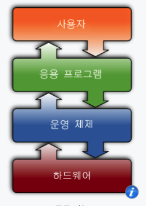
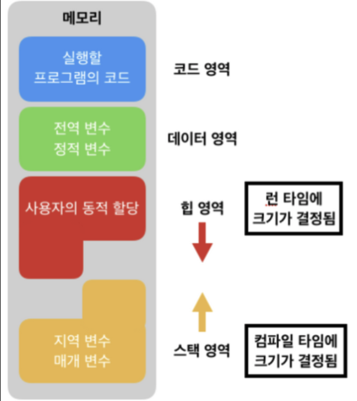
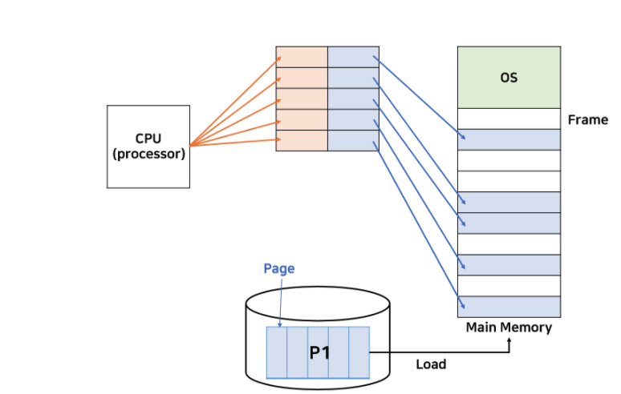
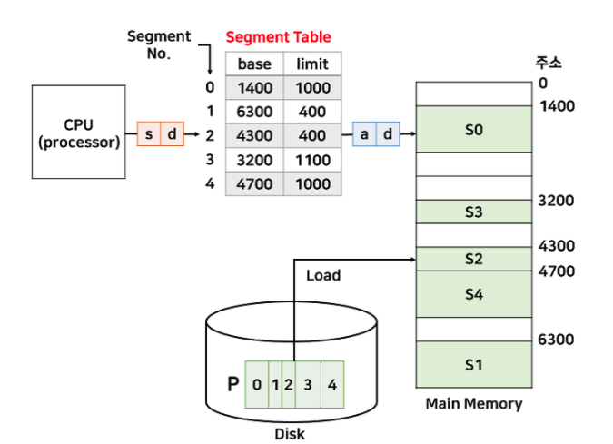
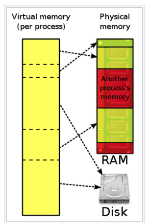

# Operating System
 

-----------------------

### 운영체제

   
 예비 답안 보기 (👈 Click)

 

-----------------------

  
운영체제는 __하드웨어를 관리하고, 응용 프로그램과 하드웨어 사이에서 인터페이스 역할을 하는 시스템 소프트웨어__

cf) 여기서 인터페이스는 서로 다른 두 개의 시스템, 장치 사이에서 정보나 신호를 주고받는 경우의 접점이나 경계면을 의미한다.

-----------------------

 

### 커널

   
 예비 답안 보기 (👈 Click)

 

-----------------------

기본적으로 소프트웨어가 컴퓨터 시스템에서 수행되기 위해서는 메모리에 그 프로그램이 올라가 있어야 한다.  
하지만 운영체제 전체가 메모리에 올라가게 된다면 메모리 공간에 낭비가 심하다.  
따라서 운영체제 중 항상 필요한 부분만 메모리에 올리게 되는데 그것이 커널이다.  
즉, __커널이란 메모리에 상주하는 운영체제의 핵심 부분__ 이다.

-----------------------

 

### 메모리구조

   
 예비 답안 보기 (👈 Click)

 

-----------------------

  

+ 코드 영역
    - __실행할 프로그램의 코드가 저장되는 영역으로 텍스트 영역__ 이라고 부른다.
    - CPU는 코드 영역에 __저장된 명령어를 하나씩 가져가서 처리__ 한다.
+ 데이터 영역(static 영역)
    - __전역 변수, 정적 변수가 저장되는 영역__ 이다.
    - 데이터 영역을 프로그램의 시작과 동시에 할당되며, 프로그램이 종료되면 소멸한다.
+ 힙 영역
    - 사용자가 직접 관리할 수 있는 영역으로 사용자에 의해 메모리 공간이 동적으로 할당되고 해제된다.
    - new 로 생성하는 object들이 저장되는 영역이다.
    - __런타임 시 크기__ 가 결정된다.
    - 힙 영역은 메모리의 낮은 주소에서 높은 주소 방향으로 할당된다.
    - __메모리 크기에 제한이 없고 직접 관리해야하며 속도가 스택에 비해 느리다.__
+ 스택 영역
    - __함수의 호출과 관계되는 지역 변수와 매개변수가 저장되는 영역__ 이다.
    - __컴파일 시__ 에 크기가 결정된다.
    - 함수의 호출과 함께 할당되며, 함수의 호출이 완료되면 소멸한다.
    - 메모리의 높은 주소에서 낮은 주소의 방향으로 할당된다.
    - __스택 크기가 제한되어 있고 힙에 비해 상대적으로 빠르다.__

-----------------------

 

### 스택과 힙의 차이점

   
 예비 답안 보기 (👈 Click)

 

-----------------------

+ 스택 : 함수를 호출할 때 지역변수나 함수의 매개변수를 할당하는 공간
+ 힙 : 런타임 시 생성되는 객체들이 저장되는 공간
+ 두 영역은 같은 물리 메모리 공간을 공유하지만 쓰임새가 다르고 힙은 낮은 주소부터 채워지고 스택은 높은 주소부터 채워지기에 서로의 영역을 누가 침범하느냐에 따라 heap overflow, stack overflow가 발생한다.

-----------------------

 

### 힙영역을 크게 잡으면 안되는 이유

   
 예비 답안 보기 (👈 Click)

 

-----------------------

GC의 수행 시간이 너무 오래 걸리게 된다.

-----------------------

 

### 프로세스와 스레드

   
 예비 답안 보기 (👈 Click)

 

-----------------------

+ 프로세스
    - __컴퓨터에서 실행중인 프로그램__
    - __각자 고유한 공간과 자원을 할당받는다.__
    - 각각의 code, data, stack, heap 영역을 보유
    - 각각의 영역을 갖기에 동기화 작업이 필요하지 않음
    - 각각의 영역을 갖기에 컨텍스트 스위칭 비용이 크다.
+ 스레드
    - __한 프로세스의 내의 실행 단위__
    - __stack만 고유한 영역을 갖고 나머지 영역은 프로세스 자원을 공유__
    - stack 이외의 영역을 공유하므로 동기화 작업이 필요
    - stack 이외의 영역을 공유하므로 컨텍스트 스위칭 비용이 적음

-----------------------

 

### 프로세스 생성 과정

   
 예비 답안 보기 (👈 Click)

 

-----------------------

1. PCB가 생성되며 OS가 실행한 프로그램의 코드를 읽어들여 프로세스에 할당된 메모리의 Text 영역에 저장한다.
    - Text segment(혹은 Code segment)는 실행가능한 명령어를 포함하고 있는 메모리 영역이다.
2. 초기화된 전역 변수 및 static 변수를 data 영역에 할당.
3. HEAP과 Stack은 초기 메모리 주소 초기화
4. PCB에 여러 정보가 기록되면 Ready Queue에서 CPU를 할당받기까지 대기한다.

-----------------------

 

### 크롬 탭은 프로세스인지 쓰레드인지

   
 예비 답안 보기 (👈 Click)

 

-----------------------

크롬은 탭마다 PID를 가지고 있으니 Process이며 각 Tab마다 랜더링 정보나 기타 데이터를 따로 관리한다고 한다.  
그로인해 메모리를 많이 잡아먹기도 하지만 하나의 Tab에 오류가 생겼다고 모든 Tab에 영향을 끼치진 않는다.

-----------------------

 

### 멀티 스레드 vs 멀티 프로세스

   
 예비 답안 보기 (👈 Click)

 

-----------------------

+ 멀티 스레드
    - __하나의 프로세스를 여러 개의 스레드로 구성하여 자원을 공유하면서 작업을 수행하는 것__
    - 멀티 프로세스보다 적은 메모리 공간을 차지하고 Context Switching이 빠른 장점이 있지만, 오류로 인해 하나의 스레드가 종료되면 전체 스레드가 종료될 수 있다는 점과 동기화 문제를 가지고 있다.
+ 멀티 프로세스
    - __하나의 프로그램을 여러 개의 프로세스로 구성하여 프로세스가 병렬적으로 작업을 수행하는 것__
    - 하나의 프로세스가 죽더라도 다른 프로세스에 영향을 끼지지 않는다는 장점이 있지만, 멀티 스레드보다 많은 메모리 공간을 차지하는 단점이 있다.

-----------------------

 

### 멀티 프로세스 대신 멀티 스레드를 사용하는 이유

   
 예비 답안 보기 (👈 Click)

 

-----------------------

+ 프로그램을 여러 개 키는 것보다 하나의 프로그램 안에서 여러 작업을 해결하는 것이 더욱 효율적이기 때문
+ 컨텍스트 스위칭 시 stack 영역만 초기화하면 되기 때문에 더 빠르다.
+ 프로세스를 생성하여 자원을 할당하는 콜이 줄어들어 자원을 효율적으로 관리할 수 있다.

-----------------------

 

### 스레드마다 스택을 독립적으로 할당하는 이유

   
 예비 답안 보기 (👈 Click)

 

-----------------------

스택 메모리 공간이 독립적이라는 것은 독립적인 함수 호출이 가능함을 의미하고 이는 독립적인 실행 흐름이 추가된다는 것을 의미한다.  
즉, __독립적인 실행 흐름을 만들기 위해서 스레드마다 스택을 할당한다.__

-----------------------

 

### 스레드마다 PC 레지스터를 독립적으로 할당하는 이유

   
 예비 답안 보기 (👈 Click)

 

-----------------------

__PC값은 스레드가 명령어를 어디까지 수행했는지를 나타낸다.__ 스레드는 CPU를 할당받았다가 스케줄러에 의해서 다시 선점당한다. 따라서 명령어가 연속적으로 수행되지 못하기 때문에 이를 기억할 필요가 있어 독립적으로 할당한다.

-----------------------

 

### 컨텍스트 스위칭

   
 예비 답안 보기 (👈 Click)

 

-----------------------

+ __여러 프로세스를 처리해야 하는 상황에서 현재 진행중인 Task(프로세스, 스레드)의 상태를 PCB에 저장하고 다음에 진행할 Task의 상태값을 읽어 레지스터에 적재하는 과정__
+ 다음에 실행할 Task의 PCB정보를 읽어 Register에 적재하고 CPU가 이전에 진행했던 과정을 연속적으로 수행한다.
    - register는 CPU내부의 요청을 처리하는 데 필요한 데이터를 일시적으로 저장하는 작은 기억장치
+ __컨텍스트 스위칭을 진행하는 동안 다른 작업을 할 수 없다.__ -> 오버헤드의 원인
    - 오버헤드란 어떤 처리를 하기 위해 들어가는 간접적인 처리 시간, 메모리 등을 의미한다.
    - A 라는 작업 처리에 단순히 10초가 걸리는데 안정성 고려하려 처리했더니 15초가 걸린경우 오버헤드는 5초이다.
+ __한 프로세스의 상태는 그 프로세스의 프로세스 제어 블록(PCB)에 기록되어 있다.__

### 진행 과정
1. CPU가 다른 프로세스로 전환하면 시스템은 프로세스의 상태를 PCB에 저장한다.
2. 대기열에서 다음 프로세스를 선택하고 PCB를 __복원__ 한다.
3. PCB의 __프로그램 카운터(레지스터)__ 가 로드되어 선택한 프로세스에서 실행을 계속한다.

-----------------------

 

### IPC(Inter Process Communication)

   
 예비 답안 보기 (👈 Click)

 

-----------------------

__프로세스간 통신__ 을 의미하며 프로세스는 커널이 제공하는 IPC 설비를 이용해 프로세스간의 통신을 한다.  
+ 메모리 공유 : 프로세스끼리 특정 공통 메모리 영역을 공유하여 통신
+ 메시지 전달 : 파이프(쉘에서 사용하는 그 파이프), 소켓

-----------------------

 

### 프로세스 종류

   
 예비 답안 보기 (👈 Click)

 

-----------------------

+ 자식 프로세스
    - fork로 자식 프로세스를 만든 상태, 부모의 데이터, 힙, 스택, PCB 복사
+ 데몬 프로세스
    - 백그라운드에서 동작하면서 특정한 서비스를 제공하는 프로세스
+ 고아 프로세스
    - 부모 프로세스가 먼저 종료되어 고립된 자식 프로세스
+ 좀비 프로세스
    - 자식 프로세스가 종료되었음에도 불구하고 부모 프로세스로부터 작업 종료에 대한 승인을 받지 못한 프로세스

-----------------------

 

### Deadlock

   
 예비 답안 보기 (👈 Click)

 

-----------------------

+ __두 개 이상의 프로세스나 스레드가 서로 자원을 기다리면서 무한히 대기하는 상태__
+ 발생 조건
    - 상호 배제
        - 한 자원에 여러 프로세스가 동시에 접근할 수 없다.
    - 점유 대기
        - 하나의 자원을 소유한 상태에서 다른 자원을 기다린다.
    - 비선점
        - 프로세스가 어떤 자원의 사용을 끝낼 때까지 프로세스의 자원을 뺏을 수 없다.
    - 순환 대기
        - 각 프로세스가 순환적으로 다음 프로세스가 요구하는 자원을 갖고 있다.

-----------------------

 

### 교착 상태 해결 방법

   
 예비 답안 보기 (👈 Click)

 

-----------------------

4가지 발생 조건 중 하나라도 제거하면 교착 상태를 막을 수 있다.  
공유 자원 중 많은 경우에 한 번에 한 프로세스 혹은 스레드만 접근할 수 있기 때문에 상호 배제 조건은 제거하기 어렵다.  
__대부분 교착 상태 방지 알고리즘은 순환 대기가 발생하는 것을 막는데 초점이 맞춰져 있다.__

+ 예방(Prevention)
    - 교착 상태 조건 중 하나를 제거함으로 데드락이 발생하지 않도록 예방하는 방식
    - 자원 낭비가 심하다.
+ 회피(Avoidance)
    - __데드락 발생 가능성을 인정하면서도 적절하게 회피하는 방식__
    - 은행원 알고리즘
        - 프로세스가 자원을 요구할 때 시스템은 자원을 할당한 후에도 안정 상태로 남아있게 되는지를 사전에 검사하는 알고리즘
        - 발생하지 않으면 자원을 할당하고, 발생하면 다른 프로세스가 자원을 해제할 때까지 대기한다.
        - 안전상태: 시스템이 교착상태를 일으키지 않으면서 각 프로세스가 요구한 최대 요구량만큼 필요한 자원을 할당해 줄 수 있는 상태
        - 항상 안전 상태를 유지할 수 있다는 장점이 있으나 최대 자원 요구량을 미리 알아야 하고 항상 불안전 상태를 방지해야 하므로 자원 이용도가 낮다.
+ 탐지(Detection) 및 회복(Recovery)
    - 은행원 알고리즘과 유사하게 시스템의 자원 할당 상태를 갖고 데드락이 발생했는지 여부를 탐색한다.
    - 탐지했다면 데드락을 회복한다.
        - 데드락 상태의 프로세스 모두 중단시키기
        - 프로세스를 하나씩 중단 시킬 때마다 탐지 알고리즘으로 데드락을 탐지하면서 회복시키기
        - 자원 섬점을 통해 해결하기(교착 상태에 있는 프로세스가 점유하고 있는 자원을 선점하여 다른 프로세스에 할당)

-----------------------

 

### 식사하는 철학자 문제(Dining Philosophers)

   
 예비 답안 보기 (👈 Click)

 

-----------------------

1. 일정 시간 생각한다.
2. 왼쪽 포크가 사용 가능해질 때까지 대기하고 사용가능하다면 집는다.
3. 오른쪽 포크가 사용 가능해질 때까지 대기하고 사용가능하다면 집는다.
4. 양쪽 포크를 잡으면 일정 시간만큼 식사한다.
5. 오른쪽 포크를 내려놓는다.
6. 왼쪽 포크를 내려놓는다.
7. 1번으로 돌아간다.

모두가 왼쪽 포크를 집게되면 모두 오른쪽 포크를 대기하게 되어 기아 상태가 발생한다.

#### 교착상태 조건 성립
+ 상호 배제 : 포크는 한 철학자만 사용할 수 있다.
+ 점유 대기 : 왼쪽 포크를 집은 상태에서 오른쪽 포크를 기다린다.
+ 비선점 : 이미 누군가가 집어든 포크를 강제로 빼앗을 수 없다.
+ 순환 대기 : 모든 철학자들이 오른쪽에 앉은 철학자가 포크를 놓기를 기다린다.

#### 해결책
+ 뮤텍스(화장실이 한개만 있는 식당)
    - 공유된 자원에 하나의 스레드만 접근할 수 있도록 한다.
+ 세마포어(화장실이 여러 개인 식당)
    - 철학자 문제를 예시로 들면 철학자는 5명이니 최대 4명만 접근할 수 있도록 한다.

-----------------------

 

### Critical Section(임계영역)

   
 예비 답안 보기 (👈 Click)

 

-----------------------

Critical Section은 __동일한 자원에 접근하는 코드 영역__ 을 의미한다.

-----------------------

 

### 임계영역 해결책

   
 예비 답안 보기 (👈 Click)

 

-----------------------

+ 뮤텍스와 세마포어
    - 공유된 자원의 데이터를 여러 스레드(또는 프로세스)가 접근하는 것을 막는 것
+ 차이
    - 뮤텍스
        - __오직 1개만의 스레드(또는 프로세스)만 접근__ 할 수 있다.
        - 1개만 접근 가능하므로 반드시 락을 획득한 프로세스가 락을 해제해야 한다.
    - 세마포어
        - __세마포어 변수만큼의 스레드(또는 프로세스)가 접근__ 할 수 있다.
        - 현재 수행중인 프로세스가 아닌 다른 프로세스가 세마포어를 해제할 수 있다.
    
세마포어와 뮤텍스에 관해서는 [여기](https://worthpreading.tistory.com/90)에서 그림으로 잘 설명해주니 참고하자.  

-----------------------

 

### 경쟁 상태(Race Condition)

   
 예비 답안 보기 (👈 Click)

 

-----------------------

두 개 이상의 프로세스가 공통 자원을 병렬적으로 읽거나 쓰는 동작을 할 때, 공용 데이터에 대한 접근 순서에 따라 결과값이 달라지는 상황

-----------------------

 

### 수준 스레드

   
 예비 답안 보기 (👈 Click)

 

-----------------------

사용자 수준 스레드와 커널 수준 스레드는 __생성 주체가 누구냐에 따라 구분__ 된다.  

-----------------------

 

### 커널 수준 스레드

   
 예비 답안 보기 (👈 Click)

 

-----------------------

+ __커널이 만들고 관리하는 스레드__
+ 장점 : __커널이 직접 제공해주므로 안정성과 다양한 기능을 제공__
+ 단점 : __유저 모드와 커널 모드의 빈번한 전환으로 성능 저하__
+ 사용자 수준 스레드와 커널 수준 스레드가 __1대1로 매핑__ 한다.  
+ 커널이 직접 스케줄링하고 실행하기 때문에 커널의 관리 지원을 받을 수 있지만, 유저모드와 커널모드의 전환이 빈번하게 이뤄져 성능저하가 발생한다.
+ __동일한 프로세스에서 할당된 여러 개의 스레드들 중 한 스레드가 Block되더라도 다른 스레드들은 실행시킬 수 있다.__  

-----------------------

 

### 사용자 수준 스레드

   
 예비 답안 보기 (👈 Click)

 

-----------------------

+ __스레드 관련 라이브러리로 구현해 사용하는 스레드__
+ 해당 스레드와 관련된 모든 행위를 사용자 영역에서 하기 때문에, 커널은 사용자 수준 스레드의 존재를 알지 못하고 스레드 교환에 개입하지 않는다.  
+ 사용자 수준 스레드 N개가 커널 수준 스레드 1개에 매핑되므로, __다대일 스레드 매핑__ 이라고 한다.  
+ 장점
    - __커널이 스레드를 모르기 때문에 모드 간의 전환이 없고 성능상 이득__
        - 스케쥴링이나 동기화를 위해 커널을 호출하지 않으므로, 커널 영역으로 전환하는 오버헤드 감소
    - 커널에 독립적으로 스케쥴링이 가능해 모든 운영체제에 적용 가능
    - 커널이 나닌 스레드 라이브러리에서 스레드 스케쥴링을 제어하므로 유연한 스케쥴링 가능
+ 단점
    - __사용자 수준 스레드들중 한 스레드가 블록당하면 모든 사용자 스레드가 블록된다.__
    - 커널이 스레드 관리에 개입하지 않으므로 스레드 간 보호에 커널 보호 방법을 사용할 수 없다.

-----------------------

 

### 사용자 모드와 커널 모드

   
 예비 답안 보기 (👈 Click)

 

-----------------------

CPU에는 여러 가지 명령어가 있고 이를 실행하는데 CPU도 권한 모드를 갖고 있다.  
+ 사용자 모드
    - __사용자가 접근할 수 있는 영역을 제한적으로 두고, 프로그램 자원에 함부로 침범하지 못하게 하는 모드__
    - 응용 프로그램이 사용
+ 커널 모드
    - __특정 명령어 실행과 원하는 작업 수행을 위한 자원 접근을 가능케 하는 모드__
    - OS가 사용

1. 1~1000 까지 더한다. (사용자 모드)
2. 파일에서 데이터를 가져온다. (커널 모드)
3. 1~1000 까지의 합과 데이터를 더한다. (사용자 모드)

위와 같이 프로세스가 실행되는 동안 프로세스는 수없이 유저모드와 커널모드를 왔다갔다 하면서 실행된다.  
여기서 __시스템 콜__ 이라는 개념이 나오게 되는데, 시스템 콜이란 __프로세스가 운영체제에게 어떤 기능을 사용하게 해달라고 요청할 때 사용하는 방식__ 이다.  
프로세스가 유저모드에서 실행되다가 특별한 요청이 필요할 때 시스템 콜을 이용해 커널에 요청을 하면 커널 모드로 전환된다.  
시스템 콜을 받은 커널이 그 요청에 대한 일을 처리하고 값을 리턴하면 다시 커널 모드에서 유저 모드로 전환된다.  
결과적으로 __두 모드로 권한을 분리함으로 인해 응용 프로그램이 전체 컴퓨터 시스템을 해치지 못하게 한다.__

-----------------------

 

### CPU Scheduling

   
 예비 답안 보기 (👈 Click)

 

-----------------------

실행 준비가 된 프로세스 중에서 그중 하나를 선택해 CPU를 할당하는 방식을 의미한다.    

-----------------------

 

### 프로세스 스케줄러 종류

   
 예비 답안 보기 (👈 Click)

 

-----------------------

+ 단기 스케줄러 : 어떤 프로세스를 실행 시킬지
+ 중기 스케줄러 : 메모리 공간이 부족한 경우 어떤 프로세스를 swap out 할지
+ 장기 스케줄러 : 어떤 프로세스를 ready queue에 보낼지

-----------------------

 

### CPU 성능 척도

   
 예비 답안 보기 (👈 Click)

 

-----------------------

+ CPU Utilization(이용률) : CPU가 놀지 않고 일한 시간
+ Throughput(처리량) : 단위 시간당 처리량, CPU가 얼마나 많은 일을 했는지
+ Turnaround Time(소요시간, 반환시간) : CPU 사용 시간 + 기다린 시간 (짧을수록 좋다)
+ Waiting Time(대기시간) : 프로세스가 Ready Queue에서 기다린 전체 시간의 합
+ Response Time(응답시간) : 프로세스가 Ready Queue에 들어가서 최초로 CPU 얻기까지 걸린 시간

-----------------------

 

### 선점 방식

   
 예비 답안 보기 (👈 Click)

 

-----------------------

하나의 프로세스가 다른 프로세스 대신에 CPU를 차지할 수 있다.
+ Round Robin(RR)    
    - __시간 할당량을 매 프로세스에 주고 할당된 시간 안에 완료하지 못한 프로세스는 레디 큐의 맨 뒤에 배치하는 방식__
+ Shortest Remaining Time First (SRTF)
    - __CPU 점유 시간이 가장 짧은 프로세스에 CPU를 먼저 할당하는 빙식__
    - SJF 방식에서 선점 방식만 다르다고 보면 된다.
    - __기아 문제__ 발생
+  Multilevel Feedback Queue(다중 레벨 피드백 큐)
    - 각 단계마다 하나의 큐를 두고, 큐 시간 할당량 내에 처리하지 못하면 다음 큐로 보내는 방식
    - 단계가 커질수록 시간 할당량이 커지는 형태

-----------------------

 

### 비선점 방식

   
 예비 답안 보기 (👈 Click)

 

-----------------------

하나의 프로세스가 끝나지 않으면 다른 프로세스는 CPU를 차지할 수 없다.
+ First Come First Served(FCFS)
    - 큐에 도착한 순서대로 실행
    - 최악의 경우 오래 걸리는 문제가 가장 먼저 들어옴
+ Shortest Job First (SJF)
    - CPU 점유 시간이 가장 짧은 프로세스에 CPU를 먼저 할당하는 방식
    - __기아 문제__ 발생
+ Highest Response Ratio Next
    - 준비 큐에서 기다리는 프로세스 중 응답비율이 가장 큰것을 먼저 처리하는 방식
    - 서비스 받을 시간이 분모, 대기 시간이 분자에 있어 대기 시간이 큰 경우 우선순위가 높아진다.

-----------------------

 

### 동시성과 병렬성

   
 예비 답안 보기 (👈 Click)

 

-----------------------

+ 동시성
    - __동시에 실행되는 것 같이 보이게 하는 것__
    - __싱글 코어에서 멀티스레드를 동작시키기 위한 방식__
+ 병렬성
    - __실제로 동시에 여러 작입이 처리 되는것__
    - 멀티 코어에서 멀티 스레드를 동작시키기 위한 방식
    - 한 번에 여러 스레드를 실행 한다.

-----------------------

 

### 인터럽트

   
 예비 답안 보기 (👈 Click)

 

-----------------------

인터럽트란 프로그램을 실행하고 있는 도중에 입출력 요청 또는 예외상황을 처리해야 하면 실행하던 프로그램을 멈추고 CPU가 해당 작업을 처리하도록 하는 것을 의미한다.

-----------------------

 

### 시스템 콜

   
 예비 답안 보기 (👈 Click)

 

-----------------------

__시스템 콜은 사용자나 응용프로그램이 커널에서 제공하는 기능을 사용하기 위한 인터페이스이다.__  
운영체제는 커널이 제공하는 서비스를 시스템 콜을 이용해 제한함으로써 컴퓨터 자원을 보호한다.

-----------------------

 

### 메모리구조 순서

   
 예비 답안 보기 (👈 Click)

 

-----------------------

CPU에 가까운 순서대로 레지스터, 캐시, 주기억장시, 보조기억장치 순이다.  
+ 레지스터 : CPU 내에 존재하는 메모리로 빠르고 작다.
+ 캐시 : CPU와 주기억장치 사이에서 중간 저장소 역할을 한다.
+ 주기억장치 : 현재 수행되는 프로그램과 데이터 저장
+ 보조기억장치 : 용량이 크나 느리다.

-----------------------

 

### 메모리 관리

   
 예비 답안 보기 (👈 Click)

 

-----------------------

각각의 프로세스는 독립된 메모리 공간을 갖고, 운영체제 혹은 다른 프로세스의 메모리 공간에 접근할 수 없는 제한이 걸려있다. 단지, __운영체제__ 만이 운영체제 메모리 영역과 사용자 메모리 영역의 접근에 영향을 받지 않는다. 따라서 메모리에는 적절하게 관리되어 사용되야 한다.  

### 기본 용어
+ Swapping
    - 메모리의 관리를 위해 사용되는 기법
    - __CPU 할당 시간이 끝난 프로세스의 메모리를 보조기억장치(하드웨어)로 내보내고 다른 프로세스의 메모리를 불러들인다.__
+ 단편화
    - 프로세스들이 메모리에 적재되고 제거되는 일이 반복되다보면, __프로세스들이 차지하는 메모리 사이에 사용하지 못할 만큼의 생기는 작은 공간__ 을 의미한다.
    - 외부 단편화
        - __물리 메모리 공간 중 사용하지 못하게 되는 일부분__
        - 물리 메모리(RAM)에서 사이사이 남는 공간을 모두 합치면 충분한 공간이 되는 부분들이 분산되어 있을 때
    - 내부 단편화
        - __프로세스가 사용하는 메모리 공간에 포함되어있는 부분중 남는 부분__
+ 압축
    - 외부 단편화를 해소하기 위해 프로세스가 사용하는 공간들을 한쪽으로 모는 방식  

-----------------------

   

### 메모리 fit

   
 예비 답안 보기 (👈 Click)

 

-----------------------

+ First fit : 메모리의 처음부터 검사해서 크기가 충분한 첫번째 메모리에 할당
+ Next fit : 마지막으로 참조한 메모리 공간에서부터 탐색을 시작해 공간을 찾음
+ Best fit : 모든 메모리 공간을 검사해서 내부 단편화를 최소화하는 공간에 할당
+ Worst fit : 남은 공간 중에 가장 큰 공간에 할당

-----------------------

   

### 페이징 전략

   
 예비 답안 보기 (👈 Click)

 

-----------------------

  
+ __프로세스의 주소공간을 동일한 크기의 페이지 단위로 나누고, 메모리는 동일한 크기의 Frame으로 나눠서 물리적 메모리에 불연속적으로 저장하는 방식__
+ 메모리가 불연속적으로 할당되어 있기 때문에 메모리로 가기 전에 각 페이지의 실제 메모리 주소가 저장되어 있는 페이지 테이블에서 물리 주소로 변경되어야 한다.
+ __내부 단편화__ 가 발생한다.

-----------------------

   

### 세그멘테이션 전략

   
 예비 답안 보기 (👈 Click)

 

-----------------------

  
+ __프로세스의 주소공간을 서로 크기가 다른 논리적인 블록단위인 세그먼트로 분할하고 메모리에 배치하는 방식__
+ 프로세스는 논리적인 블록단위 세그먼트로 Code, Data, Stack & Heap 으로 나눌 수 있다.
+ 세그멘테이션도 페이징과 유사하게 세그먼트 테이블이 존재하지만, 각각의 세그먼트의 크기가 다르므로 limit 정보가 주어진다.
+ __외부 단편화__ 가 발생한다.

-----------------------

   

### 가상 메모리

   
 예비 답안 보기 (👈 Click)

 

-----------------------

가상 메모리는 __프로세스 전체가 메모리 내에 올라오지 않더라도 실행이 가능하도록 하는 기법__ 이다.  
가상 메모리가 존재하지 않았을 때는, 실행되는 코드의 전부를 물리 메모리에 존재시켜야 했고, 메모리 용량보다 큰 프로그램을 실행시킬 수 없었다.  
가상 메모리 기술 덕분에 물리 메모리 크기에 제약을 받지 않게 되어 동시에 많은 프로그램을 실행할 수 있게 되었다. 이에 따라 __응답시간은 유지되고 CPU이용율과 처리율이 높아졌다.__  
하지만 물리 메모리로 프로그램을 구동하는 것보다는 속도가 느린 단점이 있다.

### 가상 주소 공간
+ 프로세스가 요구하는 메모리 공간을 가상 메모리에서 제공함으로써 현재 직접적으로 필요하지 않은 메모리 공간은 실제 메모리에 올라가지 않도록 한다.
+ 예를 들어, 한 프로그램이 실행되며 논리 메모리 100KB를 요구하지만 실행에 필요한 메모리 공간의 합이 40KB라면, 실제 물리 메모리에는 40KB만 올라가고, 나머지 60KB는 가상 메모리에 존재해 요구 시에 물리 메모리에 올라간다.

### 이점
  
+ __가상 메모리는 시스템 라이브러리가 여러 프로세스들 사이에 공유될 수 있도록 한다.__  
+ __프로세스들이 메모리를 공유하는 것을 가능케 하고, 프로세스들은 공유 메모리를 통해 통신할 수 있다.__  
    - 각 프로세스들은 공유 라이브러리를 자신의 주소 공간에 두고 사용하는 것 처럼 인식하지만, 공유 라이브러리는 실제로는 물리 메모리 영역에 올라가있고 모든 프로세스들에게 공유되고 있다.  

-----------------------

   

### 요구 페이징(Demand Paging)

   
 예비 답안 보기 (👈 Click)

 

-----------------------

요구 페이징은 __프로그램 실행 시작 시에 프로그램 전체를 디스크에서 물리 메모리에 적재하는 대신, 초기에 필요한 것들만 적재하는 전략을 의미__ 한다.  
가상 메모리 시스템에서 많이 사용되며, 가상 메모리는 대부분 페이지로 관리된다.  
따라서, 가상 메모리에는 실행과정에서 필요해질 때 페이지들이 적재되고 단 한번도 접근되지 않은 페이지는 물리 메모리로 적재되지 않는다.  

-----------------------

   

### 페이지 교체

   
 예비 답안 보기 (👈 Click)

 

-----------------------

요구 페이징에서 언급한 대로 프로그램 실행 시 모든 항목이 물리 메모리에 올라오지 않고, 프로세스 동작에 필요한 페이지만 요청하게 되는데 이때 페이지 부재(page fault)가 발생하게 되면, 원하는 페이지를 보조저장장치(하드웨어)에서 가져오게 된다.  
하지만, 물리 메모리가 모두 사용중이라면, 페이지 교체가 이뤄져야한다.

### 페이지 교체 알고리즘
+ FIFO
    - 가장 오래된 페이지를 교체한다.
+ OPT(Optimal)
    - 가장 먼 미래 동안 사용되지 않을 페이지를 교체한다.(불가능)
+ LFU(Least Frequently Use)
    - 가장 사용 빈도가 적은 페이지를 교체한다.
+ MFU(Most Frequently used)
    - 가장 사용 빈도가 많은 페이지를 교체한다.
+ LRU(Least Recently Use)
    - 가장 오랫동안 사용되지 않은 페이지를 교체한다.
+ NUR(Not Used Recently)
    - LRU와 유사한 알고리즘으로, 가장 오랫동안 사용되지 않은 페이지를 교체한다.
    - 이를 확인하기 위해서 참조비트와 변형비트를 사용한다.
    - 참조 비트 : 페이지가 호출되지 않았을 때는 0, 호출되었을 때는 1
    - 변형 비트 : 페이지 내용이 변경되지 않았을 때는 0, 변경되었을 때는 1
    - 00인것이 가장 먼저 교체되버린다.
+ Clock Algorithm
    - LRU와 유사한 알고리즘으로, 각 페이지가 최근에 참조되었는지 여부를 활용한다.
    - 페이지마다 reference bit을 갖고 있고, 초기에는 모두 0,  참조되면 1으로 변경된다.
    - page replacement가 진행되면 한쪽 방향으로 page table을 참조하기 시작하면서 1비트를 만다면 0비트로 내리고 0비트를 만나면 해당 페이지가 replacement 대상이 된다.
    - __가장 오랫동안 참조되지 않은 페이지를 찾을 수는 없지만, 가장 최근에 참조된 페이지는 피할 수 있다.__

-----------------------

   

### Trashing

   
 예비 답안 보기 (👈 Click)

 

-----------------------

__메모리 영역에 접근하게 될 때, 메모리에 페이지 부재(=페이지 폴트(Page fault)율이 높은 것을 의미한다.__  
Page Fault, Page Replacement가 발생하면서 다양한 프로세스가 메모리에 올라오면 메모리의 유효공간은 줄어들고 CPU의 가동시간이 올라가면서 자원을 최대한 활용하는 상태에 이른다.  
시간이 흐르면 CPU 사용률이 떨어지게 되는데 이는 __메모리에 프로세스가 많아지면서 프로세스당 물리 메모리를 사용할 수 있는 프레임의 개수가 줄어들고, 페이지가 물리 메모리에 적게 올라온 프로세스는 명령을 조금만 수행해도 Page Fault가 발생하여 Page Replacement를 진행__ 하게 되기 때문이다.  
Page Replacement로 Swap 공간에서 페이지를 가져오기까지 상대적으로 오랜 시간이 걸리기 때문에 그동안 다른 프로세스가 CPU를 넘겨받지만 그 프로세스도 곧 Page Replacement를 진행하게 된다.  
__결과적으로 모든 프로세스들이 페이지를 교체하느라 바쁘고 CPU는 할일이 없어서 쉬게 되는데 CPU가 놀고있는 것을 발견한 운영체제는 더 많은 프로세스를 메모리에 올리면서 악순환이 반복된다.__  
이 현상을 Trashing이라고 한다.  
Trashing을 해소하기 위해 운영체제는 __Working Set 알고리즘과 Page Fault Frequency 알고리즘__ 을 사용한다.  
Working Set 알고리즘은 대부분의 프로세스가 일정한 페이지만 집중적으로 참조한다는 성격을 이용해서 __특정 시간동안 참조되는 페이지 개수를 파악하여 그 페이지 개수만큼 프레임이 확보되면 그때 페이지들을 메모리에 올리는 알고리즘이다.__  
Page Replacement 활동을 진행할 때도 프로세스마다 Working Set 단위로 페이지를 쫓아낸다.  
__Page Fault Frequency 알고리즘은 Page Fault 퍼센트의 상한과 하한을 두고 상한을 넘으면 지급하는 프레임 개수를 늘리고, 하한을 넘으면 지급 프레임 개수를 줄인다.__  
이도 남는 프레임이 없으면 프로세스 단위로 페이지를 쫓아낸다.  

-----------------------

   

### 메모리가 고갈되면 어떤 현상이 발생할까요?

   
 예비 답안 보기 (👈 Click)

 

-----------------------

__프로세스들의 Swap이 활발해지면서 CPU 사용률이 하락하게 되고, CPU가 놀고있는 것을 발견한 운영체제는 프로세스를 추가하게 되는 쓰레싱 현상이 발생한다.__  
쓰레싱이 해소되지 않을 경우, Out of Memory 상태로 판단되어 중요도가 낮은 프로세스를 찾아 강제로 종료하게 된다.  

-----------------------

   

### CPU 사용률을 계속 체크하는 이유

   
 예비 답안 보기 (👈 Click)

 

-----------------------

특정 시점만 체크한 경우 CPU 사용률이 높아보일 수 있다.  
연속 체크시 CPU 사용률이 급격하게 떨어지는 구간을 발견할 가능성이 높아지고, 이때 메모리 적재량을 함께 체크하면 쓰레싱 유무를 확인할 수 있게 된다.  
따라서 추가적인 서버자원을 배치하는 등 해결방안을 마련할 수 있다.

-----------------------

   

### 캐시의 지역성

   
 예비 답안 보기 (👈 Click)

 

-----------------------

캐시 메모리는 __CPU와 메모리 사이의 속도 차이를 완화하기 위한 역할__ 을 한다.  
캐시는 메모리의 데이터를 미리 가져와 저장해두는 임시 장소로 앞으로 사용될 것으로 예상되는 데이터를 미리 저장해 놓는다.  
즉, __프로세서(CPU) 가까이에 위치하면서 빈번하게 사용되는 데이터를 놔두는 장소__ 이다.  
이러한 역할을 수행하기 위해서는 CPU가 어떤 데이터를 원할 것인가를 어느정도 예측하고 있어야 한다.  
캐시의 성능은 작은 용량의 캐시 메모리에 CPU가 이후에 참조할, 쓸모 있는 정보가 어느정도 들어있느냐에 따라 좌우되기 때문이다.  
적중률(Hit rate)를 극대화 시키기 위해 데이터 지역성(Locality)의 원리를 사용한다.  
+ 시간 지역성
    - 최근에 참조된 주소의 내용은 곧 다음에 다시 참조되는 특성
+ 공간 지역성
    - 참조된 주소와 인접한 주소의 내용이 다시 참조되는 특성

이런 지역성을 이용해 현재 접근하고 있는 메모리의 근처 값들을 캐시에 저장해 놓는다면 캐시 적중률을 높일 수 있다.

-----------------------

   

### 캐시 라인

   
 예비 답안 보기 (👈 Click)

 

-----------------------

캐시에 목적 데이터가 저장되어 있다면 바로 접근하여 출력할수 있어야 캐시가 의미가 있어진다.  
따라서, 캐시에 저장하는 데이터에는 __데이터의 메모리 주소 등을 기록해 둔 태그__ 를 달아놓게 되고 __태그들의 묶음을 캐시라인__ 이라고 한다.  

-----------------------

   

### Memory Corruption

   
 예비 답안 보기 (👈 Click)

 

-----------------------

버그로 인한 메모리 오염, 예상되지 않은 메모리 값 변경 등에 의해 발생한다.

-----------------------

   

### DMA(Direct Memory Access)

   
 예비 답안 보기 (👈 Click)

 

-----------------------

데이터가 이동하는 데에는 언제나 CPU의 개입이 있어야 한다. 그러므로 대량의 데이터가 이동할 때는 CPU에 많은 부하가 걸리게 된다. 그래서 __CPU를 거치지 않고 직접 데이터를 전송하는 방법__ 이 모색되었는데 그것을 DMA라고 한다.

-----------------------

   

