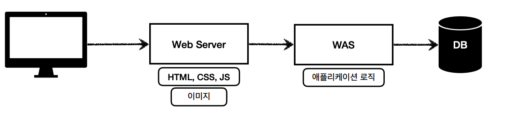
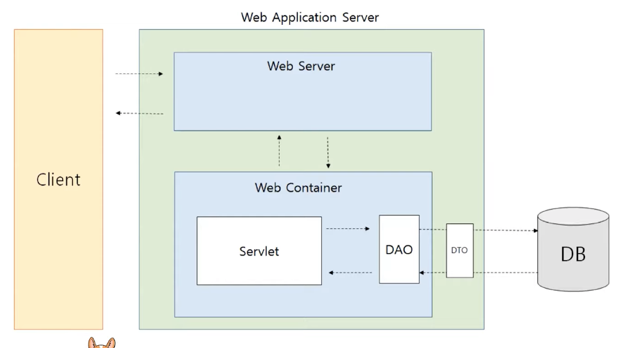
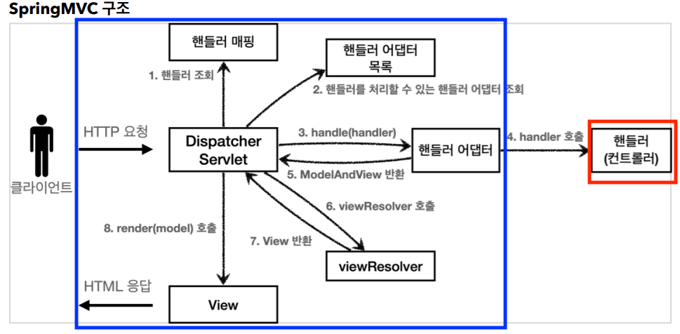
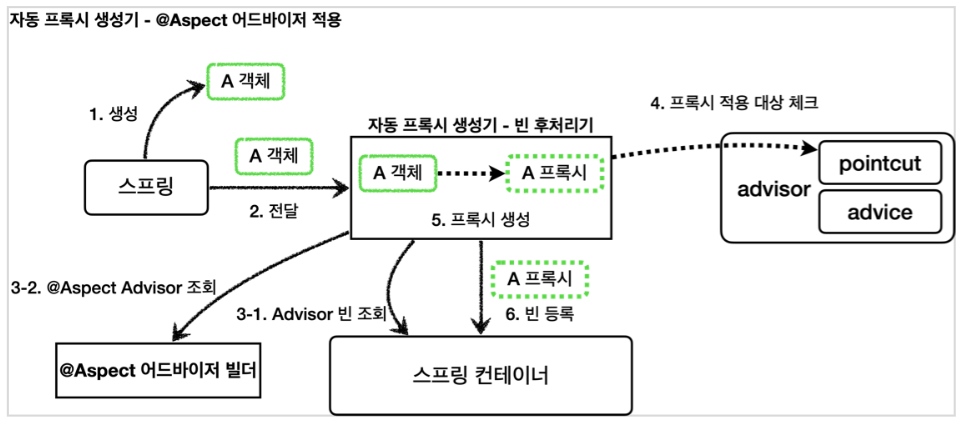
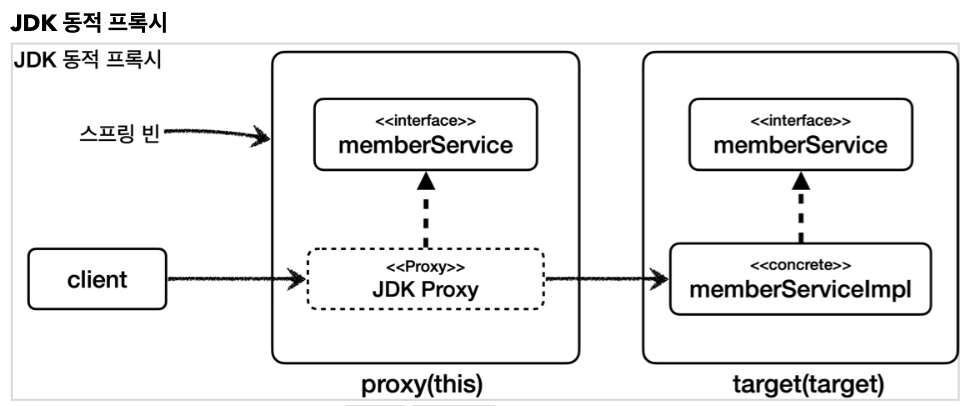
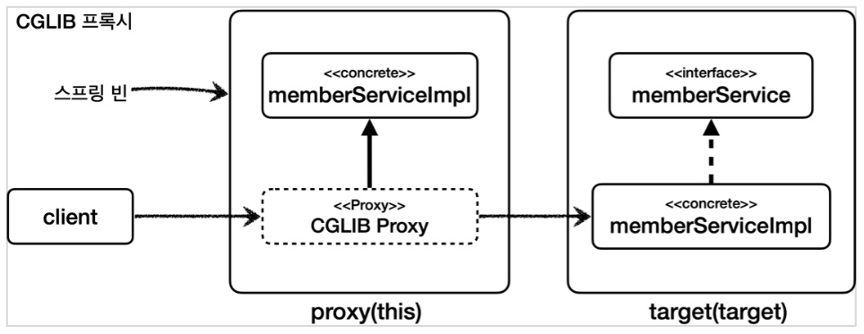
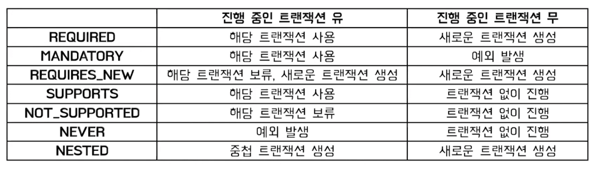
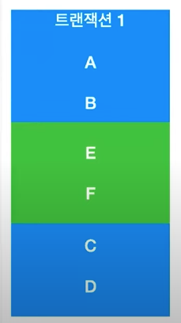
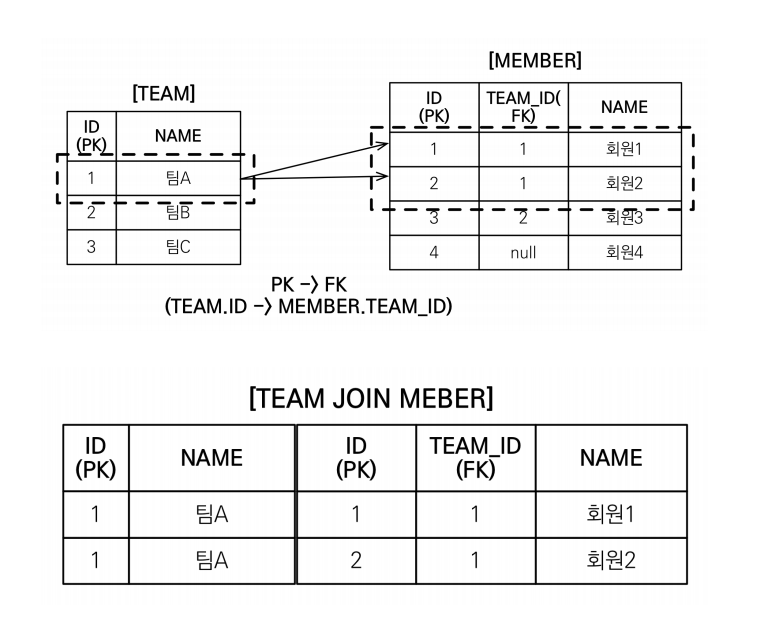
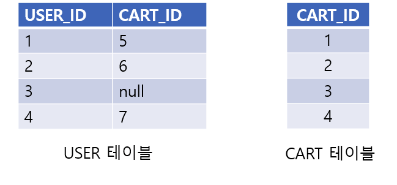

# Spring & JPA
<br>

-----------------------

### 프레임워크와 라이브러리

<details>
   <summary> 예비 답안 보기 (👈 Click)</summary>
<br />

-----------------------

둘의 차이는 **제어 흐름에 대한 주도권이 어디에 있는 가**의 차이이다.

* 프레임워크란 응용 프로그램이나 소프트웨어 솔루션 개발을 수월하기 위해 __구조, 틀이 제공된 소프트웨어 환경__ 이다.
* 라이브러리란 특정 기능을 수행하는 코드의 집합이다.

  
프레임워크의 경우 제어 흐름을 스스로 가지고 있는 반면에 라이브러리의 경우 제어 흐름을 개발자가 가지고 있다.

</details>

-----------------------

<br>

### Spring이란

<details>
   <summary> 예비 답안 보기 (👈 Click)</summary>
<br />

-----------------------

스프링은 __자바 플랫폼을 위한 오픈 소스 애플리케이션 프레임워크__ 이다.  
동적인 웹 사이트를 개발하기 위한 여러 가지 서비스를 제공하고 있다.  

+ POJO 기반의 구성으로 자바 코드를 이용해서 객체를 구성하는 방식 그대로 스프링에서 사용할 수 있다.
    - 덕분에 높은 생산성과 유연한 테스트를 할 수 있다.
+ DI(의존성 주입)을 통한 객체 관계 구성을 지원한다.
+ AOP(횡단 관심사 분리) 지원
+ MVC 구조로 계층이 분리되어 관리하기 수월하다. 
+ 배치 애플리케이션 스프링 배치가 있다.

</details>

-----------------------

<br>


### DI (Dependency Injection)

<details>
   <summary> 예비 답안 보기 (👈 Click)</summary>
<br />

-----------------------


__DI는 스프링 프레임워크에서 지원하는 IoC의 형태__ 이다.  
__클래스 사이의 의존관계를 빈 설정 정보를 바탕으로 컨테이너가 자동으로 연결해주는 것이다.__  
+ 장점
    - __스프링 자체에서 설정을 통해 연관 관계를 맺어줌으로써 객체간 결합도를 낮춰준다.__
    - __클래스의 재사용성을 높이고, 유지보수가 편리해진다.__
    - 의존성 주입으로 인해 stub, mock 객체를 사용해 unit 테스트의 이점이 생긴다.
+ 단점
    - 의존성 주입을 위한 선행 작업이 필요해 간단한 프로그램에서는 번거롭다.
    - __코드 추적이 어렵다.__


</details>

-----------------------

<br>


### IoC (Inverse of Control 제어의 역전)

<details>
   <summary> 예비 답안 보기 (👈 Click)</summary>
<br />

-----------------------


__객체의 생성부터 생명주기의 관리까지 모든 객체에 대한 제어권이 바뀐 것을 의미__ 한다.  
개발자는 프레임워크에 필요한 부품을 개발하고 조립하는 방식으로 개발을 하고 최종 호출은 개발자가 아니라 프레임워크의 내부에서 결정된 대로 이뤄지게 되는데 이런 현상을 제어의 역전이라고 한다.

</details>

-----------------------

<br>


### 주입 방식

<details>
   <summary> 예비 답안 보기 (👈 Click)</summary>
<br />

-----------------------


+ 수정자 주입
    - 대부분 의존 관계 주입은 한번 일어나면 종료시점까지 변경할 일이 거의 없다.
    - Setter를 통해 주입하게 되면 변경될 위험이 존재
    - setter을 public으로 열어야함
+ 필드 주입
    - 외부에서 변경이 불가능해서 테스트하기 어렵다.
+ 생성자 주입
    - 생성자 주입을 권장
    - 생성자 호출 시점에 딱 1번만 호출되는 것을 보장
    - final 키워드를 통해 불변하게 설계 가능
    - 의존성 주입이 누락되는 것을 방지할 수 있음(IDE에서 컴파일 오류로 알려줌)


</details>

-----------------------

<br>

### 스프링 컨테이너

<details>
   <summary> 예비 답안 보기 (👈 Click)</summary>
<br />

-----------------------


__스프링 컨테이너는 자바 객체의 생명 주기를 관리하며, 생성된 자바 객체들에게 추가적인 기능을 제공하는 등 역할을 한다.__  
간단하게, 등록된 빈의 생명주기를 관리하는 역할을 한다.  
스프링 컨테이너의 종류에는 BeanFactory와 __ApplicationContext__ 가 있다.  
ApplicationContext가 BeanFactory의 빈 관리 기능들을 상속받았고, 그 외에 국제화 등의 추가적인 기능을 갖고 있어 스프링 컨테이너라고 하면 보통 ApplicationContext라고 한다.  

</details>

-----------------------

<br>

### Bean

<details>
   <summary> 예비 답안 보기 (👈 Click)</summary>
<br />

-----------------------


+ __스프링 컨테이너 안에서 관리되는 객체__
+ 컨테이너에 담겨있으며, 필요할 때 컨테이너에서 가져와서 사용
+ @Bean을 사용해 등록하거나 xml을 사용해 등록하고, Bean으로 등록된 객체는 쉽게 주입하여 사용 가능


</details>

-----------------------

<br>


### Bean 생명주기

<details>
   <summary> 예비 답안 보기 (👈 Click)</summary>
<br />

-----------------------


>스프링 컨테이너 생성 -> 스프링 빈 생성 -> 의존 관계 주입 -> 초기화 콜백 -> 사용 -> 소멸전 콜백 -> 스프링 종료

+ 스프링 컨테이너에 의해 생명주기 관리
+ 스프링 컨테이너 초기화 시 빈 객체 생성, 의존 객체 주입 및 초기화
+ 생성과 의존관계 주입과 초기화 분리
    - 의존관계 주입(생성자 주입)은 필수정보를 받고 메모리 할당을 통해 객채 생성 책임
    - 초기화는 생성된 값들을 활용해 외부 커넥션을 연결하는 등 무거운 작업 수행
    - 명확하게 분리하는 것이 유지보수 관점에서 좋다.
+ 싱글톤 빈들은 컨테이너가 종료되기 직전에 소멸전 콜백이 발생

초기화와 소멸 메서드는 애노테이션으로 __@PostConstruct, @PreDestroy__ 를 사용하는 것이 권장된다.

</details>

-----------------------

<br>


### Bean 스코프


<details>
   <summary> 예비 답안 보기 (👈 Click)</summary>
<br />

-----------------------


+ 싱글톤
    -  spring 프레임워크의 기본이 되는 스코프
    - 스프링 컨테이너 시작과 종료까지 1개의 객체로 유지
+ 프로토타입
    - 빈의 생성, 의존관계 주입, 초기화까지만 관여하고 이후에는 컨테이너에서 관리하지 않는 스코프
    - 따라서 매번 요청마다 새로 만들어짐
    - 싱글톤은 스프링이 뜰때 생성되는데 반해, 프로토타입은 __요청할때 생성됨__
+ 웹 스코프
    - request : 각 요청이 들어오고 나갈때까지 유지
    - session : 세션이 생성되고 종료될때까지 유지
    - application : 웹의 서블릿 컨텍스트와 동일한 생명주기를 갖는 스코프
        - 서블릿 컨텍스트는 __web application내에 있는 모든 서블릿들을 관리하며 정보공유할 수 있게 도와 주는 역할__ 을 하는데, 톰캣 컨테이너가 실행 시 애플리케이션 하나당 한개의 서블릿컨텍스트가 생성된다.
        - 생명 주기는 보통 톰캣의 시작과 종료와 일치한다.

</details>

-----------------------

<br>

### Spring Annotation

<details>
   <summary> 예비 답안 보기 (👈 Click)</summary>
<br />

-----------------------

Annotation은 프로그램에게 추가적인 정보를 제공하는 메타데이터이다.


+ __@ComponentScan__
    - @Component, @Service, @Repository, @Controller, @Configuration이 붙은 클래스 Bean들을 찾아서 Context에 bean을 등록해주는 애노테이션
    - 전부 다 @Component를 사용하지 않고 @Repository 등으로 분리해서 사용하는 이유는, 예를 들어 @Repository는 DAO에서 발생할 수 있는 unchecked exception들을 스프링의 DataAccessException으로 처리할 수 있기 때문이다.
    - 또한 가독성에서도 해당 애노테이션을 갖는 클래스가 무엇을 하는지 단 번에 알 수 있다.
+ __@EnableAutoConfiguration__
    - autoConfiguration도 Configuration중 하나에 해당한다.
    - spring.factories 내부에 여러 Configuration들이 있고 조건에 따라 Bean이 등록되게 되는데 메인 클래스 @SpringBootApplication을 실행하면 @EnableAutoConfiguration에 의해 spring.factories 안에 있는 수많은 자동 설정들이 조건에 따라 적용되어 수 많은 Bean들이 생성된다.
    - 간단하게 정리하면, __Application Context를 만들 때 자동으로 빈설정이 되도록 하는 기능이다.__
+ @Component
    - 개발자가 직접 작성한 class를 Bean으로 등록하기 위한 애노테이션
+ @Bean
    - 개발자가 직접 제어가 불가능한 외부 라이브러리등을 bean으로 만들려할 때 사용되는 애노테이션
+ @Configuration
    - @Configuration을 클래스에 적용하고 @Bean을 해당 class의 메서드에 적용하면 @autowired로 Bean을 부를 수 있다.
+ @Autowired
    - 스프링이 Type에 따라 알아서 Bean을 주입해준다.
    - Type을 먼저 확인한 후 못 찾으면 Name에 따라 주입한다.
    - 강제로 주입하고자 하는 경우 @Qulifier을 같이 명시
+ @Qualifier
    - 같은 타입의 빈이 두 개 이상 존재하는 경우 스프링이 어떤 빈을 주입해야할 지 알 수 없어서 스프링 컨테이너를 초기화하는 과정에서 예외가 발생한다.
    - @Qualifier는 @Autowired와 함께 사용하여 정확히 어떤 bean을 사용할지 지정하여 특정 의존 객체를 주입할 수 있다.
+ __@Resource__
    - __@Autowired와 마찬가지로 Bean 객체를 주입해주는데 차이점은 Autowired는 타입으로, Resource는 이름으로 연결해준다.__
    - __애노테이션 사용으로 인해 특정 Framework에 종속적인 애플리케이션을 구성하지 않기 위해서 @Resource 사용을 권장한다.__
+ @Controller
    - API와 view를 동시에 사용하는 경우에 사용
    - 보통 view 화면 return을 목적으로 사용한다.
+ @RestController
    - view가 필요 없이 API만 지원하는 서비스에서 사용
+ @SpringBootApplication
    - @Configuration, @EnableAutoConfiguration, @ComponentScan 3가지를 하나로 합친 애노테이션


</details>

-----------------------

<br>


### 웹 서버와 웹 애플리케이션 서버


<details>
   <summary> 예비 답안 보기 (👈 Click)</summary>
<br />

-----------------------



+ 웹 서버
    - 정적 리소스 파일을 제공하는 서버
+ 웹 애플리케이션 서버(WAS)
    - 웹 서버가 하는 일 + 애플리케이션 로직(DB 연결, 동작 수행, 데이터 제공)까지 제공하여 동적인 처리를 하는 서버
    - 자바 진영에서는 서블릿 컨테이너 기능을 제공하면 WAS 라고 한다.
    - 위 그림에는 없지만 WAS 안에도 웹 서버가 따로 존재한다.

</details>

-----------------------

<br>


### 서블릿


<details>
   <summary> 예비 답안 보기 (👈 Click)</summary>
<br />

-----------------------

  
서블릿은 WAS 안에서 __동적인 페이지를 만드는데 사용되는 서버 프로그램__ 이다.  
서블릿이 존재하기 전에는 요청이 들어오면 HTTP 요청 메시지를 파싱하는 것부터 여러 부가 작업을 개발자가 수행해야 했다. 하지만 서블릿이 나오면서 부가적인 작업을 대신해주게 되었고, 개발자는 실직적인 메인 로직에만 집중 할 수 있게 되었다.

</details>

-----------------------

<br>


### 서블릿 컨테이너

<details>
   <summary> 예비 답안 보기 (👈 Click)</summary>
<br />

-----------------------

앞서 스프링 컨테이너와 비슷하게 서블릿 컨테이너는 __서블릿의 생명주기__ 를 관리한다.  
+ init : 서블릿 초기화
+ service : HTTP 요청 유형을 확인하고 맞게 doGet, doPost, doPut 등 메서드를 호출하여 요청 처리
+ destroy : 서블릿 제거

서블릿 객체도 __싱글톤__ 으로 관리되기 때문에 최초 요청 시점에 서블릿 객체를 초기화해서 서블릿 컨테이너에 보관하고 이후에는 같은 서블릿을 공유해서 사용한다.

### 요청 시 동작 과정

  
1. 사용자가 URL을 클릭하면 HTTP Request를 Servlet Container로 보낸다.
2. __Servlet Container는 쓰레드 풀에서 쓰레드를 꺼내 할당__ 해주고 HttpServletRequest, HttpServletResponse 두 객체를 생성한다.
3. 사용자가 요청한 URL을 분석하여 어느 서블릿에 대한 요청인지 찾는다.
4. 서블릿 컨테이너에 존재하지 않으면 초기화하고 있다면 가져와서 service() 메서드를 호출한다.
    - Spring MVC의 경우 DispatcherServlet이 초기화되고 호출된다.
5. service 메서드가 수행이 끝나면 HttpServletResponse 객체에 응답을 보낸다.
6. 응답이 완료되면 HttpServletRequest, HttpServletResponse 객체를 소멸시킨다.

</details>

-----------------------

<br>


### 특정 서블릿에 접근하는 n명의 사용자가 있는 경우 이 서블릿은 첫번째 사용자가 처음 엑세스 했을때만 인스턴스화 되는건가요, 아니면 모든 사용자에게 개별적으로 인스턴스화 되는건가요?

<details>
   <summary> 예비 답안 보기 (👈 Click)</summary>
<br />

-----------------------


웹 애플리케이션이 로드되면 서블릿 컨테이너(아파치 톰캣 같은)는 ServletContext를 __한번 생성하여__ 메모리에 보관한다.  
이후 servlet, filter, listener가 발견되면 해당 클래스들은 __한번 인스턴스 생성하고__ 서버의 메모리에 보관한다.  
다른 것들은 처음으로 HTTP request가 올때 init 메서드로 생성하여 보관한다.(이 이유로 첫 사용자의 경우 응답속도가 늦다.)  


</details>

-----------------------

<br>


### MVC 패턴

<details>
   <summary> 예비 답안 보기 (👈 Click)</summary>
<br />

-----------------------

  
1. 핸들러 조회
    - 핸들러 매핑을 통해 요청 URL에 매핑된 핸들러(컨트롤러)를 조회한다.
2. 핸들러 어댑터 조회
    - 핸들러를 실행할 수 있는 핸들러 어댑터를 조회한다.
3. 핸들러 어댑터 실행
    - 조회한 핸들러(컨트롤러)를 인자로 핸들러 어댑터에 넘겨서 핸들러를 실행시킨다.
4. ModelAndView 반환
    - 핸들러(컨트롤러)가 로직을 수행하고 반환하는 정보로 ModelAndView로 변환해서 반환한다.
5. viewResolver 호출
    - 적절한 viewResolver를 찾고 해당 viewResolver를 호출한다.
    - RestController라면 이 과정과 이후 과정 없이 컨버터를 이용해 바로 결과값을 리턴한다.
6. View 반환
    - viewResolver는 뷰의 논리 이름을 물리 이름으로 바꾸고, 랜더링 역할을 담당하는 뷰 객체를 반환한다.
7. 뷰 랜더링
    - 뷰를 통해서 뷰를 랜더링한다.

### MVC 패턴 장단점
+ 정의
    - Model, View, Controller로 분리하는 아키텍처
+ 장점
    - 과거에는 Controller에 다 담아두고 처리했다.
    - 기능 별로 코드를 분리하여, 가독성을 높이고 재사용성을 증가시킨다.
+ 단점
    - __view와 model 사이에 의존성이 높아서 애플리케이션이 커질수록 복잡해지고 유지보수가 어렵다.__
    - __대규모의 프로그램에서 Controller에 다수의 Model과 View가 복잡하게 연결되어 코드 분석과 테스트가 어려워 질 수 있다.__
    - 이런 의존성 문제를 해결하기 위해 MVVM, MVP 구조가 등장했다.  

</details>

-----------------------

<br>


### 어떻게 하나의 컨트롤러로 여러 요청을 받을까?

<details>
   <summary> 예비 답안 보기 (👈 Click)</summary>
<br />

-----------------------

컨트롤러는 기본적으로 컴포넌트 스캔되면서 스프링 빈 컨테이너에 올라가있고 싱글톤 패턴으로 구현되어있기 때문에 여러 스레드의 요청이 들어와도 하나의 컨트롤러 객체를 공유하면서 처리한다.  
여기서 주의할 점은 싱글톤 패턴으로 구현되어 있어 있다는 것은 Thread-Safe하지 않다는 의미이므로 상태를 공유하거나 저장하는 코드가 없도록 Stateless하게 정의해야 한다.  
__결과적으로 내부에는 상태가 존재하지 않으니 메서드에 대한 정보만 같이 공유해서 쓰는 것이다.__

</details>

-----------------------

<br>


### 싱글톤 패턴은 멀티스레드 환경에 어떤 문제가 생길까?

<details>
   <summary> 예비 답안 보기 (👈 Click)</summary>
<br />

멀티스레드 환경에서 스프링 싱글톤에서 문제가 생겼다면 메서드를 호출하는 환경이 스레드 세이프하게 구현되지 않았다던가, 싱글톤 패턴으로 생성되는 객체가 전역변수를 가졌기 때문이다.  
싱글톤 패턴은 하나의 객체를 공유하기 때문에 전역변수 같은 것은 되도록이면 사용하지 않아야 한다.  
이를 해결하는 방법은 다음과 같다.
+ 지역 변수 사용
+ Atomic 자료형 사용
+ ThreadLocal 사용
+ Synchronized 사용

</details>

-----------------------

<br>

### AOP(Aspect Oriented Programming)

<details>
   <summary> 예비 답안 보기 (👈 Click)</summary>
<br />

-----------------------


관점 지향 프로그래밍으로 __공통 관심 사항과 핵심 관심 사항을 분리__ 하는 것을 의미한다.  
소스 코드에서 여러 번 반복해서 사용하는 코드(흩어진 관심사)를 Aspect로 모듈화하여 핵심 로직에서 분리해 재사용하는 것이라고 볼 수 있다.  
여러 객체에 공통으로 적용할 수 있는 기능을 구분함으로써 재사용성을 높여주는 프로그래밍 기법이다.  
특정 로직(로그, 성능테스트, 권한)을 모든 메서드에 적용하고 싶을 때, 일일이 추가하는 것이 아니라 로직을 만들어서 적용할 수 있다.  
따라서, 비즈니스 로직 앞/뒤에 공통 관심 사항을 수행해 중복 코드를 줄인다.  
__주요 용어__  
+ Aspect
    - 흩어진 관심사를 모듈화 한 것
        - 모듈 : 외부에서 재사용할 수 있는 패키지들을 묶은 것
    - advice + pointcut을 모듈화 한 것
+ Target
    - advice의 대상이 되는 객체
    - Pointcut으로 결정
+ Advice
    - 실질적인 부가 기능 로직을 정의하는 곳
    - 특정 조인 포인트에서 Aspect에 의해 취해지는 조치
+ Join point
    - advice가 적용될 수 있는 모든 지점
    - ex) 메서드 실행 시점, 생성자 호출 시점, 필드 값 접근 시점 등등..
    - __스프링 AOP는 프록시 방식을 사용하므로 조인 포인트는 항상 메서드 실행 지점__
+ Pointcut
    - 하나 이상의 조인 포인트를 선별하는 표현식
    - __스프링 AOP는 프록시 기반이기 때문에 조인 포인트가 메서드 실행 시점 뿐이 없고 포인트컷도 메서드 실행 시점만 가능__
+ Advisor
    - 스프링 AOP에서만 사용되는 용어로 advice + pointcut 한 쌍
+ Weaving
    - pointcut으로 결장한 타겟의 join point에 advice를 적용하는 것
+ AOP 프록시
    - AOP 기능을 구현하기 위해 만든 프록시 객체
    - 스프링에서 AOP 프록시는 JDK 동적 프록시 또는 CGLIB 프록시

</details>

-----------------------

<br>

### AOP 적용 시점


<details>
   <summary> 예비 답안 보기 (👈 Click)</summary>
<br />

-----------------------

+ 컴파일 시점
    - .java 파일을 컴파일러를 통해 .class를 만드는 시점에 부가 기능 로직을 추가
    - 모든 지점에 적용 가능
    - AspectJ가 제공하는 특별한 컴파일러를 사용해야 하기 때문에 특별할 컴파일러가 필요한 점과 복잡하다는 단점이 있다.
+ 클래스 로딩 시점
    - .class 파일을 JVM 내부의 클래스 로더에 보관하기 전에 조작하여 부가 기능 로직 추가
    - 모든 지점에 적용 가능
    - 특별한 옵션과 클래스 로더 조작기를 지정해야하므로 운영하기 어렵다.
+ __런타임 시점__
    - __스프링이 사용하는 방식__
    - 런타임 시점에 프록시를 사용하여 실제 대상 코드는 그대로 유지되고 프록시를 통해 부가 기능이 적용 
    - __프록시는 메서드 오버라이딩 개념으로 동작하기 때문에 메서드에만 적용 가능__
    - 특별한 컴파일러나, 복잡한 옵션, 클래스 로더 조작기를 사용하지 않아도 스프링만 있으면 AOP를 적용할 수 있기 때문에 스프링 AOP는 런타임 방식을 사용

</details>

-----------------------

<br>

### AOP 적용 과정

<details>
   <summary> 예비 답안 보기 (👈 Click)</summary>
<br />

-----------------------

  

1. 스프링 빈 대상이 되는 객체를 생성한다.(@Bean, 콤포넌트 스캔 대상)
2. 생성된 객체를 빈 저장소에 등록하기 직전에 빈 후처리기에 전달한다.
3. 모든 Advisor 빈을 조회합니다.
4. @Aspect Advisor 빌더 내부에 저장된 모든 Advisor를 조회합니다.
5. 3,4에서 조회한 Advisor에 포함되어 있는 포인트컷을 통해 클래스와 메서드 정보를 매칭하면서 프록시를 적용할 대상인지 아닌지 판단합니다.
6. 여러 Advisor의 하나라도 포인트컷의 조건을 만족한다면 프록시를 생성하고 원본 빈 대신 프록시를 빈 저장소로 반환합니다.
7. 만약 프록시 생성 대상이 아니라면 들어온 빈 그대로 빈 저장소로 반환합니다.
8. 빈 저장소는 객체를 받아서 빈으로 등록합니다.

Advisor 빈을 조회하고 @Aspect Advisor 빌더 내부에 저장된 모든 Advisor를 조회하여 대상이 된다면 프록시를 원본 빈 대신에 반환하는 로직이 추가된 것을 확인할 수 있습니다.

</details>

-----------------------

<br>

<br>

### jdk 동적 프록시 vs CGLIB

<details>
   <summary> 예비 답안 보기 (👈 Click)</summary>
<br />

-----------------------


#### jdk 동적 프록시
  

JDK 동적 프록시의 경우 대상의 인터페이스가 있으면 해당 인터페이스의 구현체로 프록시를 생성한다. 따라서 실제로 구현된 다른 JDK 동적 프록시의 구현체로 타입 캐스팅이 불가능하다.


#### cglib
  

CGLIB은 구현체를 상속받아 프록시를 생성하기 때문에 구현체로 타입 캐스팅이 가능하다.  
CGLIB 라이브러리에는 부모 생성자 2번 호출 문제, final 키워드 클래스, 메서드 사용 문제 등이 있었지만 spring에서 자체적으로 위 문제를 해결했다.  

**그래서 결과적으로 spring boot는 기본적으로 CGLIB를 채택한다.**


</details>

-----------------------

<br>


### DAO, DTO, VO

<details>
   <summary> 예비 답안 보기 (👈 Click)</summary>
<br />

-----------------------

+ DAO
    - DB 데이터를 조회하거나 조작하는 기능을 전담하는 객체
    - DB 접근 로직과 비즈니스 로직을 분리하기 위해서 사용
+ DTO
    - 계층간의 데이터 교환을 위한 객체
    - 로직을 갖지 않는 순수 데이터 객체로 getter, setter만 포함
+ VO
    - 읽기 전용으로 불변 객체
    - getter, setter(불변이므로 setter가 없음) 이외의 추가 로직 포함 가능


</details>

-----------------------

<br>


### Filter, Interceptor

<details>
   <summary> 예비 답안 보기 (👈 Click)</summary>
<br />

-----------------------

  
+ Filter
    - __Dispatcher Servlet에 요청이 전달되기 전/후에 url 패턴에 맞는 모든 요청에 대해 부가작업을 처리하는 기능을 제공하는 것__
    - __톰캣과 같은 웹 컨테이너(웹 애플리케이션 WAS 단)에서 동작__ 하기 때문에 Spring과 무관한 자원에 대해 동작
    - Spring Context 외부에서 동작하므로 __ErrorController__ 에서 예외 처리
    - init
        - 필터 객체를 초기화하고 서비스에 추가하기위한 메서드
        - 웹 컨테이너(WAS 단)에서 1회 init 메서드를 호출하여 필터 객체를 초기화하면 이후 요청들은 doFilter를 통해 전/후 처리가 된다.
    - doFilter
        - url-pattern에 맞는 모든 HTTP 요청이 디스패처 서블릿으로 전달되기 전/후에 웹 컨테이너에 의해 실행되는 메서드
        - doFilter의 파라미터로 FilterChain이 있는데, FilterChain의 doFilter 를 통해 다음 대상으로 요청을 전달한다.
    - destroy
        - 필터 객체를 서비스에서 제거하고 사용하는 자원을 반환하는 메서드
        - 웹 컨테이너에 의해 1번 호출된다.
    - 참고로 필터를 추가하기 위해서는 javax.servlet의 Filter 인터페이스를 구현하면 된다.
+ Interceptor
    - __Spring이 제공하는 기술로, Dispatcher Servlet이 컨트롤러를 호출하기 전과 후에 요청과 응답을 참조하거나 가공할 수 있는 기능을 제공하는 것__
    - __스프링 컨텍스트에서 동작__
    - Spring Context 내부에서 동작하므로 __@ControllerAdvice__ 을 사용하여 예외 처리
    - preHandle
        - 컨트롤러가 호출되기 전에 실행되어 컨트롤러 이전에 처리해야 하는 전처리 작업이나 요청 정보를 가공하거나 추가하는 경우에 사용할 수 있다.
    - postHandle
        - 컨트롤러 호출된 후에 실행되어 컨트롤러 이후에 처리해야하는 후처리 작업이 있을 때 사용할 수 있다.
        - 보통 컨트롤러가 반환하는 ModelAndView 타입의 정보가 제공되는데, 최근에는 Json 형태로 데이터를 제공하는 REST API 기반의 컨트롤러가 사용되면서 잘 사용하지 않는다.
    - afterCompletion
        - 모든 뷰에서 최종 결과를 생성하는 일을 포함해 모든 작업이 완료된 후에 실행된다.
        - 요청 처리 중에 사용한 리소스를 반환할 때 사용하기 적합하다.    
    - 참고로 인터셉터를 추가하기 위해서는 org.springframework.web.servlet의 HandlerInterceptor 인터페이스를 구현하면 된다.

### 실행 과정
1. 서버 실행 시 Servlet이 올라오는 동안 init 후 doFilter 실행
2. Dispatcher Servlet을 지나쳐 Interceptor의 PreHandler 실행
3. 컨트롤러를 거쳐 내부 로직 수행 후, Interceptor의 PostHandler 실행
4. doFilter 실행
5. Servlet 종료 시 destory


### 둘의 차이

대상|필터(Filter)|인터셉터(Interceptor)
---|---|---
관리 컨테이너|웹 컨테이너|스프링 컨테이너
Rqeust/Response 조작 여부|가능|불가능
용도| + 보안 관련 공통 작업<br>+ 이미지/데이터 압축 및 문자열 인코딩<br>+ 모든 요청에 대한 로깅 또는 감사|+ 인증/인가 등과 같은 공통 작업<br>+ Controller로 넘겨주는 정보의 가공<br>+ API 호출에 대한 로깅 또는 감사

인터셉터가 조작 여부가 불가능하다는 것은 HttpServletRequest, HttpServletResponse 객체를 제공받으므로 객체 자체는 조작할 수 없다는 의미이고, 내부 값들은 조작할 수 있다.

</details>

-----------------------

<br>


### AOP, Interceptor


<details>
   <summary> 예비 답안 보기 (👈 Click)</summary>
<br />

-----------------------

AOP와 Interceptor가 비슷한 기능을 수행한다고 할 수 있는데 이들의 사용을 구분 짓는 방법은 __파라미터__ 이다.  
모든 메서드의 파라미터와 타입은 제각각이기 때문에 이에 대해 AOP를 적용하게 되면 부가 작업들이 생기게 된다.  
반면에 Interceptor의 경우 HttpServletRequest, HttpServletResponse를 파라미터로 사용하여 부가 작업이 필요하지 않다.  
또한, 인터셉터는 Conotroller 앞에서 동작하고 AOP는 Service 앞에서 동작한다.  

</details>

-----------------------

<br>


### 레이어드 아키텍처

<details>
   <summary> 예비 답안 보기 (👈 Click)</summary>
<br />

-----------------------


  
Spring은 레이어드 아키텍처로 이루어져있다.  
하나의 레이어는 자신의 고유 역할을 수행하고, 인접한 다른 레이어에 무언가를 요청하거나 응답한다.  
그밖의 다른 레이어는 신경 쓸 필요가 없기 때문에 각 레이어는 자신의 역할에 충실할 수 있다.  
따라서 시스템 전체를 수정하지 않고 특정한 레이어의 기능을 개선하거나 교체할 수 있기 때문에 재사용성이 좋고 유지 보수하기에도 유리하다.  
또한, 레이어별로 테스트 구현이 편해지고 코드 가독성도 높아진다.

+ Presentation Layer
    - view를 담당하는 부분으로, 클라이언트와 직접적으로 맞닿는 부분
+ Application Layer 
    - 비즈니스 핵심 로직을 처리하는 부분
    - Service 객체라는 것은 하나의 트랜잭션으로 구성되어 작동
+ Persistence Layer
    - 데이터 관련 처리를 담당하는 부분

</details>

-----------------------

<br>


### OSIV

<details>
   <summary> 예비 답안 보기 (👈 Click)</summary>
<br />

-----------------------


OSIV는 Open Session In View의 약자로 __영속성 컨텍스트를 뷰단까지 열어준다__ 는 뜻이다.  
스프링의 OSIV는 프레센테이션 계층에는 트랜잭션이 없기 때문에 엔티티를 수정할 수 없지만 영속성 컨텍스트가 살아있기 때문에 지연로딩이 가능합니다.  
언뜻보면 만능처럼 보이지만 단점이 있다.
+ 같은 영속성 컨텍스트를 여러 트랜잭션이 공유할 수 있다.
+ 프레젠테이션 계층에서 엔티티를 수정하고 트랜잭션(서비스계층)으로 들어오면 엔티티가 수정된다.
+ 프레젠테이션 계층에서 지연로딩에 의한 SQL이 실행되기 때문에 성능 튜닝시 확인해야할 부분이 넓어진다.

</details>

-----------------------

<br>


### 커넥션 풀

<details>
   <summary> 예비 답안 보기 (👈 Click)</summary>
<br />

-----------------------

애플리케이션이 데이터베이스를 사용하기 위해서는 커넥션을 맺어야 한다.  
커넥션을 생성하고 소멸시키는 비용이 크기 때문에 커넥션 풀을 세팅해두고(기본 10) 애플리케이션이 시작하는 시점에 커넥션을 미리 다 만들어 놓고 이를 재활용하면서 사용한다.  
스프링 부트 2.0부터는 hikariCP를 기본 커넥션 풀로 사용한다.  

</details>

-----------------------

<br>

### DataSource

<details>
   <summary> 예비 답안 보기 (👈 Click)</summary>
<br />

-----------------------

커넥션 관련 기술이 여러 개 등장하면서 코드레벨에서는 서로 다르지만 논리적으로는 커넥션을 획득하는 역할을 하기 때문에 이를 추상화 시킨 것이 DataSource이다.  
실질적인 로직은 DataSource에 의존하도록 하고 구현 기술이 바뀔때 마다 DataSource의 구현체만 바꾸면 되므로 재사용성과 확장성을 높일 수 있다.  
커넥션 관련 기술은 커넥션을 계속 신규 생성하는 DriverManager, DBCP2 커넥션 풀, HikariCP 커넥션 풀 등이 있다.  
DriverManager는 DataSource를 구현하지 않아서 스프링에서 DriverManagerDataSource라는 구현 클래스를 제공한다.  

</details>

-----------------------

<br>

### 트랜잭션을 추상화하는 이유

<details>
   <summary> 예비 답안 보기 (👈 Click)</summary>
<br />

-----------------------


DataSource와 같은 맥락이다.  
다양한 데이터 접근 기술이 등장하면서 코드레벨에서는 서로 다르지만 논리적으로는 같은 기능을 수행하기 때문에 트랜잭션을 추상화했다.  
스프링 트랜잭션 추상화 클래스는 __PlatformTransactionManager__ 이다. 보통 __트랜잭션 매니저__ 라고 부른다.  
다양한 접근 기술로는 JDBC, JPA, 하이버네이트 등이 있다.  

</details>

-----------------------

<br>

### @Transactional 동작 방식


<details>
   <summary> 예비 답안 보기 (👈 Click)</summary>
<br />

-----------------------

spring의 @Transactional는 AOP로 구성되어 있다. 즉, 프록시로 동작하므로 오버라이딩 개념으로 동작한다.  
따라서 __클래스에 붙으면 클래스의 전체 public 메서드에 트랜잭션 처리가 된 프록시가 빈으로 등록된다.__ 단, private 메서드에는 적용이 불가능하며, 같은 클래스 내의 함수에서 함수간 호출의 경우 트랜잭션이 적용되지 않을 수 있다.

예를 들어, 트랜잭션이 붙지 않은 함수에서 트랜잭션이 붙은 다른 함수를 내부적으로 호출하는 경우 적용되지 않는다. 이와 같은 경우는 함수를 다른 클래스로 각각 분리해서 호출해야 한다.  

<br>

보통 서비스 단에서 트랜잭션을 시작하고 끝낸다.  
그렇다면 __하나의 트랜잭션 내에서는 같은 커넥션을 사용__ 해야 하는데 과정이 다음과 같다.  
1. 서비스단에서 트랜잭션이 시작하면 트랜잭션 매니저가 커넥션을 생성하고(풀을 사용하면 풀에서 가져오고) autoCommit을 false로 세팅한 뒤 트랜잭션 동기화 매니저의 스레드 로컬에 커넥션을 보관한다.  
2. 이후 리포지토리 계층에서는 트랜잭션 동기화 매니저의 스레드 로컬에서 해당 커넥션을 가져와서 사용한다.  
3. 서비스 단에서 트랜잭션을 종료할 때는 트랜잭션 동기화 매니저에서 해당 커넥션을 가져와 커밋 또는 롤백을 수행하고 리소스를 정리하고 커넥션을 커넥션 풀에 반환한다.  

__하나의 트랜잭션에서 같은 커넥션을 사용하도록 도움을 주는 기능을 제공한다고 보면 된다.__  

<br>


</details>

-----------------------

<br>


### Propagation 전파단계

<details>
   <summary> 예비 답안 보기 (👈 Click)</summary>
<br />

-----------------------

트랜잭션 전파란 __트랜잭션의 경계에서 이미 트랜잭션이 진행 중인 트랜잭션이 있을 때 어떻게 동작할지를 결정하는 것__ 입니다.    



#### REQUIRED

  

```java
@Transactional(propagation=Propagation.REQUIRED)
```
디폴트 설정은 REQUIRED입니다.  
진행중인 트랜잭션이 없다면 새로 트랜잭션이 생성하여 사용합니다.  
이미 시작된 트랜잭션이 있다면 해당 트랜잭션의 중간에 참여하여 실행되게 됩니다.  
따라서 두 메서드가 하나의 트랜잭션으로 실행되기 때문에 어느 곳에서라도 문제가 발생하면 전부 롤백됩니다.

#### REQUIRES_NEW
```java
@Transactional(propagation=Propagation.REQUIRES_NEW)
```
진행중인 트랜잭션이 없다면 새로운 트랜잭션을 만들어 동작하고, 진행중인 트랜잭션이 존재한다면 해당 트랜잭션을 잠시 보류시키고 자신이 만든 트랜잭션을 실행합니다.

#### SUPPORTS
```java
@Transactional(propagation=Propagation.SUPPORTS)
```
진행중인 트랜잭션이 없다면 트랜잭션 없이 메서드를 실행하고, 진행중인 트랜잭션이 있다면 REQUIRED처럼 해당 트랜잭션에 참여합니다.

#### NOT_SUPPORTED
```java
@Transactional(propagation=Propagation.NOT_SUPPORTED)
```
진행중인 트랜잭션이 없다면 트랜잭션이 없이 진행하고, 진행중인 트랜잭션이 있다면 해당 트랜잭션을 보류하고 트랜잭션 없이 진행합니다.

#### MANDATORY
```java
@Transactional(propagation=Propagation.MANDATORY)
```
진행중인 트랜잭션이 없다면 예외가 발생하고, 진행중인 트랜잭션이 있다면 참여합니다.

#### NEVER
```java
@Transactional(propagation=Propagation.NEVER)
```
진행중인 트랜잭션이 없다면 트랜잭션 없이 진행하고, 진행중인 트랜잭션이 있다면 예외를 발생시킵니다.

#### NESTED
  

```java
@Transactional(propagation=Propagation.NESTED)
```
진행중인 트랜잭션이 없다면 새로운 트랜잭션을 만들어 수행하고, 진행중인 트랜잭션이 있다면 새로운 트랜잭션을 만들고 진행중인 트랜잭션 내에 삽입합니다. 새로 만든 트랜잭션은 부모 트랜잭션의 커밋, 롤백에는 영향을 받지만 부모 트랜잭션은 새로 만든 트랜잭션의 커밋과 롤백에는 영향을 받지 않습니다.


</details>

-----------------------

<br>

### ORM

<details>
   <summary> 예비 답안 보기 (👈 Click)</summary>
<br />

-----------------------


+ JDBC API
    - JAVA 진영 Database 연결 표준 인터페이스
+ Spring JDBC
    - template을 통해 데이터를 꺼내면서 한단계 더 추상화
+ MyBatis
    - SQL 분리를 목적으로 XML로 관리하는 방식
+ ORM(Object Relational Mapping)
    - 객체지향 코드와 데이터 중심 데이터베이스의 패러다임 불일치를 해결하기 위해 나온 기술
    - 객체와 관계형 데이터베이스를 맵핑하는 기술
+ JPA
    - 자바 ORM의 표준 API 명세를 JPA 인터페이스라고 한다.
+ Hibernate
    - JPA 인터페이스의 구현체
+ Spring Data JPA
    - JPA에 Repository를 추가하여 한단계 더 추상화한 것

</details>

-----------------------

<br>


### 영속성 컨텍스트

<details>
   <summary> 예비 답안 보기 (👈 Click)</summary>
<br />

-----------------------

영속성 컨텍스트란 __엔티티를 영구 저장하는 환경을 의미__ 한다.  
생명 주기
+ 영속
    - 영속성 컨텍스트에 저장된 상태
+ 준영속
    - 영속성 컨텍스트에 저장되었다가 분리된 상태
+ 비영속
    - 영속성 컨텍스트와 전혀 관계없는 상태
+ 삭제
    - 삭제된 상태

### 영속성 컨텍스트의 이점
+ 1차 캐시
    - 조회가 가능하며 1차 캐시에 없으면 DB에서 조회하여 1차 캐시로 가져온다.
+ 동일성 보장
    - == 비교가 가능하다.
+ 쓰기 지연
    - 트랜잭션 커밋 전까지 SQL을 바로 보내지 않고 모아서 보낼 수 있다.
+ 변경 감지(더티 체킹)
    - 1차 캐시에 들어온 데이터를 스탭샷 찍어두고 커밋시점에 비교하여 update SQL을 생성한다.
+ 지연 로딩
    - 엔티티안에서 엔티티를 불러올 때 사용 시점에 쿼리를 날려 가져올 수 있다.

</details>

-----------------------

<br>


### N+1 문제

<details>
   <summary> 예비 답안 보기 (👈 Click)</summary>
<br />

-----------------------

N+1 문제란, 연관관계를 Lazy하게 매핑해놓은 상태로 조회한 여러개의 엔티티가 있을때, 여러 엔티티에서 Lazy하게 가져온 연관관계 객체에 접근하는 경우, 쿼리가 여러번 나가는 현상을 의미한다.
첫번째로 여러 엔티티를 조회했을때는 1번의 쿼리가 발생했지만, 여러 엔티티의 Lazy한 객체에 접근하면서 N번의 쿼리가 더 발생한다는 의미이다.

이에 대한 해결책은 Fetch Join과 Batch Size가 있다.  
Fetch Join을 사용하면 Lazy로딩으로 프록시로 들어오던 것을 join으로 한 번에 땡겨올 수 있다.  
Batch Size는 N+1문제가 발생하던 것 처럼 프록시로 가져오고 학생들 가져오게 될 때 쿼리가 한번 더 나가게 되는데 이때 in쿼리로 Batch size 개수만큼 가져온다.  

예를 들어, 하나의 팀에 여러 학생이 있을때, 가져온 팀이 10개이고 Batch size가 5라면, 최초에 학생을 가져오는 쿼리에서 where 조건문 in 쿼리로 5개의 team id값을 넣어서 쿼리를 날린다. 이렇게 되면 결과적으로 학생을 가져오는 쿼리는 2번 나가게 되어 총 쿼리는 3(팀 가져오는 쿼리 + 학생 가져오는 쿼리)개의 쿼리가 나가게 된다.  

참고로 @EntityGraph를 사용해도 Fetch join으로 가져올 수 있다.  

</details>

-----------------------

<br>


### fetch join 한계


<details>
   <summary> 예비 답안 보기 (👈 Click)</summary>
<br />

-----------------------

+ fetch join 대상에는 별칭을 줄 수 없다.
    - 하이버네이트는 허용하지만 가급적이면 사용하지 않는게 좋다.
    - fetch join은 나의 연관된 것들을 다 끌고오겠다는 의미로 설계된 것이기 때문에 대상을 where문과 on에서 사용하게 되면 필터링이 되므로 의도된 설계와 맞지 않는다.
+ __둘 이상의 컬렉션은 fetch join 할 수 없다.__ 
    - 2개 이상의 컬렉션을 Fetch join으로 땡겨오면 데이터 정합성 문제가 발생한다.(MultipleBagFetchException)
    - 해결책은 자주 사용하는 컬렉션 쪽에 Fetch join을 걸어주고 나머지는 Lazy Loading을 걸어둔 상태에서 Batch Size로 처리한다.
+ OneToMany의 경우 여러 이슈가 있다. 
  + 페이징 쿼리는 성능 이슈가 있다.
  + 페이징 쿼리가 아닌 경우, 반드시 distinct를 사용해야 한다.


#### OneToMany 이슈 
ManyToOne의 경우 애초에 Many에 One을 끼워넣기 때문에 최대 Many의 데이터 개수만큼만 조회된다. 반면에 OneToMany의 경우 One에 Many를 끼워넣기 때문에 기존 One의 개수 만큼의 데이터가 아니라 더 많은 데이터가 조회된다.(뻥튀기 된다.)

  

팀A에 학생1, 학생2가 연관된 데이터가 DB에 있다고 했을 때, 개발자의 의도는 팀A에 연결된 모든 Member를 모두 꺼내오는 식으로 페이징을 1로 주고 쿼리를 oneToMany에서 fetch Join을 날리게 되면 DB단에서는 OneToMany이므로 Team쪽 데이터가 뻥튀기되면서 (팀A, 회원1), (팀A, 회원2)로 구성되고 여기서 페이징하게 되면 (팀A, 회원1)의 데이터만 나오게 된다. 따라서 **JPA는 이를 판단할 수 없기 때문에 애초에 나가는 쿼리를 살펴보면 페이징 쿼리가 제거되서 나가고 연관된 데이터를 전부다 끌고오는 쿼리가 나가게 된다. 그리고 해당 데이터를 메모리에 적재해서 페이징을 시작한다.**  

만약 테이블에 100만개의 데이터가 있다는 그걸 다 땡겨온 상태에서 페이징을 진행한다는 의미다. 결과적으로는 의도대로 동작할 지라도 엄청난 성능에 악영향을 주기 때문에 사용해서는 안된다. 이러한 성능 이슈 때문에 이를 경고하는 메시지가 콘솔에 찍힌다. 따라서 OneToMany에서 페이징 쿼리를 날리고 싶다면 batch size를 사용해야 한다.  

<br>

페이징 쿼리를 사용하지 않고 OneToMany를 사용할 때 주의할 점도 있다. 앞서 설명했듯이 OneToMany에서 fetch Join을 하면 DB에서는 데이터가 뻥튀기 된 상태로 넘어온다. 이걸 애플리케이션 단에서 받으면 당연히 아무처리 없이 뻥튀기 된 상태로 받게 된다. 즉, (팀A, 회원1), (팀A, 회원2) 이렇게 받게 되는 문제가 발생하는 것이다. 이를 해결하기 위해서는 쿼리에 distinct를 명시하면 된다. DB단에서는 당연히 행 데이터가 서로 다르기 때문에 distinct가 동작하지 않지만 애플리케이션 단으로 데이터가 넘어오면 JPA에서 distinct로 식별자가 같은 것을 걸러서 컬렉션으로 꽂아주는 기능을 제공해준다. 따라서 OneToMany 관계에서 fetch join을 사용한다면 반드시 distinct를 명시해야 한다.

> hibernate 6.0 버전부터는 default로 distinct가 들어가기 때문에 문제가 해결되었다.
> https://docs.jboss.org/hibernate/orm/6.0/migration-guide/migration-guide.html#query-sqm-distinct

</details>

-----------------------

<br>

### OneToOne 양방향 관계 Lazy 로딩 주의

<details>
   <summary> 예비 답안 보기 (👈 Click)</summary>
<br />

-----------------------

OneToOne 양방향 관계에서는 연관관계 주인이 호출할 때는 Lazy가 동작하지만, 주인이 아닌 곳에서 호출하게 되면 Lazy가 먹히지 않는다.  
이유는 프록시는 null을 감쌀 수 없기 때문에 프록시의 한계로 나타나는 문제이다.  
  
User과 Cart가 일대일 양방향관계이고 연관관계 주인은 User라고 가정해보자.  
Cart 테이블을 보면 Cart는 User_Id 값을 알지 못한다. 알기 위해서는 User 테이블을 조회해야하는데 이렇게 되면 User 테이블을 조회해야하기 때문에 Lazy의 의미가 없어진다. 그래서 Lazy로 설정해도 Eager로 동작하는 것이다.  
<Br>

그렇다면 OneToMany의 경우에도 마찬가지가 아닐까 라고 생각할 수 있지만 OneToMany는 Lazy가 정상 동작한다.  
이유는 컬렉션의 경우는 비어있다고 isEmpty로 표현이 가능하지만, OneToOne은 없다면 Null값이 들어가기 때문이다.  
</details>

-----------------------

<br>


### 상속관계 매핑

<details>
   <summary> 예비 답안 보기 (👈 Click)</summary>
<br />

-----------------------


+ 상속관계 매핑
  - 객체간의 상속관계를 DB에 적용시키기 위한 작업
  - 부모 클래스에 __@Inheritance__ 애노테이션 붙여서 상속관계 명시
  - JOINED 전략이 제일 합리적, 매우 간단하면 SINGLE_TABLE 전략 사용
  - 부모, 자식 클래스 모두 @Entity
  - 전략에 따라 부모테이블이 생성될 수도, 안될 수도 있다.
+ __@MappedSuperclass__
  - 객체끼리 __공통되는 속성(프로퍼티)__ 를 뽑아서 만든 클래스(BaseEntity 처럼 시간 뽑을 때)
  - Item을 부모로 book, album 같이 포함되는 상속관계가 아니라 createDate같이 객체끼리 공통되는 필드가 겹칠 때 사용
  - 자바에서는 상속으로 사용하나 상속관계 매핑과 다르게 __엔티티가 아니라 DB상에 올라가지 않음__
+ 임베디드 타입
    - MappedSuperclass와 유사하게 공통되는 속성을 뽑아서 만든 클래스로 @Embeddable 애노테이션을 붙인다.
    - 사용하는 곳에서는 상속이 아니라 필드로 선언하고 위에 @Embedded 애노테이션을 붙이다.
    - 테이블로 올라가지 않는다.

MappedSuperclass와 임베디드 타입은 거의 똑같다고 보면 되는데 임베디드 타입은 위임이고, MappedSuperclass는 상속이다.  
보통 상속보다는 위임이 좋기 때문에 위임을 선택하지만 편의상 경우에 따라 상속이 좋은 선택이 될 수도 있다.
```sql
-- 임베디드 타입
select m from Member m where m.traceDate.createdDate > ?

-- 상속
select m from Member m where m.createdDate > ?
```
위임의 경우 한 번 더 접근해야하는데 상속은 바로 접근할 수 있다.  
__또한 임베디드 타입은 서로 다른 엔티티가 공유하게 되면 SideEffect가 발생할 수 있다.(한 쪽에서 고치면 다른쪽에서도 바뀐다.)__  

</details>

-----------------------

<br>


### QueryDsl을 사용하는 이유


<details>
   <summary> 예비 답안 보기 (👈 Click)</summary>
<br />

-----------------------


+ 컴파일 타임에 오류를 잡을 수 있고, 동적 쿼리를 쉽게 작성할 수 있다.  

</details>

-----------------------

<br>


### Spring batch

<details>
   <summary> 예비 답안 보기 (👈 Click)</summary>
<br />

-----------------------

단발성으로 대용량 데이터를 처리하는 애플리케이션을 배치 애플리케이션이라고 하고 스프링 진영에는 스프링 배치가 있다.  
스프링 배치는 레이저 구조 3개로 구분된다.

+ 애플리케이션 레이어
    - 개발자가 작성한 모든 배치 작업과 사용자 정의 코드를 포함한다.
+ 코어 레이어
    - 배치 작업을 시작하고 제어하는데 필요한 핵심 런타임 클래스들을 포함(jobLauncher, job, step, flow 등)한다.
+ 인프라 레이어
    - 잡을 실행의 흐름과 처리를 위한 틀을 제공
    - 애플리케이션과 코어 모두 인프라 위에서 빌드된다.


</details>

-----------------------

<br>


### 청크기반 방식

<details>
   <summary> 예비 답안 보기 (👈 Click)</summary>
<br />

-----------------------

+ itemReader, itemProcessor, itemWriter로 구성된다.
    - itemReader
        - Custor 기반 처리 
            - 데이터를 호출하면 다음 커서로 이동하는 스트리밍 방식으로 데이터를 한 건씩 처리
            - 모든 결과를 메모리에 할당하기 때문에 메모리 사용량 증가
            - 모든 데이터를 처리할 때까지 커넥션 유지
            - 멀티스레드 환경에서 동시성 이슈 발생하므로 동기화 처리가 필요
        - 페이징 기반 처리
            - 페이지 사이즈 만큼 데이터를 한 번에 처리
            - 페이지 사이즈 만큼 커넥션을 맺고 끊음
            - 페이징 결과만 메모리에 할당
            - 멀티 스레드 환경에서 스레드 안정성을 보장하기에 별도 동기화 처리 불필요
        - __페이지 사이즈와 청크 사이즈를 일치시켜야 하는 이유__
            - 청크 사이즈가 50이고 페이지 사이즈가 10이면 5번의 read가 발생하면서 한 번의 트랜잭션 처리를 위해서 5번의 조회 쿼리를 날리는 성능 이슈가 발생할 수 있다.
            - JPA를 사용하는 경우 영속성 컨텍스트가 깨지는 문제가 발생한다. JpaPagingItemReader의 경우 페이지를 읽을때, 이전 트랜잭션을 flush, clear로 초기화 시켜버린다. 그러다 보니 마지막에 읽은 페이지를 제외한 이전에 조회한 결과들의 트랜잭션 세션이 전부 종료되어 버리면서 processor에서 Lazy 로딩이 불가능하게 되는 현상이 발생한다.
    - itemWriter
        - jpaItemWriter
            - JPA 엔티티 기반으로 데이터를 처리하고 엔티티를 하나씩 insert한다.
            - usePersist 옵션을 true로 두고 properties에 별도 설정을 하면 batchSize만큼 한번에 insert 할 수 있긴 하다.
        - JdbcBatchItemWriter
            - Jpa처럼 단건 처리가 아닌 일괄 bulk insert 처리한다.
        - __ChunkSize 만큼 데이터를 커밋하기 때문에 Chunk size가 곧 Commit Interval(커밋 간격)이 된다.__

+ chunkSize 만큼 데이터를 한 번에 처리하고 다음 chunkSize는 새로운 트랜잭션으로 동작한다.
+ repeat, retry, skip을 통해서 반복 및 오류 제어를 할 수 있다.


```yml
# jpaWriter 한번에 insert 옵션
spring:
    jpa:
        show-sql: false
        generate-ddl: false
        hibernate:
            ddl-auto: validate
        database: mysql
        database-platform: org.hibernate.dialect.MySQL8Dialect
        open-in-view: false
        properties:
            hibernate:
                order_inserts: true
                order_updates: true
                jdbc:
                    batch_size: 1000
```

</details>

-----------------------

<br>


### HibernateItemReader vs JpaPaingReader의 차이

<details>
   <summary> 예비 답안 보기 (👈 Click)</summary>
<br />

-----------------------

> [참고](https://jojoldu.tistory.com/414)


스프링 배치는 일반적으로 Chunk 단위로 트랜잭션이 관리된다. 하지만 JpaItemReader의 경우, doReadPage 메서드 안에서 읽기에 관한 트랜잭션을 처리한다. jpaItemReader의 경우 페이지를 읽을 때마다 flush, clear로 트랜잭션을 비워버린다. 따라서 영속성 컨텍스트에 이전 페이지에서 읽은 데이터가 남아있지 않는다. 따라서 chunkSize와 페이징 사이즈가 다른 경우, batchSize를 주더라도 processor에서 N+1문제가 발생할 수 있다.  

hibernateItemReader는 위와 같은 이슈가 없다. 즉, chunkSize와 페이징 사이즈를 일치시키면 이런 이슈도 없다. 

</details>

-----------------------

<br>


### MSA vs Monolithic(모놀리식)

<details>
   <summary> 예비 답안 보기 (👈 Click)</summary>
<br />

-----------------------

+ Monolithic(모놀리식)
    - 장점
        - 개발 환경이 같아서 복잡하지 않다.
        - End-To-End 테스트가 용이하다.(MSA의 경우 필요한 서비스들을 모두 동작시켜야함)
    - 단점
        - 프로젝트가 커지면 __빌드, 배포 시간이 오래걸린다.__
        - 작은 수정사항이 있어도 전체를 다시 빒드하고 배포해야 한다.
        - 많은 양의 코드가 몰려있어 개발자가 모두를 이해하는데 어렵고 유지보수하기도 어렵다.
        - __일부분의 오류가 전체에 영향을 미친다.__
+ MSA
    - 장점
        - 서비스 단위로 개발을 진행하기에 해당 부분을 온전히 이해하기 쉽다.
        - __새로 추가되는 부분은 빠르게 수정 및 배포가 가능하다.__
        - 해당 기능에 맞는 기술, 언어 등을 선택하여 사용할 수 있다.
        - __문제가 생기면 해당 기능에만 문제가 생긴다.__
    - 단점
        - __서비스가 분산되어 있어 관리하기 어렵다.__
        - 통신오류가 잦을 수 있다.
        - __테스트가 불편하다.__

</details>

-----------------------

<br>

