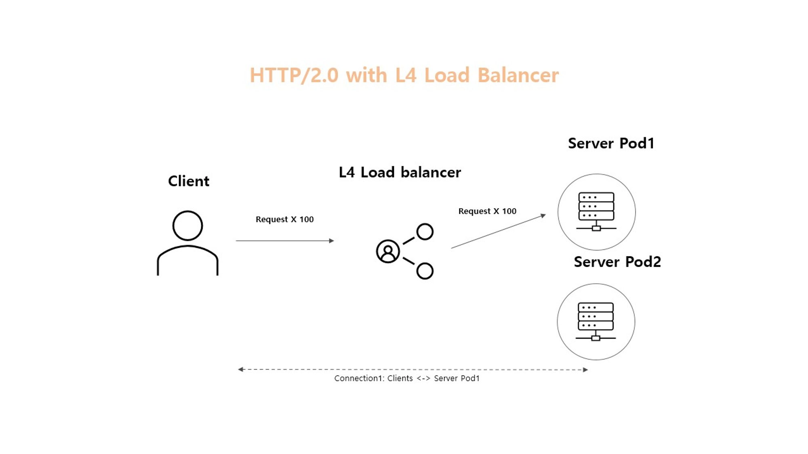

# gRPC

> grpc guide docs : https://grpc.io/docs/guides/

<br>

-----------------------

<br>


### gRPC란

<details>
   <summary> 예비 답안 보기 (👈 Click)</summary>
<br />

-----------------------

* rpc(remote procedure call)는 네트워크로 연결된 서버 상의 프로시저를 원격으로 호출할 수 있는 통신 기술이고 gRPC는 구글에서 개발한 rpc 프레임워크  
* gRPC 아키텍처는 클라이언트, 서버, 프로토콜 버퍼로 구성되며, 클라이언트와 서버 간에 교환되는 서비스 메서드와 메시지 유형을 정의한 프로토콜 버퍼를 사용하여 통신한다.

<br>

**주요 특징**
* protocol buffers
* 다양한 프로그래밍 언어(Java, Kotlin, Go, etc..) 지원하고 플랫폼 독립적으로 사용가능
* proto 파일 기반 자동 코드 생성
* 양방향 스트리밍 지원(실시간 데이터 전송)
* HTTP/2 기반 통신


#### protocol buffer
> How does serialization and deserialization work in gRPC?

**구글에서 개발한 데이터 직렬화 형식**으로 바이너리 형식으로 직렬화하며, JSON 형식과의 주요 차이는 다음과 같다.


* 속도 & 크기 : 형식이 사람이 읽을 수 없는 바이너리이기 때문에 동일한 양의 정보를 전송하는데 더 작은 크기를 사용하고 더 빠르게 전송할 수 있다.
* 데이터 유형 : json에서 사용할 수 없는 enum, map과 같은 복잡한 데이터 유형 지원
* 플랫폼 독립성 : 플랫폼에 종속적이지 않기 때문에 다양한 언어의 시스템간의 교환이 가능
 


</details>

-----------------------

<br>

### stub

<details>
   <summary> 예비 답안 보기 (👈 Click)</summary>
<br />

-----------------------

stub은 함수 호출에 사용한 파라미터를 직렬화하고 서버에서 잔달된 결과를 역직렬화하는 기능을 담당한다.  
grpc의 client역할을 한다고 보면 된다.

</details>

-----------------------

<br>


### channel

<details>
   <summary> 예비 답안 보기 (👈 Click)</summary>
<br />

grpc는 커넥션 관련 세팅, 로드밸런싱, tls 세팅 등을 추상화하고 있는 channel을 제공한다. (netty 등 구현체 제공)
클라이언트가 grpc channel을 만들면 내부적으로 서버와 http2 connection을 맺는다고 보면 된다.  

channel에는 resolver와 LB를 설정할 수 있다.
* 리졸버는 주기적으로 target DNS를 리졸브하면서 엔드포인트를 갱신
* 커넥션이 실패하면 로드밸런서는 직전에 사용했던 address list를 사용하여 재연결을 시작
* 커넥션풀 관리

> cf) 기본적으로 gRPC 채널은 하나의 TCP 커넥션을 사용하지만 로드밸런싱이나 특정 네트워크 구성을 위해 여러 커넥션이 존재할 수 있다.


#### keepAlive 옵션
> 기본적으로 비활성화되어있다.

gRPC의 keepAlive는 HTTP/2 ping 프레임을 보내 연결상태를 주기적으로 확인하고 응답이 제때 오지 않으면 연결을 실패로 간주하고 커넥션을 닫아버린다. 커넥션이 닫힌다고 해서 채널이 닫히는 것은 아니기 때문에 커넥션은 다시 재생성되고 잠시 순단이 있지만 커넥션에 연결에 문제는 없다.

grpc가 연결에서 주기적으로 ping frame을 전송하면 커넥션은 not idle 상태가 되기 때문에 죽지 않는다.

-----------------------

</details>

-----------------------

<br>

### 버전 호환성

<details>
   <summary> 예비 답안 보기 (👈 Click)</summary>
<br />

-----------------------

> https://protobuf.dev/programming-guides/proto3/#reserved

```protobuf
message ExampleMessage {
  int32 old_field = 1 [deprecated = true];  // 더 이상 사용하지 않는 필드
  reserved 1;  // 이 번호는 다시 사용되지 않도록 예약
  string new_field = 2;  // 새롭게 추가된 필드
}
```

protobuf에서 사용하지 않는 필드의 경우, 위와 같이 deprecated 옵션과 reserved 키워드를 추가할 수 있다. reserved 없이 해당 필드를 제거하고 다음에 새로운 필드를 같은 번호로 사용하는 경우, 이후 문제가 생겨 이전 버전으로 서빙해야되는 경우 충돌이 발생할 수 있기 때문이다. 

> 참고로 proto 3버전부터는 optional이 기본값으므로 값이 명시되어있지 않으면 기본값으로 들어간다.


</details>

-----------------------

<br>

### status code

<details>
   <summary> 예비 답안 보기 (👈 Click)</summary>
<br />

-----------------------

> https://grpc.io/docs/guides/status-codes/ 


grpc는 http status code와 별개로 RPC 호출에서 발생할 수 있는 다양한 오류 상황을 표현하기 위한 status code를 제공한다.
자세한 내용은 위 문서를 참고하자.


</details>

-----------------------

<br>

### 인터셉터

<details>
   <summary> 예비 답안 보기 (👈 Click)</summary>
<br />

-----------------------

grpc interceptor는 크게 serverInterceptor와 clientInterceptor로 구분되며 각 구분의 하위로 streaming과 unary로 다시 분류된다. 

서버단은 다음과 같다.

```java
@ThreadSafe
public interface ServerInterceptor {

  <ReqT, RespT> ServerCall.Listener<ReqT> interceptCall(
      ServerCall<ReqT, RespT> call,
      Metadata headers,
      ServerCallHandler<ReqT, RespT> next);
}
```
* ServerCall
  * 서버에서 클라이언트 gRPC 요청을 처리하는 객체(호출의 생명 주기 관리)
  * 클라이언트와의 개별 gRPC 호출을 나타내며, 메시지 송수신과 호출 종료 등을 관리
* ServerCallHandler
  * ServerCall과 Metadata를 인자로 받아 요청 처리의 준비 작업을 수행하고, 이후 요청 처리의 주체인 ServerCall.Listener를 반환하는 인터페이스
  * ServerCall.Listener는 클라이언트로부터 추가적인 메시지를 수신하거나, 요청이 반쪽 받힘 상태(half-closed)로 전환되거나, 요청이 완료되었을 때 등의 다양한 이벤트를 처리하는 콜백 메서드를 제공


SimpleForwardingServerCall과 SimpleForwardingServerCallListener는 각각 ServerCall과 ServerCall.Listener의 편리한 래퍼 클래스로, 이 래퍼들은 gRPC 서버에서 요청을 다루는 데 필요한 메서드를 상속받아, 개발자가 특정 메소드를 오버라이드하는 것을 간소화 한다.

<br>

대략적으로 오버라이딩 제공하는 메서드는 다음과 같다.

**호출 순서**

1. onReady(ServerCallHandler) : 서버가 클라이언트로부터 데이터를 받을 준비가 되었을 때
2. onMessage(ServerCallHandler) : 클라이언트가 보낸 메시지를 수신
3. onHalfClose(ServerCallHandler) : 클라이언트가 더 이상 데이터를 보내지 않겠다는 신호
  * grpc는 http2 스트리밍 방식으로 동작하기 때문에 client에서 모든 요청을 보냈음을 알리는 신호를 위한 것
  * 따라서 서버는 onHalfClose 이후에 비즈니스 로직을 실행
4. sendHeader(ServerCall) : 응답을 시작하기 전에 응답 헤더를 전송.
5. sendMessage(ServerCall) : 응답 데이터 전송
6. close(ServerCall) : 호출을 종료하고 종료 상태(status)와 메타데이터를 클라이언트에게 전송
7. onCancel(ServerCallHandler) : 클라이언트가 요청을 취소하거나 연결이 끊어졌을 때
7. onComplete(ServerCallHandler) : 서버가 요청을 성공적으로 처리하고 응답을 클라이언트에게 보낸 후 호출


global에러 핸들링의 경우, 인터셉터의 close로 적절하게 custom해서 처리할 수 있다.  

</details>

-----------------------

<br>

### 인증

<details>
   <summary> 예비 답안 보기 (👈 Click)</summary>
<br />

-----------------------

TLS 통신을 위해 channel에 세팅할 수 있고 mTLS도 지원한다.

</details>

-----------------------

<br>

### 양방향 스트림

<details>
   <summary> 예비 답안 보기 (👈 Click)</summary>
<br />

-----------------------

```protobuf
syntax = "proto3";

service ChatService {
    rpc Chat(stream ChatMessage) returns (stream ChatMessage);
}

message ChatMessage {
    string user = 1;
    string message = 2;
}
```

gRPC의 양방향 스트리밍은 클라이언트와 서버 모두가 단일 연결을 통해 여러 메시지를 비동기적으로 보낼 수 있도록 한다. 효율적인 실시간 통신을 허용하며 특히 채팅 시스템이나 실시간 협업 편집과 같은 애플리케이션에 유용하다.

</details>

-----------------------

<br>

### k8s grpc 로드밸런싱

<details>
   <summary> 예비 답안 보기 (👈 Click)</summary>
<br />

-----------------------

> k8s에서 제공하는 LB 컴포넌트인 service는 L4 로드밸런싱을 지원합니다.

  

L4 로드 밸런서는 http1.x의 경우 client와 server가 직접 connection을 맺는다. 그리고 복수의 요청을 처리하기 위해 복수의 connection을 생성한다.   

<br>

  

grpc의 경우 l4를 사용하게 되면 적절하게 로드밸런싱이 안되는 이슈가 생긴다. http 2.0을 사용하는데 multiplex stream 기능으로 인해 하나의 커넥션을 맺고 여러 데이터를 전송하게 되기 때문이다.  

<br>

  

반면에 l7 로드 밸랜서의 경우, L4와 달리 애플리케이션 레벨에서 동작하기 때문에 HTTP/2 프로토콜을 이해하고 스트림 요청을 개별적으로 로드밸런싱 할 수 있다. 또한, client와 LB가 커넥션을 맺고 LB와 서버가 커넥션을 맺기 때문에 L7 로드밸런서에서 http2 프로토콜을 이해하고 적절하게 로드밸런싱 해줄 수 있다.   


</details>

-----------------------

<br>

