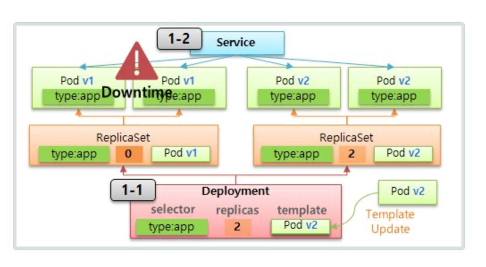

## K8s란
쿠버네티스(k8s)는 컨테이너화된 애플리케이션을 배포, 관리, 확장할 때 수반되는 다수의 수동 프로세스를 자동화하는 오픈소스 컨테이너 오케스트레이션 플랫폼입니다.

> 오케스트레이션(Orchestration)은 여러 개의 작업, 프로세스, 또는 서비스를 자동으로 조정하고 관리하는 것을 의미

## 컨트롤러
* 역할
  * Auth Healing : 파트가 죽거나 노드가 죽으면 파드를 다른 노드에 생성해준다.
  * Auto Scaling : HPA 구성을 하면 리소스 자원이 limit에 도달하면 파드의 수를 늘린다.
* 종류
  * deployment
  * replicaSet
  * job
  * etc..

### deployment
보통 애플리케이션 배포를 구성하면 컨트롤러의 deployment를 사용한다.

deployment로 배포하면 이에 따른 ReplicaSet이 뜨고 ReplicaSet이 설정된 개수만큼 Pod을 띄운다. Selector로 라벨을 확인해서 pod이 개수가 설정대로 떴는지 확인한다. Service는 deployment와 별도로 띄우게 되며, service도 마찬가지로 Selector로 pod으로 라우팅하게 된다. 

### Job
일정 시간 동안만 pod을 띄우고 역할을 수행한 뒤에 종료되는 종류이다.

## pod
* readinessProbe : 컨테이너가 트래픽을 받을 준비가 되었는지 확인하는 옵션으로 실패하면 해당 pod을 서비스 대상으로 포함시키지 않는다.
* livenessProbe : 컨테이너가 살아있는지(정상적으로 동작하는지) 확인하는 역할로 문제가 생기면 감지하여 재시작 하는 등의 작업이 실행된다.

## helm
Kubernetes 애플리케이션을 관리하기 위한 패키지 매니저입니다. Helm을 사용하면 Kubernetes 클러스터에 복잡한 애플리케이션을 쉽게 배포, 관리, 업데이트, 삭제할 수 있습니다. Helm은 Kubernetes 리소스의 집합을 패키징하여 일관된 방식으로 관리할 수 있게 해줍니다.
